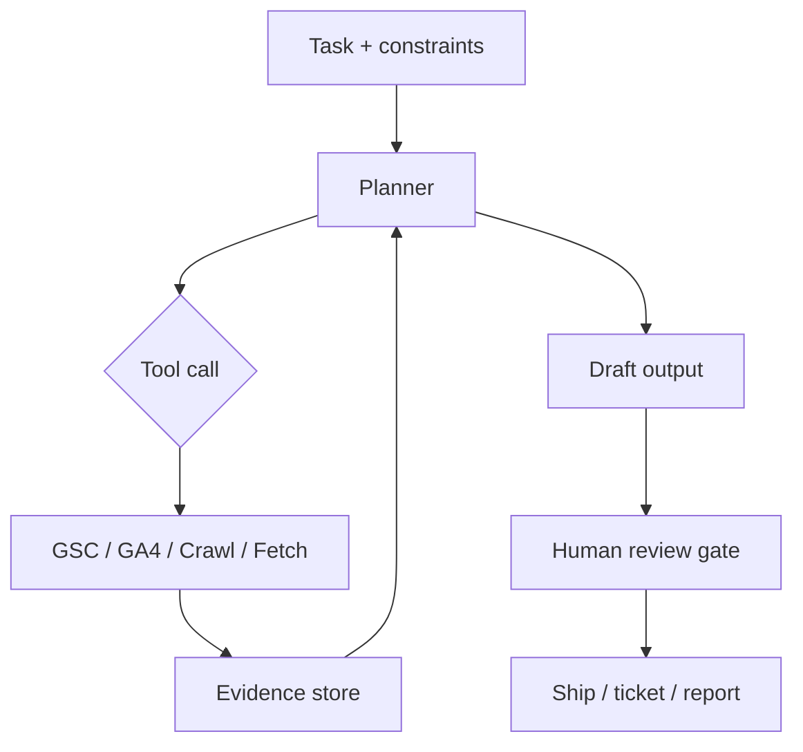

# Building Agents for SEO Tasks

**Short answer:** A useful SEO agent is not a chatbot with a keyword prompt. It is a bounded workflow — plan → call verified tools → produce evidence-backed output → stop for human review before anything client-facing ships.

This guide covers how to design agents that do real SEO work: technical triage, Search Console analysis, content briefs, and competitive research — without turning your stack into an un-auditable black box.

> **Related guides:** [GEO Fundamentals](./geo-fundamentals.md) explains how AI systems cite content. [WebMCP Implementation](./webmcp-implementation.md) covers the *inverse* problem — exposing *your* site to agents. This guide covers agents *you build* to run SEO operations.

---

## Agents vs. Assistants

| Pattern | What it does | SEO fit |
|---------|--------------|---------|
| **Assistant** | Answers questions in a chat thread | Brainstorming, explaining concepts, drafting copy *with you in the loop* |
| **Agent** | Pursues a goal across multiple steps using tools | Audits, weekly reporting, crawl triage, structured research |
| **Workflow** | Fixed sequence, no reasoning between steps | Scheduled exports, formatted alerts, deterministic pipelines |

Most teams call everything an "agent." For SEO, reserve the term for systems that **decide which tool to call next** based on intermediate results — and keep high-stakes outputs behind human approval.

---

## High-Value SEO Agent Use Cases

Start with tasks that are **repetitive, structured, and evidence-heavy** — not tasks that require brand judgment or stakeholder politics.

### 1. Technical SEO triage

**Goal:** Turn a crawl export or URL list into a prioritized fix list.

**Tools:** Site crawler API, `robots.txt` fetcher, sitemap parser, Core Web Vitals field data (CrUX or RUM), optional Lighthouse sample.

**Output:** Table of issues ranked by impact × effort, with URLs, reproduction steps, and recommended owner (dev / content / infra).

**Why agents help:** Crawl files are large; the value is filtering noise and grouping patterns (e.g. 4,200 duplicate titles → one template fix).

### 2. Search Console analyst

**Goal:** Summarize query/page deltas week-over-week and flag anomalies.

**Tools:** GSC Search Analytics API, optional GA4 landing-page report for reconciliation.

**Output:** Executive brief: top gainers/losers, new queries entering top 10, pages with impression growth but flat clicks (zero-click / AI Overview signal), recommended follow-ups.

**Guardrail:** Agent cites **exact queries and URLs** from API responses — never invent metrics.

### 3. Content brief generator

**Goal:** Produce a brief aligned to search intent for a target query cluster.

**Tools:** SERP fetch or rank-tracking API, internal content inventory, optional keyword volume source.

**Output:** Intent classification (3Cs), recommended format, outline with H2s, entities to cover, internal link targets, differentiation angle.

**Guardrail:** Human editor approves before writers start; agent does not publish.

### 4. On-page QA checker

**Goal:** Verify a draft or live URL against an on-page checklist.

**Tools:** HTML fetch, schema validator, readability check, internal link graph (scoped).

**Output:** Pass/fail per checklist item with line-level references (title length, missing canonical, schema errors).

### 5. Competitive SERP monitor

**Goal:** Track who ranks for priority queries and what changed in winning URLs.

**Tools:** Rank tracker or SERP API, diff on cached HTML for top N URLs.

**Output:** Weekly change log: new entrants, lost rankings, structural changes in competitor pages (new FAQ schema, expanded sections).

---

## Reference Architecture

Every production SEO agent should follow the same skeleton:



### Layer 1 — Task contract

Define upfront:

- **Scope** — one site, one folder, one query set; never "the whole internet"
- **Success criteria** — what a good output contains (tables, URLs, dates, confidence notes)
- **Forbidden actions** — no publish, no disavow, no robots.txt edits without explicit approval
- **Budget** — max tool calls, max tokens, max runtime

### Layer 2 — Tools, not prompts

Agents fail when you ask the model to *remember* APIs. Give it **typed tools** with clear descriptions:

| Tool | Returns | SEO use |
|------|---------|---------|
| `get_search_analytics` | GSC rows (query, page, clicks, impressions, position) | Trend analysis |
| `inspect_url` | Index status, canonical, crawl state | Technical triage |
| `fetch_page` | Rendered HTML + headers | On-page QA |
| `list_sitemap_urls` | URL inventory | Coverage audits |
| `run_crawl_sample` | Issues for URL batch | Prioritization |

Write tool descriptions for the **model**, not marketing: *"Returns GSC search analytics for the last 28 days. Requires site URL and date range. Does not include Search Console properties you lack permission for."*

[MCP](https://modelcontextprotocol.io/) (Model Context Protocol) is the emerging standard for packaging these tools so the same agent runtime can talk to GSC, GA4, crawlers, and internal docs without custom glue per provider.

### Layer 3 — Evidence-first outputs

Require every recommendation to cite:

1. **Source** — which tool call produced the data
2. **Date range** — especially for GSC/GA4
3. **Row-level proof** — query, URL, or issue ID

If the agent cannot fetch evidence, it should say so — not extrapolate.

### Layer 4 — Human review gate

Automate **drafting and triage**; keep **commitment** human:

- Client reports
- Content publish / unpublish
- Redirect maps
- Disavow files
- Pricing or strategy recommendations

---

## Example: Weekly GSC Analyst Agent

**Task contract**

```
Analyze omar-corral.com GSC data for the last 28 days vs prior 28 days.
Flag: (1) queries with +50% impressions and flat/declining clicks,
      (2) pages losing average position > 2,
      (3) new queries entering top 20.
Max 12 tool calls. Output markdown brief with tables. No strategic guarantees.
```

**Pseudocode shape** (framework-agnostic):

```typescript
const task = {
  site: 'https://omar-corral.com/',
  periods: { current: '2026-05-13..2026-06-09', prior: '2026-04-15..2026-05-12' },
  maxToolCalls: 12,
};

// Agent loop (simplified)
while (hasBudget(task) && !planComplete(plan)) {
  const step = planner.next(plan, evidence);
  const result = await tools[step.tool](step.args);
  evidence.append({ tool: step.tool, result, fetchedAt: new Date() });
  plan.update(result);
}

const draft = synthesizer.brief(evidence, task);
await humanReview(draft); // required before send
```

**Output excerpt (what good looks like)**

| Query | Impressions Δ | Clicks Δ | Avg pos Δ | Note |
|-------|---------------|----------|-----------|------|
| `core web vitals inp` | +84% | −12% | −0.3 | Possible zero-click / AI Overview absorption |
| `content cluster seo` | +41% | +18% | +1.1 | Healthy engagement |

Each row links back to the API pull that produced it.

---

## Multi-Agent vs. Single Agent

| Approach | When to use | Risk |
|----------|-------------|------|
| **Single agent, many tools** | Most SEO teams starting out | Context bloat if tasks are huge |
| **Specialist agents** | Mature ops: Technical, Content, Reporting | Handoff errors between agents |
| **Orchestrator + workers** | Enterprise: parallel crawls + synthesis | Higher build cost |

**Practical default:** one agent per **recurring deliverable** (weekly GSC brief, monthly technical digest) — not one mega-agent for "all SEO."

---

## Tooling Stack Options

You do not need a custom platform on day one.

| Layer | Options |
|-------|---------|
| **Runtime** | Cursor agents, Claude Code, OpenAI Assistants API, LangGraph, custom Node/Python |
| **Tool protocol** | MCP servers (GSC, GA4, Firecrawl, GitHub, Sheets) |
| **Scheduling** | GitHub Actions cron, Cloud Scheduler, local cron with secrets in env |
| **Storage** | JSON artifacts in repo, S3, or warehouse — version outputs for audit |
| **Review** | PR on generated markdown, Slack approval button, ticket queue |

For static-site publishers: pair **read-only MCP tools** with a repo that stores agent outputs as markdown under `reports/` — never let the agent write to production CMS directly.

---

## Security & Compliance

- **OAuth scopes:** GSC and GA4 tokens should be read-only unless you have a documented write workflow.
- **Secrets:** API keys in environment variables or GitHub Actions secrets — never in prompts or committed configs.
- **Client data:** Scope agents per property; do not cross-mingle Search Console sites in one thread.
- **PII:** Strip form submissions and user paths from crawl context before sending to third-party models.
- **Rate limits:** Respect GSC/GA4 quotas; backoff and cache responses within allowed TTL.

---

## Production Checklist

- [ ] Task contract written in plain language (scope, budget, forbidden actions)
- [ ] Tools return structured JSON, not prose
- [ ] Tool descriptions state permissions and failure modes
- [ ] Evidence attached to every recommendation
- [ ] Human review gate before client-facing output
- [ ] Logs retained: prompts, tool calls, timestamps (not necessarily full model traces)
- [ ] Dry-run on a known date range; compare agent brief to manual analysis
- [ ] Rollback plan: agent suggests, human executes

---

## What Not to Automate (Yet)

- **Link building outreach** — relationship context defeats generic agents
- **Algorithm impact postmortems** — correlation without experiment design misleads stakeholders
- **Full-site content rewrites** — brand voice and legal review need humans
- **Autonomous publishing** — citation drift and factual errors compound silently

Agents should make senior SEOs **faster and more consistent**, not replace judgment on high-stakes calls.

---

## Where This Connects to WebMCP

| Direction | Guide |
|-----------|-------|
| **Inbound** — agents accessing *your* marketing site | [WebMCP Implementation](./webmcp-implementation.md) |
| **Outbound** — agents you run against *your* SEO stack | This guide |
| **Live architecture POV** | [OC MCP on omar-corral.com](https://omar-corral.com/oc-mcp/) |

The same discipline applies both ways: **structured tools, explicit schemas, evidence-backed responses.**

---

## Next Steps

1. Pick **one** recurring task you already do manually (weekly GSC review is ideal).
2. Write the task contract and list the 3–5 tools it needs.
3. Implement read-only tools first; run a 4-week shadow period (agent draft vs your manual report).
4. Promote to production only when row-level accuracy matches your manual baseline.

**[WebMCP Implementation →](./webmcp-implementation.md)** — expose structured data so inbound agents do not scrape your site.

---

*Building agents for a specific stack? [Get in touch](https://omar-corral.com/#contact) — I help teams wire GSC, GA4, and crawl tooling into reviewable agent workflows.*
