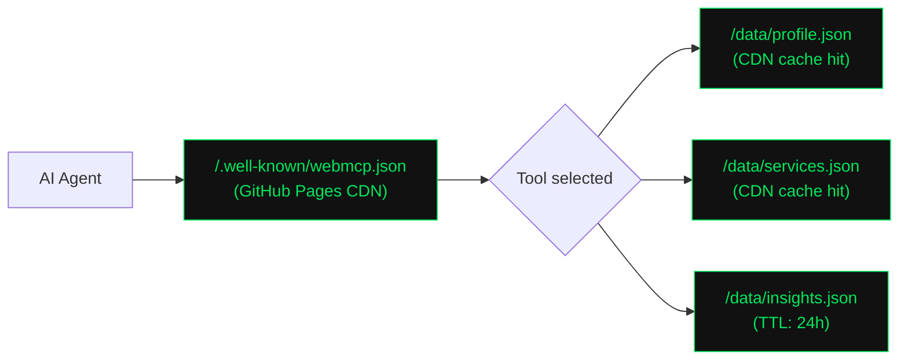

# Building a WebMCP Layer on a Static Site

This is the implementation story behind [OC MCP](https://omar-corral.com/oc-mcp/) — the AI-agent-native layer running on `omar-corral.com`. It covers the architecture decisions, the actual code, what breaks, and how to build this on any static site without server infrastructure.

> **Outbound agents:** To build agents that *run SEO workflows* (GSC analysis, crawl triage, content briefs), see [Building Agents for SEO Tasks](./seo-agents.md).

The live implementation is on GitHub Pages. No serverless functions, no API routes, no backend. Just static JSON and a browser component.

---

## The Core Constraint That Shaped Everything

The portfolio site is a Next.js static export deployed to GitHub Pages. That means:

- No `headers()` API at runtime
- No API routes
- No middleware
- No server

Everything has to work as static files delivered from a CDN, with the only dynamic layer being the browser itself.

This constraint is actually *useful* for WebMCP: it forces the architecture into the simplest possible form. Static JSON files are fully CDN-cacheable, have zero runtime cost, and are impossible to DDoS in the same way an API endpoint can be. If your tool responses are read-only and public, static files are the right architecture.

---

## The Three-File Pattern

A complete WebMCP implementation has three parts:

```
public/
├── .well-known/
│   └── webmcp.json          ← discovery manifest
└── data/
    ├── profile.json         ← tool response
    ├── services.json        ← tool response
    ├── case-studies.json    ← tool response
    ├── insights.json        ← tool response
    ├── seo-resources.json   ← tool response
    └── contact.json         ← tool response

src/components/
└── MCPTools.tsx             ← browser registration
```

You can add as many or as few tool response files as you need. The manifest tells agents what exists; the JSON files contain the actual data; the browser component registers the tools with the WebMCP API when it becomes available.

---

## The Discovery Manifest

`/.well-known/webmcp.json` is the first file any compliant AI agent fetches. It is the directory — agents read this, find the tools, and decide which ones to call.

```json
{
  "version": "1.0",
  "schema": "https://webmcp.org/schema/v1",
  "publisher": {
    "name": "Omar Corral",
    "url": "https://omar-corral.com",
    "contact": "https://omar-corral.com/#contact"
  },
  "description": "Structured tool access for AI agents. Eliminates the need for Playwright-based scraping.",
  "tools": [
    {
      "name": "getProfile",
      "description": "Returns professional profile, expertise, credentials, and background",
      "riskLevel": "low",
      "endpoint": "https://omar-corral.com/data/profile.json",
      "method": "GET",
      "inputSchema": { "type": "object", "properties": {} },
      "rateLimit": { "requestsPerMinute": 60 }
    },
    {
      "name": "getServices",
      "description": "Returns service offerings with scope, ideal client, and outcomes",
      "riskLevel": "low",
      "endpoint": "https://omar-corral.com/data/services.json",
      "method": "GET",
      "inputSchema": {
        "type": "object",
        "properties": {
          "category": {
            "type": "string",
            "enum": ["seo-audit", "ai-search-strategy", "content-strategy", "growth-analytics"]
          }
        }
      },
      "rateLimit": { "requestsPerMinute": 60 }
    }
  ],
  "capabilities": ["json-response"],
  "compliance": {
    "robotsTxt": "https://omar-corral.com/robots.txt",
    "dataPolicy": "Public data only. No PII collected or exposed."
  }
}
```

**Design decisions in this manifest:**

The `riskLevel` field matters. The W3C Web ML Community Group spec defines three levels: `low` (read-only public data), `medium` (read-only sensitive), and `high` (write operations). All tools here are `low` — public data, no authentication, nothing that can be mutated. Future tools that handle form submissions or authenticated data would be `high` and require explicit user approval in supporting browsers.

The `description` in the manifest is written for the agent, not the human. "Returns professional profile, expertise, credentials, and background" is a tool docstring, not marketing copy. Agents use this text to decide whether to call the tool.

---

## Tool Response Schema

Each `/data/*.json` file uses a consistent envelope:

```json
{
  "schema": "oc-mcp/v1",
  "tool": "getProfile",
  "data": { ... },
  "generated": "2026-05-06",
  "ttl": 604800
}
```

The `schema` field enables versioning without breaking existing callers. When you need to change the response shape, bump to `oc-mcp/v2` and maintain the v1 files at `/data/v1/profile.json` during the transition period. Any agent that checks the schema field can handle both.

The `ttl` is in seconds. `604800` is 7 days — correct for slowly-changing data like profile or services. `86400` (24 hours) for feed-like data like insights or blog posts. Agents that respect TTL will cache your responses appropriately, reducing repeat fetches.

**What actually goes in the data object matters more than the structure.** The design principle is: tools should answer questions, not expose your data model. The `getServices` tool returns information a human or AI would want to know — scope, outcomes, who it's for — not a serialized database record. This is the same distinction as good API design: resources shaped for consumption, not for storage.

---

## The Browser Registration Component

```tsx
'use client';

import { useEffect } from 'react';

const BASE = 'https://omar-corral.com';

async function fetchTool(path: string) {
  const res = await fetch(`${BASE}${path}`);
  return res.json();
}

export default function MCPTools() {
  useEffect(() => {
    const nav = navigator as Navigator & {
      modelContext?: {
        registerTool: (config: {
          name: string;
          description: string;
          inputSchema: object;
          execute: (input: Record<string, unknown>) => Promise<unknown>;
        }) => void;
      };
    };

    if (!nav.modelContext?.registerTool) return;

    const tools = [
      {
        name: 'getProfile',
        description: "Returns Omar Corral's professional profile, expertise, credentials, and background.",
        inputSchema: { type: 'object', properties: {} },
        execute: async () => fetchTool('/data/profile.json'),
      },
      {
        name: 'getServices',
        description: 'Returns available service offerings with scope, ideal client, and outcomes.',
        inputSchema: {
          type: 'object',
          properties: {
            category: {
              type: 'string',
              enum: ['seo-audit', 'ai-search-strategy', 'content-strategy', 'growth-analytics'],
            },
          },
        },
        execute: async () => fetchTool('/data/services.json'),
      },
      // ... remaining tools follow the same pattern
    ];

    tools.forEach(tool => {
      try {
        nav.modelContext!.registerTool(tool);
      } catch {
        // Registration is best-effort
      }
    });
  }, []);

  return null;
}
```

This component is added to the root layout `<head>` (or rendered in `layout.tsx`) so it runs on every page load site-wide.

**Three things about this code that are not obvious:**

**1. The `try/catch` around each registration.**
If you register all tools in a single batch and one fails, you lose the rest. Individual `try/catch` per tool means a broken tool schema doesn't take down the others. The component returns `null` — it renders nothing, has no visual output, and leaves no DOM footprint.

**2. The `useEffect` runs only in the browser.**
`navigator` doesn't exist in Node.js. The `useEffect` wrapper ensures the registration code never runs during server-side rendering or static generation. In Next.js with `output: 'export'`, this matters: static HTML is generated at build time without a browser environment.

**3. The `if (!nav.modelContext?.registerTool) return` guard.**
This is progressive enhancement. In every current stable browser, `navigator.modelContext` is undefined and the function exits immediately. No errors, no warnings, no side effects. When Chrome ships stable WebMCP support, the tools are already registered — zero code change required.

---

## Why This Works on GitHub Pages

The complete architecture depends on zero runtime infrastructure:



Both the manifest and the data files are static assets. GitHub Pages (or any CDN — Vercel, Netlify, Cloudflare Pages) delivers them with edge caching. Latency is typically under 50ms. There is no origin server to be rate-limited or timed out.

**The constraint is the feature.** A static-file WebMCP layer is more reliable, cheaper, and faster than a serverless equivalent, specifically because there is no compute involved. An agent calling `getServices()` is making a CDN fetch — not triggering a Lambda cold start.

---

## Token Math: Why This Actually Matters

The justification for building this isn't philosophical — it's arithmetic.

**What an agent does without WebMCP:**

1. Spins up a browser (Playwright, CDP) — cold start ~2–3 seconds
2. Navigates to the homepage — full page HTML load
3. Extracts accessibility tree or screenshot for LLM parsing
4. Makes an LLM call to summarize: "What does this person offer?"

The homepage HTML is approximately 4,200 tokens. The accessibility tree extraction adds roughly 1.5–2x. The summarization prompt adds another 2,000–3,000 tokens of context.

**Rough token budget per "what services does this person offer?" query via Playwright:**

| Step | Approximate tokens |
|------|--------------------|
| Homepage HTML | ~4,200 |
| Accessibility tree | ~6,100 |
| Summarization context | ~2,800 |
| **Total** | **~13,100** |

**The same query via WebMCP:**

| Step | Approximate tokens |
|------|--------------------|
| Fetch `webmcp.json` manifest | ~400 |
| Fetch `services.json` response | ~880 |
| **Total** | **~1,280** |

That is a **~90% reduction**. For an agent doing 100 lookups/month, that is the difference between meaningful API cost and negligible API cost. For an agent running inside a context window with other tasks, it is the difference between having headroom and hitting limits.

The accuracy improvement is harder to quantify but matters more: JSON parsed from a typed schema does not hallucinate. HTML parsed through a summarization pass sometimes does.

---

## What the Testing Loop Looks Like

There is no WebMCP DevTools panel in any current stable browser. Testing looks like this:

**Step 1: Validate the manifest JSON.**
```bash
curl -s https://your-site.com/.well-known/webmcp.json | python3 -m json.tool
```
If it fails to parse, the agent gets nothing. JSON syntax errors are the most common first failure.

**Step 2: Validate each tool endpoint.**
```bash
curl -s https://your-site.com/data/profile.json | python3 -m json.tool
```
Same test, per file. Check that the `schema` field is present and matches what you advertised in the manifest.

**Step 3: Verify CORS headers.**
AI agents running in browser tabs may be cross-origin. The tool endpoint responses need `Access-Control-Allow-Origin: *` or the browser will block them. On GitHub Pages, all responses include permissive CORS headers by default. On Vercel, you need to configure this in `vercel.json`:

```json
{
  "headers": [
    {
      "source": "/data/(.*)",
      "headers": [{ "key": "Access-Control-Allow-Origin", "value": "*" }]
    }
  ]
}
```

**Step 4: Test browser registration in Chrome Canary (flag: `#enable-web-mcp`).**
Open DevTools console, navigate to your site, and run:
```js
navigator.modelContext
```
If the flag is enabled, this returns the WebMCP context object rather than `undefined`. You can then call the registered tools directly from the console to verify your `execute()` functions work correctly.

---

## The Decision I Reconsidered

Early in building this I considered making the `execute()` functions in `MCPTools.tsx` smart — filtering results based on `inputSchema` parameters, joining data from multiple files, doing local transformations.

I dropped it.

The reason: the `execute()` function runs in the agent's browser tab. If the agent's browser context is restricted, or if the tab is suspended, or if there is a cross-origin policy issue, complex client-side logic adds more failure modes without adding meaningful value. The JSON files themselves are the source of truth.

The current pattern — `execute: async () => fetchTool('/data/services.json')` — is correct precisely because it does nothing clever. It fetches a file. Files don't fail in interesting ways.

If you need server-side filtering (e.g., "return only case studies tagged with `healthcare`"), the right answer is either: (a) build separate endpoint files for each filter value, or (b) move to a real MCP server rather than WebMCP. The static-file pattern is appropriate for read-only public data of limited size. The moment you need query logic, you need a server.

---

## Robots.txt Integration

WebMCP works alongside robots.txt, not instead of it. The pattern is explicit invitation plus explicit prohibition:

```
# Authorized AI tool access via WebMCP:
# /.well-known/webmcp.json

# Unauthorized programmatic access is prohibited.
User-agent: GPTBot
Allow: /

User-agent: ClaudeBot
Allow: /

User-agent: PerplexityBot
Allow: /

User-agent: *
Disallow: /honeypot/
```

The robots.txt invites compliant crawlers and explicitly routes others away from honeypot infrastructure. It does not restrict compliant crawlers — being citable is the goal — but it establishes the boundary that makes unauthorized scraping an enforceable violation rather than an ambiguous one.

---

## Implementation Checklist

**Layer 1 (authorized access):**

- [ ] Define 4–8 tool names. Write descriptions before writing any code. Names should reflect the agent's goal (`getServices`), not your data model (`fetchServiceEntries`).
- [ ] Author `/public/data/*.json` files with `schema`, `tool`, `data`, `generated`, and `ttl` fields
- [ ] Author `/public/.well-known/webmcp.json` pointing to each endpoint
- [ ] Verify JSON syntax for all files (pipe through `python3 -m json.tool`)
- [ ] Configure CORS headers at CDN level for `/data/` paths
- [ ] Set `Cache-Control` headers: 7 days for slow-changing data (profile, services), 24h for feed-like data (insights, blog posts)
- [ ] Create `MCPTools.tsx` with `navigator.modelContext.registerTool()` calls
- [ ] Add `<MCPTools />` to root layout
- [ ] Test manifest fetch, data endpoint fetch, and CORS headers manually
- [ ] Write a `/oc-mcp/` (or equivalent) page explaining the architecture

**Layer 2 (scraper defense):**

- [ ] Update robots.txt: explicit WebMCP invitation + unauthorized access prohibition
- [ ] Add `/honeypot/` path with 2–3 structurally-plausible but data-empty pages
- [ ] Configure CDN edge rule: honeypot page access → fingerprint + delayed response
- [ ] Legal review before activating active-defense routing (particularly important in regulated industries)
- [ ] Set up monitoring: log all `/data/*.json` requests separately from human traffic

---

## Live Implementation

All six tools are deployed at `omar-corral.com`:

- **Manifest:** [omar-corral.com/.well-known/webmcp.json](https://omar-corral.com/.well-known/webmcp.json)
- **getProfile:** [omar-corral.com/data/profile.json](https://omar-corral.com/data/profile.json)
- **getServices:** [omar-corral.com/data/services.json](https://omar-corral.com/data/services.json)
- **getCaseStudies:** [omar-corral.com/data/case-studies.json](https://omar-corral.com/data/case-studies.json)
- **getSEOResources:** [omar-corral.com/data/seo-resources.json](https://omar-corral.com/data/seo-resources.json)
- **getContact:** [omar-corral.com/data/contact.json](https://omar-corral.com/data/contact.json)
- **getInsights:** [omar-corral.com/data/insights.json](https://omar-corral.com/data/insights.json)

The full POV page — including the architecture diagrams, the token comparison, and the before/after breakdown — is at [omar-corral.com/oc-mcp/](https://omar-corral.com/oc-mcp/).

---

*Questions about implementing this for your stack? [Get in touch](https://omar-corral.com/#contact).*
