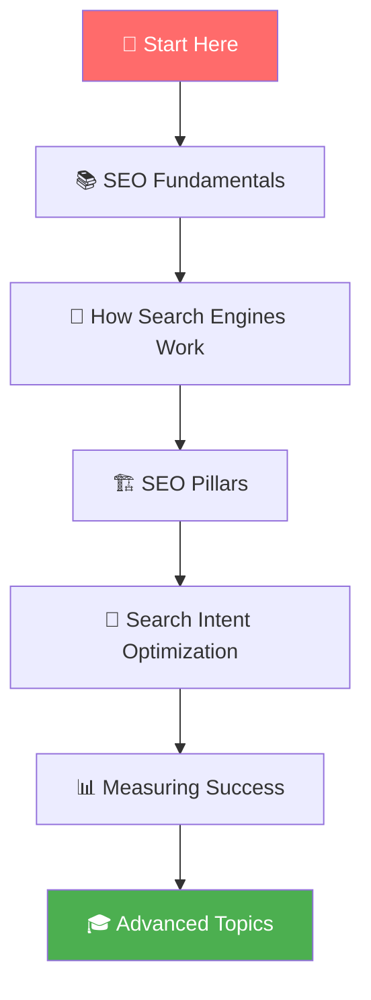
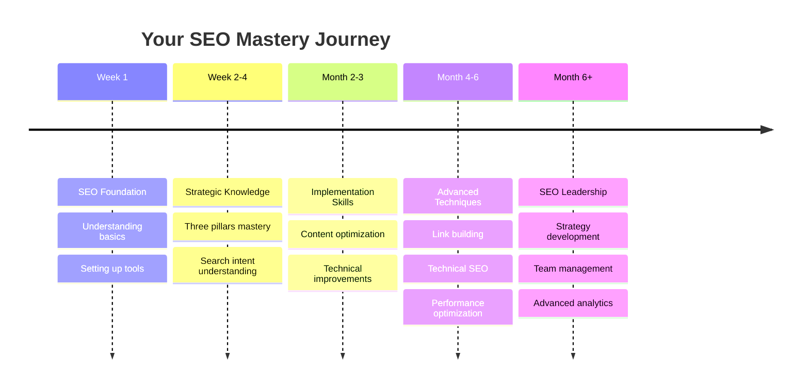

# Getting Started with SEO

Welcome to your comprehensive **SEO learning journey**! This guide will take you from complete beginner to confident SEO practitioner through a structured, step-by-step approach.

## 🎯 **Your SEO Learning Path**

Master SEO through our carefully designed progression:



---

## 📚 **Step 1: SEO Fundamentals**

**[Start with SEO Fundamentals →](./seo-fundamentals.md)**

*Master the core concepts that form the foundation of all successful SEO strategies*

### **What You'll Learn:**
- What SEO really is and why it matters for business
- Core SEO concepts and terminology
- SEO vs other marketing channels
- Mobile-first indexing and user intent
- SEO timeline expectations and success factors

**⏱️ Time to complete**: 15-20 minutes  
**📈 Skill level**: Complete Beginner  
**🎯 Outcome**: Clear understanding of SEO fundamentals

---

## 🔧 **Step 2: How Search Engines Work**

**[Learn How Search Engines Work →](./how-search-engines-work.md)**

*Deep dive into the technical process that powers search engines*

### **What You'll Learn:**
- The complete crawling, indexing, and ranking process
- What search engines look for when evaluating pages
- How ranking algorithms have evolved over time
- Modern search complexity and personalization
- Optimization strategies for each stage

**⏱️ Time to complete**: 25-30 minutes  
**📈 Skill level**: Beginner  
**🎯 Outcome**: Technical understanding of search engine operations

---

## 🏗️ **Step 3: SEO Pillars**

**[Master the Three SEO Pillars →](./seo-pillars.md)**

*Understanding Authority, Relevance, and Experience - the foundation of modern SEO*

### **What You'll Learn:**
- The three pillars: Authority, Relevance & Experience
- How to build website authority and trust (E-A-T)
- Creating relevant, intent-matching content
- Optimizing user experience and Core Web Vitals
- The synergy effect when all pillars work together

**⏱️ Time to complete**: 35-40 minutes  
**📈 Skill level**: Intermediate  
**🎯 Outcome**: Strategic SEO framework understanding

---

## 🎯 **Step 4: Search Intent Optimization**

**[Master Search Intent Optimization →](./search-intent-optimization.md)**

*Create content that perfectly matches what searchers are looking for*

### **What You'll Learn:**
- The four types of search intent
- How to analyze and match search intent
- Content optimization for different intent types
- SERP feature optimization opportunities
- Advanced intent optimization strategies

**⏱️ Time to complete**: 30-35 minutes  
**📈 Skill level**: Intermediate  
**🎯 Outcome**: Ability to create intent-aligned content

---

## 📊 **Step 5: Measuring Success**

**[Learn to Measure SEO Success →](./measuring-success.md)**

*Track, measure, and report on your SEO performance effectively*

### **What You'll Learn:**
- Essential SEO metrics and KPIs
- Setting up tracking with Google Analytics & Search Console
- SEO reporting frameworks and templates
- Industry benchmarks and success indicators
- Advanced analytics and attribution modeling

**⏱️ Time to complete**: 25-30 minutes  
**📈 Skill level**: Intermediate  
**🎯 Outcome**: Comprehensive SEO measurement capabilities

---

## 🚀 **Your 30-Day SEO Quick Start Plan**

Ready to start implementing? Follow this structured plan:

### **Week 1: Foundation** 📊
```bash
Foundation Checklist:
□ Complete SEO Fundamentals guide
□ Set up Google Search Console
□ Install Google Analytics 4
□ Learn how search engines work
□ Audit your current website
```

### **Week 2: Strategy** 🎯  
```bash
Strategy Checklist:
□ Study the three SEO pillars
□ Conduct basic keyword research
□ Analyze search intent for target keywords
□ Identify content gaps and opportunities
□ Plan your content strategy
```

### **Week 3: Implementation** 🛠️
```bash
Implementation Checklist:
□ Optimize existing title tags & meta descriptions
□ Create 2-3 new intent-optimized pages
□ Improve internal linking structure  
□ Fix technical SEO issues
□ Set up conversion tracking
```

### **Week 4: Measurement** 📈
```bash
Measurement Checklist:
□ Set up SEO tracking dashboard
□ Establish baseline metrics
□ Create monthly reporting template
□ Review and analyze early results
□ Plan next month's activities
```

---

## 📈 **Expected Learning Timeline**



---

## 🎓 **After Completing This Guide**

Once you've mastered the fundamentals, continue your SEO education with:

### **🛠️ Essential Tools**
**[Explore SEO Tools →](../tools/)**  
Discover the free and premium tools that will accelerate your SEO success.

### **📚 Advanced Topics** *(Coming Soon)*
- **Keyword Research Mastery**: Advanced strategies for finding and targeting keywords
- **Technical SEO Deep Dive**: Website optimization and technical foundations  
- **Content Optimization**: Creating content that ranks and converts
- **Link Building Strategies**: Earning high-quality, authoritative backlinks
- **Local SEO**: Optimizing for local search and Google My Business

---

## 📊 **Success Metrics for This Learning Path**

Track your progress as you complete each section:

| Learning Stage | Knowledge Check | Practical Application |
|----------------|----------------|----------------------|
| **Fundamentals** | Can explain what SEO is and why it matters | Set up basic tracking tools |
| **Search Engines** | Understand crawling, indexing, ranking | Optimize for crawlability |
| **SEO Pillars** | Can describe Authority, Relevance, Experience | Audit current site against pillars |
| **Search Intent** | Can identify and match search intent | Create intent-optimized content |
| **Measuring Success** | Know which metrics matter | Set up comprehensive tracking |

---

## 💡 **Learning Tips for Success**

### **📖 How to Use This Guide**
- **Follow the sequence**: Each section builds on the previous one
- **Take notes**: Keep a learning journal for key insights
- **Apply immediately**: Practice concepts on your own website
- **Ask questions**: Engage with the SEO community for clarification

### **🎯 Maximize Your Learning**
- **Set aside dedicated time**: 2-3 hours per week minimum
- **Practice on real projects**: Apply concepts to actual websites
- **Stay updated**: SEO evolves constantly; keep learning
- **Join communities**: Connect with other SEO practitioners

### **⚡ Quick Start Option**
*Short on time? Start with these priorities:*
1. [SEO Fundamentals](./seo-fundamentals.md) - Core concepts (20 min)
2. [SEO Pillars](./seo-pillars.md) - Strategic framework (40 min) 
3. [Measuring Success](./measuring-success.md) - Essential tracking (25 min)

---

## 🤝 **Get Help Along the Way**

### **Community Support**
- SEO communities on Reddit, Discord, and LinkedIn
- Local digital marketing meetups
- Online SEO forums and Q&A sites

### **Professional Guidance**
If you need personalized help or want to accelerate your results:

- **[Schedule a Free SEO Consultation →](https://omar-corral.com/#contact)**
- **[Explore Professional SEO Services →](https://omar-corral.com/services)**

---

## 🏆 **Ready to Begin?**

Your SEO mastery journey starts with understanding the fundamentals. Click below to begin:

**[🚀 Start with SEO Fundamentals →](./seo-fundamentals.md)**

*Transform your understanding of search engine optimization with this comprehensive, practical guide designed for real-world application.*

---

**💡 Remember**: SEO is both an art and a science. Master the fundamentals, stay curious, and always focus on creating value for your users. Great rankings will follow naturally!
