# Getting Started with SEO

Welcome to your journey into **Search Engine Optimization (SEO)**! This comprehensive guide will take you from complete beginner to confident SEO practitioner.

## 🤔 What is SEO?

**Search Engine Optimization (SEO)** is the practice of improving your website to increase its visibility when people search for products or services related to your business in search engines like Google, Bing, and Yahoo.

### Why SEO Matters

- **93% of online experiences** begin with a search engine
- **75% of users** never scroll past the first page of search results
- **SEO leads have a 14.6% close rate** compared to 1.7% for outbound leads
- **Organic search** drives 53% of all website traffic

## 🎯 How Search Engines Work

Understanding how search engines work is the foundation of effective SEO. Search engines like Google, Bing, and Yahoo follow a systematic process to deliver relevant results to users. Let's dive deep into this process.

### 📊 **The Complete Search Engine Process**

```mermaid
graph TB
    A[🌐 Web Pages] --> B[🕷️ Crawling]
    B --> C[📚 Indexing]
    C --> D[🔍 User Query]
    D --> E[⚙️ Algorithm Processing]
    E --> F[📊 Ranking]
    F --> G[📋 Search Results]
    
    style A fill:#e1f5fe
    style B fill:#f3e5f5
    style C fill:#e8f5e8
    style D fill:#fff3e0
    style E fill:#fce4ec
    style F fill:#e0f2f1
    style G fill:#f1f8e9
```

### 1. **🕷️ Crawling: Discovering the Web**

**What is crawling?**
Crawling is the process where search engines use automated programs called "crawlers," "spiders," or "bots" to systematically browse the internet and discover web pages.

**How crawlers work:**
- **Starting points**: Crawlers begin with a list of known URLs (seed URLs)
- **Following links**: They discover new pages by following links from page to page
- **Continuous process**: Crawling happens 24/7, with billions of pages crawled daily
- **Respectful crawling**: Crawlers follow robots.txt files and respect crawl rate limits

**Key crawling factors:**
- **Internal linking**: Well-connected sites are easier to crawl
- **Site architecture**: Clear hierarchical structure helps crawlers
- **Page load speed**: Faster pages get crawled more frequently
- **Server reliability**: Stable servers ensure consistent crawling
- **XML sitemaps**: Help crawlers discover important pages

**Common crawling challenges:**
- **Infinite spaces**: Calendar pages, search result pages with parameters
- **JavaScript-heavy sites**: Some content may not be crawlable
- **Orphaned pages**: Pages with no internal links pointing to them
- **Blocked resources**: CSS, JS, or images blocked in robots.txt

### 2. **📚 Indexing: Processing and Storing Information**

**What is indexing?**
Indexing is the process where search engines analyze crawled pages, understand their content, and store this information in massive databases for quick retrieval.

**The indexing process:**

```mermaid
flowchart TD
    A[🕷️ Crawled Page] --> B[📝 Content Analysis]
    B --> C[🏷️ Keyword Extraction]
    B --> D[🖼️ Image Analysis]
    B --> E[🔗 Link Analysis]
    B --> F[📱 Mobile Compatibility]
    B --> G[⚡ Page Speed Check]
    
    C --> H[📊 Index Database]
    D --> H
    E --> H
    F --> H
    G --> H
    
    H --> I[🎯 Ready for Ranking]
    
    style A fill:#e3f2fd
    style B fill:#f3e5f5
    style H fill:#e8f5e8
    style I fill:#fff8e1
```

**What gets indexed:**
- **Text content**: Headings, paragraphs, alt text, meta descriptions
- **Page structure**: HTML tags, schema markup, semantic elements
- **Media content**: Images, videos (with proper optimization)
- **Technical elements**: Page speed, mobile-friendliness, HTTPS status
- **Link relationships**: Internal and external link structure

**Factors affecting indexing:**
- **Content quality**: Unique, valuable content is prioritized
- **Technical SEO**: Proper HTML structure and meta tags
- **Duplicate content**: May not be indexed or ranked lower
- **Canonical tags**: Help prevent duplicate content issues
- **NoIndex directives**: Pages marked as noindex won't be stored

**Index database characteristics:**
- **Massive scale**: Google's index contains hundreds of billions of web pages
- **Real-time updates**: Index is constantly updated as new content is discovered
- **Selective storage**: Not every crawled page makes it into the index
- **Quality filters**: Low-quality or spam content may be filtered out

### 3. **📊 Ranking: Determining Search Results**

**What is ranking?**
Ranking is the process where search engines use complex algorithms to determine which indexed pages are most relevant and valuable for a specific search query.

**The ranking process:**

```mermaid
graph TB
    A[🔍 User Search Query] --> B[📝 Query Processing]
    B --> C[🎯 Intent Analysis]
    C --> D[📚 Index Search]
    D --> E[⚙️ Ranking Algorithm]
    
    E --> F[📊 200+ Ranking Factors]
    F --> G[🏆 Content Relevance]
    F --> H[🔗 Authority/Backlinks]
    F --> I[👤 User Experience]
    F --> J[⚡ Technical Performance]
    F --> K[📍 Location/Personalization]
    
    G --> L[📋 Final Rankings]
    H --> L
    I --> L
    J --> L
    K --> L
    
    L --> M[🔍 Search Results Page]
    
    style A fill:#ffeb3b
    style E fill:#f44336
    style F fill:#e91e63
    style M fill:#4caf50
```

**Key ranking factors:**

#### **Content Relevance (25-30%)**
- **Keyword relevance**: How well content matches search intent
- **Content depth**: Comprehensive coverage of topics
- **Content freshness**: Recently updated or published content
- **Semantic relevance**: Related terms and concepts

#### **Authority & Backlinks (20-25%)**
- **Link quantity**: Number of quality backlinks
- **Link quality**: Authority of linking domains
- **Link relevance**: Topical relevance of linking pages
- **Internal linking**: Site's own link structure

#### **User Experience (20-25%)**
- **Core Web Vitals**: Loading, interactivity, visual stability
- **Mobile experience**: Mobile-first indexing
- **User engagement**: Click-through rates, dwell time
- **Site navigation**: Easy-to-use site structure

#### **Technical SEO (15-20%)**
- **Site speed**: Page load times
- **HTTPS security**: Secure connections
- **Crawlability**: Easy for bots to access
- **Schema markup**: Structured data implementation

#### **Personalization (10-15%)**
- **Location**: Geographic relevance
- **Search history**: Previous search behavior
- **Device type**: Mobile vs desktop optimization
- **Time of search**: Temporal relevance

### 🎯 **Search Engine Evolution**

### 🔍 **Modern Search Complexity**

**Real-time factors:**
- **Query context**: Understanding user intent beyond keywords
- **Entity recognition**: Identifying people, places, and things
- **Semantic search**: Understanding meaning, not just words
- **Multi-modal search**: Text, image, and voice queries

**Personalization elements:**
- **Geographic location**: Local vs global results
- **Search history**: Past queries and clicked results
- **Device preferences**: Mobile vs desktop behavior
- **Social connections**: Friends' activity and preferences

### 📈 **Impact on SEO Strategy**

Understanding this process helps inform your SEO strategy:

1. **For Crawling**: Optimize site architecture and internal linking
2. **For Indexing**: Create high-quality, unique content with proper technical SEO
3. **For Ranking**: Focus on relevance, authority, and user experience

**Pro tip**: Search engines are constantly evolving. What worked yesterday might not work tomorrow. Stay updated with algorithm changes and best practices!

## 🏗️ The Three Pillars of SEO

### 1. **Technical SEO** ⚙️
The foundation of your website's search performance:
- Site speed and performance
- Mobile-friendliness
- Crawlability and indexability
- Site structure and navigation
- HTTPS security

### 2. **On-Page SEO** 📝
Optimizing individual pages for search engines:
- Keyword research and targeting
- Title tags and meta descriptions
- Header structure (H1, H2, H3)
- Content quality and relevance
- Internal linking

### 3. **Off-Page SEO** 🔗
Building authority and trust from external sources:
- Backlink acquisition
- Social media signals
- Online reputation management
- Local citations (for local businesses)
- Brand mentions

## 🎯 SEO Fundamentals Checklist

### ✅ **Essential First Steps**

1. **Set up Google Search Console**
   - Verify your website ownership
   - Submit your sitemap
   - Monitor search performance

2. **Install Google Analytics**
   - Track website traffic
   - Monitor user behavior
   - Measure conversion goals

3. **Conduct keyword research**
   - Identify target keywords
   - Understand search intent
   - Analyze competition

4. **Optimize your website structure**
   - Create clear navigation
   - Implement breadcrumbs
   - Ensure mobile responsiveness

5. **Create quality content**
   - Write for your audience first
   - Include target keywords naturally
   - Provide comprehensive, valuable information

## 🔍 Understanding Search Intent

Modern SEO focuses on matching **user intent** rather than just keywords:

### **Informational Intent**
Users seeking information or answers
- *Example*: "how to do keyword research"
- *Content type*: Guides, tutorials, blog posts

### **Navigational Intent**
Users looking for a specific website or page
- *Example*: "Google Search Console login"
- *Content type*: Brand pages, specific tools

### **Commercial Intent**
Users researching products or services
- *Example*: "best SEO tools 2024"
- *Content type*: Reviews, comparisons, lists

### **Transactional Intent**
Users ready to make a purchase or take action
- *Example*: "hire SEO consultant"
- *Content type*: Service pages, product pages

## 📊 Key SEO Metrics to Track

### **Organic Traffic**
The number of visitors coming from search engines

### **Keyword Rankings**
Your position in search results for target keywords

### **Click-Through Rate (CTR)**
Percentage of users who click your result when it appears

### **Bounce Rate**
Percentage of visitors who leave after viewing only one page

### **Conversion Rate**
Percentage of visitors who complete desired actions

## 🚀 Your First 30 Days in SEO

### **Week 1: Foundation**
- [ ] Set up Google Search Console and Analytics
- [ ] Conduct basic keyword research
- [ ] Audit your current website structure
- [ ] Check mobile-friendliness and site speed

### **Week 2: On-Page Optimization**
- [ ] Optimize title tags and meta descriptions
- [ ] Improve header structure
- [ ] Enhance existing content with target keywords
- [ ] Fix any broken links

### **Week 3: Content Creation**
- [ ] Create 2-3 high-quality, keyword-targeted pages
- [ ] Implement internal linking strategy
- [ ] Optimize images with alt text
- [ ] Submit updated sitemap

### **Week 4: Monitoring & Analysis**
- [ ] Review Search Console data
- [ ] Analyze traffic patterns in Analytics
- [ ] Check keyword ranking improvements
- [ ] Plan next month's SEO activities

## 💡 Common SEO Mistakes to Avoid

:::warning Keyword Stuffing
Don't overuse keywords in your content. Focus on natural, helpful writing that incorporates keywords contextually.
:::

:::warning Ignoring Mobile Users
Over 60% of searches happen on mobile devices. Ensure your site is mobile-friendly.
:::

:::warning Neglecting Page Speed
Slow-loading pages hurt both user experience and search rankings. Aim for loading times under 3 seconds.
:::

:::warning Buying Low-Quality Backlinks
Focus on earning high-quality, relevant backlinks rather than purchasing cheap, spammy links.
:::

## 🎓 Next Steps

Ready to dive deeper? Here's your learning path:

1. **[Essential SEO Tools](../tools)** - Discover the tools that will accelerate your SEO success
2. **Keyword Research** *(Coming Soon)* - Learn to find and target the right keywords
3. **Technical SEO Fundamentals** *(Coming Soon)* - Optimize your website's technical foundation
4. **Content Optimization** *(Coming Soon)* - Create content that ranks and converts

## 🤝 Need Help Getting Started?

SEO can seem overwhelming at first, but you don't have to do it alone. If you need personalized guidance or want to accelerate your results:

**[Schedule a Free SEO Consultation →](https://omar-corral.com/#contact)**

**[Explore Professional SEO Services →](https://omar-corral.com/services)**

---

*Remember: SEO is a marathon, not a sprint. Focus on creating valuable content for your audience, and the rankings will follow!* 🏆
