# Getting Started with SEO

Welcome to your journey into **Search Engine Optimization (SEO)**! This comprehensive guide will take you from complete beginner to confident SEO practitioner.

## 🤔 What is SEO?

**Search Engine Optimization (SEO)** is the practice of improving your website to increase its visibility when people search for products or services related to your business in search engines like Google, Bing, and Yahoo.

### Why SEO Matters

- **93% of online experiences** begin with a search engine
- **75% of users** never scroll past the first page of search results
- **SEO leads have a 14.6% close rate** compared to 1.7% for outbound leads
- **Organic search** drives 53% of all website traffic

## 🎯 How Search Engines Work

Understanding how search engines work is the foundation of effective SEO. Search engines like Google, Bing, and Yahoo follow a systematic process to deliver relevant results to users. Let's dive deep into this process.

### 📊 **The Complete Search Engine Process**

```mermaid
graph TB
    A[🌐 Web Pages] --> B[🕷️ Crawling]
    B --> C[📚 Indexing]
    C --> D[🔍 User Query]
    D --> E[⚙️ Algorithm Processing]
    E --> F[📊 Ranking]
    F --> G[📋 Search Results]
    
    style A fill:#e1f5fe
    style B fill:#f3e5f5
    style C fill:#e8f5e8
    style D fill:#fff3e0
    style E fill:#fce4ec
    style F fill:#e0f2f1
    style G fill:#f1f8e9
```



### 1. **🕷️ Crawling: Discovering the Web**

**What is crawling?**
Crawling is the process where search engines use automated programs called "crawlers," "spiders," or "bots" to systematically browse the internet and discover web pages.

**How crawlers work:**
- **Starting points**: Crawlers begin with a list of known URLs (seed URLs)
- **Following links**: They discover new pages by following links from page to page
- **Continuous process**: Crawling happens 24/7, with billions of pages crawled daily
- **Respectful crawling**: Crawlers follow robots.txt files and respect crawl rate limits

```mermaid
graph LR
    A[🏠 Homepage] --> B[📄 Page 1]
    A --> C[📄 Page 2] 
    A --> D[📄 Page 3]
    B --> E[📄 Subpage 1.1]
    B --> F[📄 Subpage 1.2]
    C --> G[📄 Subpage 2.1]
    D --> H[📄 Subpage 3.1]
    D --> I[📄 Subpage 3.2]
    
    style A fill:#ffeb3b
    style B fill:#4caf50
    style C fill:#4caf50
    style D fill:#4caf50
    style E fill:#81c784
    style F fill:#81c784
    style G fill:#81c784
    style H fill:#81c784
    style I fill:#81c784
```



**Key crawling factors:**
- **Internal linking**: Well-connected sites are easier to crawl
- **Site architecture**: Clear hierarchical structure helps crawlers
- **Page load speed**: Faster pages get crawled more frequently
- **Server reliability**: Stable servers ensure consistent crawling
- **XML sitemaps**: Help crawlers discover important pages

**Common crawling challenges:**
- **Infinite spaces**: Calendar pages, search result pages with parameters
- **JavaScript-heavy sites**: Some content may not be crawlable
- **Orphaned pages**: Pages with no internal links pointing to them
- **Blocked resources**: CSS, JS, or images blocked in robots.txt

### 2. **📚 Indexing: Processing and Storing Information**

**What is indexing?**
Indexing is the process where search engines analyze crawled pages, understand their content, and store this information in massive databases for quick retrieval.

**The indexing process:**

```mermaid
flowchart TD
    A[🕷️ Crawled Page] --> B[📝 Content Analysis]
    B --> C[🏷️ Keyword Extraction]
    B --> D[🖼️ Image Analysis]
    B --> E[🔗 Link Analysis]
    B --> F[📱 Mobile Compatibility]
    B --> G[⚡ Page Speed Check]
    
    C --> H[📊 Index Database]
    D --> H
    E --> H
    F --> H
    G --> H
    
    H --> I[🎯 Ready for Ranking]
    
    style A fill:#e3f2fd
    style B fill:#f3e5f5
    style H fill:#e8f5e8
    style I fill:#fff8e1
```



**What gets indexed:**
- **Text content**: Headings, paragraphs, alt text, meta descriptions
- **Page structure**: HTML tags, schema markup, semantic elements
- **Media content**: Images, videos (with proper optimization)
- **Technical elements**: Page speed, mobile-friendliness, HTTPS status
- **Link relationships**: Internal and external link structure

**Factors affecting indexing:**
- **Content quality**: Unique, valuable content is prioritized
- **Technical SEO**: Proper HTML structure and meta tags
- **Duplicate content**: May not be indexed or ranked lower
- **Canonical tags**: Help prevent duplicate content issues
- **NoIndex directives**: Pages marked as noindex won't be stored

**Index database characteristics:**
- **Massive scale**: Google's index contains hundreds of billions of web pages
- **Real-time updates**: Index is constantly updated as new content is discovered
- **Selective storage**: Not every crawled page makes it into the index
- **Quality filters**: Low-quality or spam content may be filtered out

### 3. **📊 Ranking: Determining Search Results**

**What is ranking?**
Ranking is the process where search engines use complex algorithms to determine which indexed pages are most relevant and valuable for a specific search query.

**The ranking process:**


**Key ranking factors:**

#### **Content Relevance (25-30%)**
- **Keyword relevance**: How well content matches search intent
- **Content depth**: Comprehensive coverage of topics
- **Content freshness**: Recently updated or published content
- **Semantic relevance**: Related terms and concepts

#### **Authority & Backlinks (20-25%)**
- **Link quantity**: Number of quality backlinks
- **Link quality**: Authority of linking domains
- **Link relevance**: Topical relevance of linking pages
- **Internal linking**: Site's own link structure

#### **User Experience (20-25%)**
- **Core Web Vitals**: Loading, interactivity, visual stability
- **Mobile experience**: Mobile-first indexing
- **User engagement**: Click-through rates, dwell time
- **Site navigation**: Easy-to-use site structure

#### **Technical SEO (15-20%)**
- **Site speed**: Page load times
- **HTTPS security**: Secure connections
- **Crawlability**: Easy for bots to access
- **Schema markup**: Structured data implementation

#### **Personalization (10-15%)**
- **Location**: Geographic relevance
- **Search history**: Previous search behavior
- **Device type**: Mobile vs desktop optimization
- **Time of search**: Temporal relevance

### 🎯 **Search Engine Evolution**


### 🔍 **Modern Search Complexity**

**Real-time factors:**
- **Query context**: Understanding user intent beyond keywords
- **Entity recognition**: Identifying people, places, and things
- **Semantic search**: Understanding meaning, not just words
- **Multi-modal search**: Text, image, and voice queries

**Personalization elements:**
- **Geographic location**: Local vs global results
- **Search history**: Past queries and clicked results
- **Device preferences**: Mobile vs desktop behavior
- **Social connections**: Friends' activity and preferences

### 📈 **Impact on SEO Strategy**

Understanding this process helps inform your SEO strategy:

1. **For Crawling**: Optimize site architecture and internal linking
2. **For Indexing**: Create high-quality, unique content with proper technical SEO
3. **For Ranking**: Focus on relevance, authority, and user experience

**Pro tip**: Search engines are constantly evolving. What worked yesterday might not work tomorrow. Stay updated with algorithm changes and best practices!

## 🏗️ The Three Pillars of SEO

Think of SEO like nutrition for your body - you need the right balance of three essential elements to stay healthy and thrive. Just as nutritionists tell us we need protein, carbohydrates, and fats in proper proportions, **successful SEO requires a balanced approach across three fundamental pillars**.

Neglect any one of these pillars, and your SEO performance will suffer. Master all three, and you'll build a sustainable foundation for long-term search success.

<div className="seo-pillars-visual">
  <div className="pillars-header">
    <h3>🏆 SEO SUCCESS</h3>
    <p>Built on Three Fundamental Pillars</p>
  </div>
  
  <div className="pillars-container">
    <div className="pillar authority-pillar">
      <div className="pillar-header">
        <h4>🎯 AUTHORITY</h4>
        <p className="pillar-question">Do You Matter in Your Space?</p>
      </div>
      <div className="pillar-items">
        <div className="pillar-item">🔗 Strategic Link Building</div>
        <div className="pillar-item">🏅 E-A-T Expertise & Trust</div>
        <div className="pillar-item">📝 Expert Content Creation</div>
        <div className="pillar-item">📈 Industry Recognition</div>
      </div>
    </div>
    
    <div className="pillar relevance-pillar">
      <div className="pillar-header">
        <h4>📊 RELEVANCE</h4>
        <p className="pillar-question">Do You Answer Search Intent?</p>
      </div>
      <div className="pillar-items">
        <div className="pillar-item">🎯 Search Intent Optimization</div>
        <div className="pillar-item">🔍 Advanced Keywords</div>
        <div className="pillar-item">📚 Content Depth & Quality</div>
        <div className="pillar-item">🔄 Freshness & Updates</div>
      </div>
    </div>
    
    <div className="pillar experience-pillar">
      <div className="pillar-header">
        <h4>⚡ EXPERIENCE</h4>
        <p className="pillar-question">Do Users Love Your Site?</p>
      </div>
      <div className="pillar-items">
        <div className="pillar-item">⚡ Core Web Vitals</div>
        <div className="pillar-item">📱 Mobile-First Excellence</div>
        <div className="pillar-item">🛠️ Technical Foundation</div>
        <div className="pillar-item">👤 User Experience Signals</div>
      </div>
    </div>
  </div>
  
  <div className="pillars-footer">
    <div className="synergy-message">
      <strong>🔄 The Synergy Effect:</strong> When all three pillars work together, you create an unstoppable SEO foundation that performs today and adapts to future algorithm changes.
    </div>
  </div>
</div>

### 1. **Authority** 🎯
*"Do you matter in your space?"*

Authority is about establishing your website as a trusted, credible source that search engines want to recommend to users. This was actually the **first problem Google solved** with their revolutionary PageRank algorithm - using links as "votes" to determine which pages deserved to rank.

**Why Authority Matters:**
- Search engines want to serve users the most reliable, trustworthy results
- Users who find authoritative content are more likely to return to the search engine
- Authority signals help search engines distinguish between millions of potential results

**Building Authority Through:**

#### **🔗 Strategic Link Building**
- **Quality over quantity**: One link from a respected industry publication beats 100 links from low-quality directories
- **Relevance matters**: Links from topically related sites carry more weight
- **Natural link earning**: Create content so valuable that others naturally want to reference it
- **Relationship building**: Develop genuine connections with other authoritative sites in your industry

#### **📈 Demonstrating Expertise (E-A-T)**
- **Author credentials**: Showcase the qualifications of your content creators
- **About pages**: Clearly communicate your expertise and experience
- **Contact information**: Make it easy for users to reach you and verify your legitimacy
- **Industry recognition**: Awards, certifications, and mentions from authoritative sources

#### **📝 Authoritative Content Creation**
- **Original research**: Conduct studies, surveys, or experiments in your field
- **Comprehensive guides**: Create the definitive resource on important topics
- **Expert interviews**: Feature recognized authorities in your content
- **Case studies**: Share real results and detailed analysis

**Pro Tip**: Think of authority like academic citations - the more respected sources that reference your work, and the more qualified you are to speak on a topic, the more authoritative you become.

### 2. **Relevance** 📊
*"Do you actually answer what people are searching for?"*

Relevance is about ensuring your content precisely matches what users are looking for when they type in their search queries. This goes far beyond simple keyword matching - modern search engines understand context, intent, and semantic relationships.

**The Evolution of Relevance:**
- **1990s**: Simple keyword matching
- **2000s**: Link-based relevance signals  
- **2010s**: Machine learning and RankBrain
- **2020s**: AI-powered understanding with BERT and beyond

**Mastering Relevance Through:**

#### **🎯 Search Intent Optimization**
- **Informational**: "How to optimize meta descriptions" → Comprehensive guides
- **Navigational**: "Google Search Console" → Direct access to tools/pages
- **Commercial**: "Best SEO tools 2024" → Comparison and review content
- **Transactional**: "Hire SEO consultant" → Service pages with clear CTAs

#### **🔍 Advanced Keyword Strategy**
- **Primary keywords**: Your main target terms
- **Semantic keywords**: Related terms that add context
- **Long-tail variations**: Specific phrases your audience uses
- **Entity optimization**: People, places, and things related to your topic

#### **📚 Content Depth & Comprehensiveness**
- **Topic clusters**: Cover all aspects of your subject matter
- **User questions**: Answer the questions your audience is actually asking
- **Content freshness**: Keep information current and updated
- **Multi-format content**: Text, images, videos, and interactive elements

**Modern Relevance Factors:**


### 3. **Experience** ⚡
*"Do users (and search bots) have a great time on your site?"*

Experience encompasses both the technical health of your website and the actual user experience. Google has evolved from just looking at authority and relevance to caring deeply about whether users have a positive experience on the pages they recommend.

**Why Experience Became Critical:**
- Users expect fast, smooth, mobile-friendly experiences
- Poor experiences lead to high bounce rates and low engagement
- Search engines can measure user satisfaction through various signals
- Technical issues can prevent search bots from properly crawling and indexing your site

**Optimizing Experience Through:**

#### **⚡ Core Web Vitals & Performance**
- **Largest Contentful Paint (LCP)**: Main content loads within 2.5 seconds
- **First Input Delay (FID)**: Page responds to user interactions within 100ms
- **Cumulative Layout Shift (CLS)**: Visual elements don't jump around unexpectedly
- **Overall page speed**: Aim for loading times under 3 seconds

#### **📱 Mobile-First Excellence**
- **Responsive design**: Looks great on all device sizes
- **Touch-friendly navigation**: Easy to use with fingers, not just mouse cursors
- **Mobile page speed**: Often slower than desktop, needs special attention
- **Mobile-specific features**: Click-to-call buttons, location integration

#### **🛠️ Technical SEO Foundation**
- **Crawlability**: Search bots can easily discover and access your pages
- **Site architecture**: Logical, hierarchical structure with clear navigation
- **HTTPS security**: Secure connections for user trust and search engine preference
- **Schema markup**: Structured data that helps search engines understand your content

#### **👤 User Experience Signals**
- **Intuitive navigation**: Users can easily find what they're looking for
- **Content layout**: Information is well-organized and scannable
- **Internal linking**: Related content is easy to discover
- **Engagement metrics**: Time on page, pages per session, return visits

**Experience Optimization Checklist:**

```mermaid
graph LR
    A[Technical Health] --> B[User Experience]
    B --> C[Search Bot Experience]
    C --> D[Performance Metrics]
    
    A --> A1[✅ Fast Loading]
    A --> A2[✅ Mobile Responsive]
    A --> A3[✅ Secure HTTPS]
    
    B --> B1[✅ Easy Navigation]
    B --> B2[✅ Quality Content]
    B --> B3[✅ Clear CTAs]
    
    C --> C1[✅ XML Sitemap]
    C --> C2[✅ Clean URLs]
    C --> C3[✅ Proper Redirects]
    
    D --> D1[✅ Core Web Vitals]
    D --> D2[✅ Engagement Metrics]
    D --> D3[✅ Conversion Rates]
```


## 🎯 **Bringing It All Together**

The magic happens when these three pillars work in harmony:

**🔄 The Synergy Effect:**
- **Authority + Relevance**: Authoritative content that perfectly matches search intent
- **Relevance + Experience**: Highly relevant content delivered through an exceptional user experience  
- **Experience + Authority**: Technical excellence that supports and amplifies your authoritative content
- **All Three Together**: The foundation for sustainable, long-term SEO success

**💡 Remember**: Search engines want happy users who will return again and again. They achieve this by serving the most authoritative, relevant content through the best possible user experience.

Focus on these three pillars, and you'll build an SEO strategy that not only ranks well today but continues to perform as search algorithms evolve.

## 🎯 SEO Fundamentals Checklist

### ✅ **Essential First Steps**

1. **Set up Google Search Console**
   - Verify your website ownership
   - Submit your sitemap
   - Monitor search performance

2. **Install Google Analytics**
   - Track website traffic
   - Monitor user behavior
   - Measure conversion goals

3. **Conduct keyword research**
   - Identify target keywords
   - Understand search intent
   - Analyze competition

4. **Optimize your website structure**
   - Create clear navigation
   - Implement breadcrumbs
   - Ensure mobile responsiveness

5. **Create quality content**
   - Write for your audience first
   - Include target keywords naturally
   - Provide comprehensive, valuable information

## 🔍 Understanding Search Intent

**Search intent** is the primary goal a user has when typing a query into a search engine. Modern SEO has evolved far beyond simple keyword matching—**Google's algorithms now prioritize understanding the *why* behind every search**.

Understanding and aligning with search intent is crucial because:
- **85% of searches** have clear intent signals that Google recognizes
- **Mismatched intent** can result in high bounce rates and poor rankings
- **Intent-optimized content** receives 3x more engagement than keyword-stuffed content

<div className="search-intent-visual">
  <div className="intent-header">
    <h3>🎯 The Four Types of Search Intent</h3>
    <p>Every search query falls into one of these categories</p>
  </div>
  
  <div className="intent-grid">
    <div className="intent-card informational">
      <div className="intent-icon">📚</div>
      <h4>INFORMATIONAL</h4>
      <p className="intent-subtitle">"I want to know..."</p>
      <div className="intent-details">
        <div className="intent-purpose">
          <strong>Purpose:</strong> Learning, understanding, researching
        </div>
        <div className="intent-examples">
          <strong>Examples:</strong>
          <ul>
            <li>"How does SEO work?"</li>
            <li>"What is PageRank algorithm?"</li>
            <li>"SEO best practices 2024"</li>
            <li>"Core Web Vitals explained"</li>
          </ul>
        </div>
        <div className="intent-content">
          <strong>Content Types:</strong>
          <span className="content-tags">
            <span className="tag">How-to Guides</span>
            <span className="tag">Tutorials</span>
            <span className="tag">Explainers</span>
            <span className="tag">Research</span>
          </span>
        </div>
      </div>
    </div>
    
    <div className="intent-card navigational">
      <div className="intent-icon">🧭</div>
      <h4>NAVIGATIONAL</h4>
      <p className="intent-subtitle">"I want to go..."</p>
      <div className="intent-details">
        <div className="intent-purpose">
          <strong>Purpose:</strong> Finding a specific website or page
        </div>
        <div className="intent-examples">
          <strong>Examples:</strong>
          <ul>
            <li>"Google Search Console"</li>
            <li>"Ahrefs login"</li>
            <li>"Omar Corral SEO services"</li>
            <li>"Facebook business page"</li>
          </ul>
        </div>
        <div className="intent-content">
          <strong>Content Types:</strong>
          <span className="content-tags">
            <span className="tag">Brand Pages</span>
            <span className="tag">Tool Access</span>
            <span className="tag">Company Info</span>
            <span className="tag">Contact Pages</span>
          </span>
        </div>
      </div>
    </div>
    
    <div className="intent-card commercial">
      <div className="intent-icon">🛍️</div>
      <h4>COMMERCIAL</h4>
      <p className="intent-subtitle">"I want to compare..."</p>
      <div className="intent-details">
        <div className="intent-purpose">
          <strong>Purpose:</strong> Researching before purchasing
        </div>
        <div className="intent-examples">
          <strong>Examples:</strong>
          <ul>
            <li>"Best SEO tools 2024"</li>
            <li>"Ahrefs vs SEMrush comparison"</li>
            <li>"Top SEO agencies reviews"</li>
            <li>"WordPress SEO plugins"</li>
          </ul>
        </div>
        <div className="intent-content">
          <strong>Content Types:</strong>
          <span className="content-tags">
            <span className="tag">Reviews</span>
            <span className="tag">Comparisons</span>
            <span className="tag">Top Lists</span>
            <span className="tag">Buyers Guides</span>
          </span>
        </div>
      </div>
    </div>
    
    <div className="intent-card transactional">
      <div className="intent-icon">💳</div>
      <h4>TRANSACTIONAL</h4>
      <p className="intent-subtitle">"I want to buy/do..."</p>
      <div className="intent-details">
        <div className="intent-purpose">
          <strong>Purpose:</strong> Ready to take action or purchase
        </div>
        <div className="intent-examples">
          <strong>Examples:</strong>
          <ul>
            <li>"Hire SEO consultant"</li>
            <li>"Buy Ahrefs subscription"</li>
            <li>"SEO audit service pricing"</li>
            <li>"Book SEO consultation"</li>
          </ul>
        </div>
        <div className="intent-content">
          <strong>Content Types:</strong>
          <span className="content-tags">
            <span className="tag">Service Pages</span>
            <span className="tag">Product Pages</span>
            <span className="tag">Pricing</span>
            <span className="tag">Contact Forms</span>
          </span>
        </div>
      </div>
    </div>
  </div>
</div>

### 🎯 **The 3Cs of Search Intent Analysis**

To optimize content for search intent, follow the **3Cs framework**:

#### **1. Content Type** 📋
*What format do top-ranking pages use?*

<div className="content-analysis">
  <div className="analysis-row">
    <div className="analysis-label">Blog Posts</div>
    <div className="analysis-arrow">→</div>
    <div className="analysis-result">Informational intent dominant</div>
  </div>
  <div className="analysis-row">
    <div className="analysis-label">Product Pages</div>
    <div className="analysis-arrow">→</div>
    <div className="analysis-result">Transactional intent likely</div>
  </div>
  <div className="analysis-row">
    <div className="analysis-label">Company Pages</div>
    <div className="analysis-arrow">→</div>
    <div className="analysis-result">Navigational intent present</div>
  </div>
  <div className="analysis-row">
    <div className="analysis-label">Comparison Lists</div>
    <div className="analysis-arrow">→</div>
    <div className="analysis-result">Commercial intent strong</div>
  </div>
</div>

#### **2. Content Format** 🎨
*How is the content structured and presented?*

- **How-to Guides** → Step-by-step informational content
- **Listicles** → "Best of" or comparison content
- **Reviews** → Commercial investigation content
- **Landing Pages** → Transactional content

#### **3. Content Angle** 💡
*What unique value proposition do top pages offer?*

- **For Beginners** → Educational angle
- **Expert Level** → Advanced insights
- **Cost-Effective** → Budget-conscious angle
- **Latest/2024** → Freshness angle

### 📊 **Search Intent in Action: SERP Features**

Different search intents trigger different SERP features:

<div className="serp-features-grid">
  <div className="serp-feature">
    <h4>📚 Informational Queries</h4>
    <ul>
      <li>✅ Featured Snippets</li>
      <li>✅ People Also Ask</li>
      <li>✅ Knowledge Panels</li>
      <li>✅ Related Searches</li>
    </ul>
  </div>
  
  <div className="serp-feature">
    <h4>🧭 Navigational Queries</h4>
    <ul>
      <li>✅ Knowledge Panels</li>
      <li>✅ Sitelinks</li>
      <li>✅ Brand Information</li>
      <li>✅ Social Media Links</li>
    </ul>
  </div>
  
  <div className="serp-feature">
    <h4>🛍️ Commercial Queries</h4>
    <ul>
      <li>✅ Shopping Results</li>
      <li>✅ Review Stars</li>
      <li>✅ Price Comparisons</li>
      <li>✅ Local Pack</li>
    </ul>
  </div>
  
  <div className="serp-feature">
    <h4>💳 Transactional Queries</h4>
    <ul>
      <li>✅ Shopping Ads</li>
      <li>✅ Local Results</li>
      <li>✅ Price Information</li>
      <li>✅ Contact Information</li>
    </ul>
  </div>
</div>

### 🎯 **Optimizing Content for Search Intent**

#### **Step 1: Intent Research**
```
1. Analyze top 10 results for your target keyword
2. Identify the dominant content type and format
3. Note common SERP features
4. Understand the searcher's goal
```

#### **Step 2: Content Alignment**
- **Match the format** that Google rewards for that query
- **Address the specific need** behind the search
- **Include relevant keywords** naturally within the content
- **Optimize for SERP features** that appear for your intent type

#### **Step 3: Intent Validation**
Use these metrics to validate intent alignment:
- **Low bounce rate** (users find what they need)
- **High dwell time** (content satisfies intent)
- **Strong CTR** (title/meta match intent)
- **Conversion goals met** (users complete desired actions)

### 🚨 **Common Search Intent Mistakes**

<div className="mistake-cards">
  <div className="mistake-card">
    <div className="mistake-title">❌ Intent Mismatch</div>
    <div className="mistake-description">Creating product pages for informational queries</div>
    <div className="mistake-solution">✅ Solution: Match content type to search intent</div>
  </div>
  
  <div className="mistake-card">
    <div className="mistake-title">❌ Keyword Stuffing</div>
    <div className="mistake-description">Focusing on keywords instead of user needs</div>
    <div className="mistake-solution">✅ Solution: Write for intent, include keywords naturally</div>
  </div>
  
  <div className="mistake-card">
    <div className="mistake-title">❌ Generic Content</div>
    <div className="mistake-description">One-size-fits-all content for different intents</div>
    <div className="mistake-solution">✅ Solution: Create intent-specific content for each keyword cluster</div>
  </div>
</div>

### 📈 **Advanced Intent Optimization**

#### **Mixed Intent Keywords**
Some keywords have multiple intents. Handle these by:
- **Creating comprehensive content** that addresses multiple intents
- **Using clear section headers** for different intent types
- **Including relevant CTAs** for each intent pathway

#### **Intent-Based Content Clusters**
Organize your content strategy around intent:
- **Informational Hub** → Educational content that builds authority
- **Commercial Pages** → Comparison and review content
- **Transactional Funnel** → Service/product pages with clear CTAs

### 💡 **Pro Tips for Intent Optimization**

1. **Study your competitors**: What content types rank for your target keywords?
2. **Use intent-based keywords**: Include natural language queries and questions
3. **Optimize for voice search**: Conversational queries often reveal clear intent
4. **Monitor user behavior**: Use analytics to validate intent alignment
5. **Update regularly**: Search intent can evolve; keep content current

**Remember**: Perfect keyword rankings mean nothing if you're not satisfying search intent. Focus on understanding and serving user needs, and rankings will follow naturally.

## 📊 Key SEO Metrics to Track

### **Organic Traffic**
The number of visitors coming from search engines

### **Keyword Rankings**
Your position in search results for target keywords

### **Click-Through Rate (CTR)**
Percentage of users who click your result when it appears

### **Bounce Rate**
Percentage of visitors who leave after viewing only one page

### **Conversion Rate**
Percentage of visitors who complete desired actions

## 🚀 Your First 30 Days in SEO

### **Week 1: Foundation**
- [ ] Set up Google Search Console and Analytics
- [ ] Conduct basic keyword research
- [ ] Audit your current website structure
- [ ] Check mobile-friendliness and site speed

### **Week 2: On-Page Optimization**
- [ ] Optimize title tags and meta descriptions
- [ ] Improve header structure
- [ ] Enhance existing content with target keywords
- [ ] Fix any broken links

### **Week 3: Content Creation**
- [ ] Create 2-3 high-quality, keyword-targeted pages
- [ ] Implement internal linking strategy
- [ ] Optimize images with alt text
- [ ] Submit updated sitemap

### **Week 4: Monitoring & Analysis**
- [ ] Review Search Console data
- [ ] Analyze traffic patterns in Analytics
- [ ] Check keyword ranking improvements
- [ ] Plan next month's SEO activities

## 💡 Common SEO Mistakes to Avoid

:::warning Keyword Stuffing
Don't overuse keywords in your content. Focus on natural, helpful writing that incorporates keywords contextually.
:::

:::warning Ignoring Mobile Users
Over 60% of searches happen on mobile devices. Ensure your site is mobile-friendly.
:::

:::warning Neglecting Page Speed
Slow-loading pages hurt both user experience and search rankings. Aim for loading times under 3 seconds.
:::

:::warning Buying Low-Quality Backlinks
Focus on earning high-quality, relevant backlinks rather than purchasing cheap, spammy links.
:::

## 🎓 Next Steps

Ready to dive deeper? Here's your learning path:

1. **[Essential SEO Tools](/docs/tools/)** - Discover the tools that will accelerate your SEO success
2. **Keyword Research** *(Coming Soon)* - Learn to find and target the right keywords
3. **Technical SEO Fundamentals** *(Coming Soon)* - Optimize your website's technical foundation
4. **Content Optimization** *(Coming Soon)* - Create content that ranks and converts

## 🤝 Need Help Getting Started?

SEO can seem overwhelming at first, but you don't have to do it alone. If you need personalized guidance or want to accelerate your results:

**[Schedule a Free SEO Consultation →](https://omar-corral.com/#contact)**

**[Explore Professional SEO Services →](https://omar-corral.com/services)**

---

*Remember: SEO is a marathon, not a sprint. Focus on creating valuable content for your audience, and the rankings will follow!* 🏆
