# Measuring SEO Success

Measuring SEO success is crucial for understanding your progress, demonstrating ROI, and making data-driven decisions. This guide covers the essential metrics, tools, and methodologies for tracking your SEO performance.

## 🎯 **Why Measuring SEO Matters**

- **Prove ROI**: Demonstrate the business value of your SEO efforts
- **Identify opportunities**: Find areas for improvement and growth
- **Track progress**: Monitor long-term trends and algorithm impact
- **Make data-driven decisions**: Base strategies on actual performance data
- **Optimize resources**: Focus efforts on what's working best

---

## 📊 **Core SEO Metrics & KPIs**

### **🚀 Traffic & Visibility Metrics**

#### **1. Organic Traffic**
*The number of visitors coming from search engines*


**How to Track:**
- **Google Analytics 4**: Acquisition → Traffic Acquisition → Organic Search
- **Google Search Console**: Performance → Total Clicks
- **Third-party tools**: Ahrefs, SEMrush organic traffic estimates

**Success Indicators:**
- **Month-over-month growth**: 10-30% monthly increase is healthy
- **Year-over-year growth**: 50-100% annual growth is excellent
- **Seasonal adjustment**: Account for industry seasonality patterns

#### **2. Keyword Rankings**
*Your position in search results for target keywords*

**Tracking Methodology:**
- **Primary keywords**: Track 20-50 most important terms
- **Long-tail keywords**: Monitor broader keyword groups
- **Competitor comparisons**: Track vs. key competitors
- **Local rankings**: Track location-specific positions

**Key Metrics:**
- **Average position**: Overall ranking performance
- **Visibility score**: Weighted by search volume
- **Top 3 positions**: High-value ranking positions
- **Featured snippets**: Zero-position captures

#### **3. Search Visibility & Impressions**
*How often your pages appear in search results*

**Measurement Framework:**


---

### **💡 Engagement & Experience Metrics**

#### **4. Click-Through Rate (CTR)**
*Percentage of users who click your result when it appears*

**Industry Benchmarks:**
- **Position 1**: 28-35% average CTR
- **Position 2-3**: 15-25% average CTR
- **Position 4-10**: 5-15% average CTR

**Optimization Opportunities:**
- **Title tag optimization**: Compelling, keyword-rich titles
- **Meta description enhancement**: Clear value propositions
- **Schema markup**: Rich snippets for better visibility
- **URL optimization**: Clean, descriptive URLs

#### **5. Bounce Rate & Dwell Time**
*How users interact with your content after arriving*

**Key Metrics:**
- **Bounce Rate**: Less than 40% is excellent, over 60% needs attention
- **Average Session Duration**: 2-4 minutes is good for most content
- **Pages per Session**: 2+ indicates good site engagement
- **Return Visitor Rate**: 30-40% shows content value

#### **6. Core Web Vitals**
*Google's user experience metrics*

```mermaid
graph TB
    A[Core Web Vitals] --> B[⚡ LCP<br/>Largest Contentful Paint<br/>Goal: < 2.5s]
    A --> C[👆 FID<br/>First Input Delay<br/>Goal: < 100ms]
    A --> D[📐 CLS<br/>Cumulative Layout Shift<br/>Goal: < 0.1]
    
    B --> E[Loading Performance]
    C --> F[Interactivity]
    D --> G[Visual Stability]
    
    E --> H[🏆 Good User Experience]
    F --> H
    G --> H
    
    style A fill:#4ecdc4,color:#fff
    style H fill:#4caf50,color:#fff
```



---

### **💰 Business Impact Metrics**

#### **7. Conversion Rate**
*Percentage of visitors who complete desired actions*

**Conversion Types:**
- **Lead generation**: Form submissions, email signups
- **E-commerce**: Product purchases, cart additions
- **Engagement**: Newsletter subscriptions, content downloads
- **Brand awareness**: Time on site, return visits

**Tracking Setup:**
- **Google Analytics Goals**: Set up conversion tracking
- **Enhanced E-commerce**: Track full purchase funnel
- **Custom Events**: Track specific user interactions
- **Attribution modeling**: Understand multi-touch journeys

#### **8. Revenue Attribution**
*Direct business impact from organic search*

**Measurement Methods:**
- **Direct attribution**: Revenue from organic traffic sessions
- **Assisted conversions**: Organic's role in multi-channel journeys
- **Lifetime value**: Long-term customer value from organic
- **Cost per acquisition**: SEO investment vs. customer acquisition cost

---

## 🛠️ **Essential SEO Measurement Tools**

### **🆓 Free Tools**

#### **Google Search Console**
*Your primary SEO performance dashboard*


**Key Reports:**
- **Performance**: Query data, click-through rates
- **Index Coverage**: Crawling and indexing status
- **Core Web Vitals**: User experience metrics
- **Mobile Usability**: Mobile-specific issues

#### **Google Analytics 4**
*Comprehensive website analytics*

**Essential Reports:**
- **Acquisition → Traffic Acquisition**: Traffic sources
- **Engagement → Pages and Screens**: Content performance
- **Monetization → E-commerce**: Revenue tracking
- **Retention → Cohort Analysis**: User behavior patterns

### **💰 Premium Tools**

#### **Comprehensive SEO Platforms**
- **Ahrefs**: Strong backlink and keyword data
- **SEMrush**: All-in-one SEO toolkit
- **Moz**: User-friendly with good local SEO features
- **SE Ranking**: Cost-effective with white-label options

#### **Specialized Tools**
- **Screaming Frog**: Technical SEO auditing
- **Page Speed Insights**: Performance optimization
- **Hotjar/Crazy Egg**: User behavior analysis
- **BrightLocal**: Local SEO tracking

---

## 📈 **SEO Reporting Framework**

### **📋 Monthly SEO Report Template**

#### **Executive Summary**
- **Key achievements**: Major wins and milestones
- **Traffic growth**: Month-over-month and year-over-year
- **Revenue impact**: Direct attribution to organic search
- **Next month priorities**: Upcoming focus areas

#### **Traffic & Visibility Performance**
```markdown
## Traffic Performance
- Organic Sessions: [Current] vs [Previous] ([% Change])
- Organic Users: [Current] vs [Previous] ([% Change])
- New vs Returning: [XX%] new, [XX%] returning

## Keyword Performance  
- Total Keywords Ranking: [Number]
- Top 10 Rankings: [Number] ([Change])
- Featured Snippets: [Number] ([Change])
- Average Position: [X.X] ([Change])
```

#### **Content & Engagement Analysis**
- **Top Performing Content**: Pages driving most traffic
- **Content Gaps**: Opportunities for new content
- **User Behavior**: Bounce rate, session duration trends
- **Conversion Performance**: Goals completed, conversion paths

#### **Technical SEO Health**
- **Core Web Vitals**: LCP, FID, CLS scores
- **Index Coverage**: Total indexed pages, errors
- **Mobile Performance**: Mobile usability issues
- **Site Speed**: Page load time improvements

---

## 🎯 **Your First 30 Days SEO Tracking Plan**

### **Week 1: Foundation Setup** 📊
```bash
SEO Tracking Setup Checklist:
□ Set up Google Search Console
□ Install Google Analytics 4
□ Configure conversion goals
□ Connect GSC to GA4
□ Set up keyword tracking tool
□ Establish baseline metrics
□ Create reporting template
```

### **Week 2: Data Collection** 📈
- **Audit current performance**: Traffic, rankings, technical issues
- **Identify tracking gaps**: Missing goals, events, or segments
- **Set up advanced tracking**: Enhanced e-commerce, custom dimensions
- **Create custom dashboards**: Real-time performance monitoring

### **Week 3: Analysis & Insights** 🔍
- **Analyze traffic patterns**: Sources, landing pages, user behavior
- **Identify quick wins**: Low-hanging fruit opportunities
- **Benchmark against competitors**: Market share analysis
- **Document findings**: Create action items and priorities

### **Week 4: Optimization & Planning** 🚀
- **Implement quick improvements**: Title tags, meta descriptions
- **Plan content strategy**: Based on keyword opportunities
- **Set monthly goals**: Realistic, measurable targets
- **Schedule regular reporting**: Monthly reviews and updates

---

## 🎯 **KPI Benchmarks by Industry**

### **B2B Services**
- **Organic Traffic Growth**: 15-25% quarterly
- **Lead Conversion Rate**: 2-5% from organic
- **Average Session Duration**: 2-4 minutes
- **Bounce Rate**: 40-60%

### **E-commerce**
- **Organic Revenue Growth**: 20-40% annually
- **Conversion Rate**: 2-4% average
- **Pages per Session**: 3-5 pages
- **Return Visitor Rate**: 30-50%

### **Local Businesses**
- **Local Ranking Positions**: Top 3 for primary keywords
- **Google My Business Views**: 100+ monthly
- **Direction Requests**: 5-20% of profile views
- **Phone Calls**: 10-30% of profile interactions

---

## 🚨 **Common Measurement Mistakes**

### **❌ Focusing Only on Rankings**
**Problem**: Rankings don't always equal business results  
**✅ Solution**: Track traffic, conversions, and revenue impact

### **❌ Ignoring Long-Term Trends**
**Problem**: Making decisions based on short-term fluctuations  
**✅ Solution**: Analyze 6-12 month trends and seasonal patterns

### **❌ Not Segmenting Data**
**Problem**: Missing important insights in aggregated data  
**✅ Solution**: Segment by traffic source, device, location, and user type

### **❌ Vanity Metrics Focus**
**Problem**: Tracking metrics that don't impact business goals  
**✅ Solution**: Align KPIs with actual business objectives

---

## 📊 **Advanced SEO Analytics**

### **Cohort Analysis for SEO**
Track user behavior patterns over time:


### **Attribution Modeling**
Understand SEO's role in multi-channel conversions:
- **First-click attribution**: SEO as entry point
- **Last-click attribution**: SEO as final touchpoint
- **Linear attribution**: Equal credit across touchpoints
- **Time-decay attribution**: More credit to recent interactions

### **Predictive SEO Analytics**
- **Seasonal trend forecasting**: Plan for traffic fluctuations
- **Keyword opportunity modeling**: Predict traffic from new keywords
- **Competitive gap analysis**: Market share opportunity assessment
- **ROI projection models**: Forecast returns from SEO investments

---

## 💡 **Key Takeaways**

✅ **Track business metrics, not just SEO metrics** - Focus on revenue, leads, and conversions  
✅ **Use multiple data sources** - Combine GSC, GA4, and third-party tools  
✅ **Report regularly** - Monthly reviews keep stakeholders informed  
✅ **Benchmark performance** - Compare against industry standards and competitors  
✅ **Focus on trends** - Long-term patterns matter more than daily fluctuations

**💡 Remember**: The best SEO metrics are those that align with your business objectives. Track what matters to your bottom line, not just search engine rankings.

---

## 🎯 **Next Steps in Your SEO Journey**

Congratulations! You've completed the SEO fundamentals. Here's your recommended learning path:

### **🛠️ Immediate Actions**
1. **[Explore Essential SEO Tools →](../tools/)** - Discover tools to accelerate your success
2. **Set up tracking systems** - Implement measurement frameworks
3. **Conduct SEO audit** - Assess your current performance
4. **Create content calendar** - Plan your content strategy

### **📚 Advanced Learning** *(Coming Soon)*
- **Keyword Research Mastery** - Advanced keyword strategies
- **Technical SEO Deep Dive** - Website optimization fundamentals  
- **Content Optimization** - Creating content that ranks and converts
- **Link Building Strategies** - Earning authoritative backlinks

### **🤝 Need Professional Help?**

SEO can be complex and time-consuming. If you need personalized guidance or want to accelerate your results:

- **[Schedule a Free SEO Consultation →](https://omar-corral.com/#contact)**
- **[Explore Professional SEO Services →](https://omar-corral.com/services)**

---

## 📈 **SEO Success Timeline**


**🏆 Remember**: SEO is a marathon, not a sprint. Focus on creating valuable content for your audience, track your progress consistently, and the rankings will follow!

---

*Ready to continue your SEO education? Explore our comprehensive [SEO Tools Guide](../tools/) to discover the software and resources that will accelerate your success.*
