# Search Intent Optimization

**Search intent** is the primary goal a user has when typing a query into a search engine. Modern SEO has evolved far beyond simple keyword matching—**Google's algorithms now prioritize understanding the *why* behind every search**.

Understanding and aligning with search intent is crucial because:
- **85% of searches** have clear intent signals that Google recognizes¹
- **Mismatched intent** can result in high bounce rates and poor rankings
- **Intent-optimized content** receives 3x more engagement than keyword-stuffed content²

*Sources: 1) Google Search Quality Guidelines, 2) Search Engine Land*

## 🎯 **The Four Types of Search Intent**

Every search query falls into one of these fundamental categories:

```mermaid
graph TB
    A[🔍 Search Query] --> B{Intent Analysis}
    B --> C[📚 INFORMATIONAL<br/>'I want to know...']
    B --> D[🧭 NAVIGATIONAL<br/>'I want to go...']
    B --> E[🛍️ COMMERCIAL<br/>'I want to compare...']
    B --> F[💳 TRANSACTIONAL<br/>'I want to buy/do...']
    
    C --> C1[How-to Guides<br/>Tutorials<br/>Research]
    D --> D1[Brand Pages<br/>Tool Access<br/>Company Info]
    E --> E1[Reviews<br/>Comparisons<br/>Buyers Guides]
    F --> F1[Service Pages<br/>Product Pages<br/>Pricing]
    
    style B fill:#ff6b6b,color:#fff
    style C fill:#4ecdc4,color:#fff
    style D fill:#45b7d1,color:#fff
    style E fill:#feca57,color:#333
    style F fill:#96ceb4,color:#fff
```



---

### 1. **📚 Informational Intent**
*"I want to know..."*

**Purpose**: Learning, understanding, researching

**Common Query Patterns:**
- "How does SEO work?"
- "What is PageRank algorithm?"
- "SEO best practices 2024"
- "Core Web Vitals explained"

**Content Types That Work:**
- **How-to Guides**: Step-by-step instructions
- **Tutorials**: Educational content with examples
- **Explainers**: Breaking down complex concepts
- **Research**: Data-driven insights and studies

**Optimization Strategy:**
- Create comprehensive, educational content
- Use clear headings and subheadings for scanability
- Include examples, screenshots, and visuals
- Target featured snippets with concise answers
- Add FAQ sections for related questions

---

### 2. **🧭 Navigational Intent**
*"I want to go..."*

**Purpose**: Finding a specific website, page, or brand

**Common Query Patterns:**
- "Google Search Console"
- "Ahrefs login"
- "Omar Corral SEO services"
- "Facebook business page"

**Content Types That Work:**
- **Brand Pages**: Official company/product pages
- **Tool Access**: Login pages, dashboards
- **Company Info**: About pages, contact information
- **Contact Pages**: Easy ways to reach you

**Optimization Strategy:**
- Ensure your brand pages rank for brand terms
- Create clear, branded page titles and meta descriptions
- Include your company name in important pages
- Optimize for local SEO if applicable
- Use schema markup for organization information

---

### 3. **🛍️ Commercial Intent**
*"I want to compare..."*

**Purpose**: Researching before making a purchasing decision

**Common Query Patterns:**
- "Best SEO tools 2024"
- "Ahrefs vs SEMrush comparison"
- "Top SEO agencies reviews"
- "WordPress SEO plugins"

**Content Types That Work:**
- **Reviews**: Detailed product/service evaluations
- **Comparisons**: Head-to-head feature analysis
- **Top Lists**: "Best of" roundup articles
- **Buyers Guides**: Comprehensive purchase advice

**Optimization Strategy:**
- Include comparison tables and feature lists
- Add pros and cons for each option
- Use review schema markup for star ratings
- Include pricing information when available
- Add clear CTAs for next steps

---

### 4. **💳 Transactional Intent**
*"I want to buy/do..."*

**Purpose**: Ready to take action, make a purchase, or complete a task

**Common Query Patterns:**
- "Hire SEO consultant"
- "Buy Ahrefs subscription"
- "SEO audit service pricing"
- "Book SEO consultation"

**Content Types That Work:**
- **Service Pages**: Clear descriptions of what you offer
- **Product Pages**: Detailed product information and benefits
- **Pricing Pages**: Transparent cost information
- **Contact Forms**: Easy ways to get started

**Optimization Strategy:**
- Include clear, compelling calls-to-action
- Display pricing and service details prominently
- Use trust signals (testimonials, guarantees, certifications)
- Make the conversion process as simple as possible
- Add local business schema if applicable

---

## 🎯 **The 3Cs of Search Intent Analysis**

To optimize content for search intent, follow the **3Cs framework**:

### **1. Content Type** 📋
*What format do top-ranking pages use?*

```mermaid
flowchart LR
    A[Analyze Top 10 Results] --> B{Dominant Format?}
    B --> C[📝 Blog Posts]
    B --> D[🛍️ Product Pages]
    B --> E[🏢 Company Pages]
    B --> F[📊 Comparison Lists]
    
    C --> C1[Informational Intent]
    D --> D1[Transactional Intent]
    E --> E1[Navigational Intent]
    F --> F1[Commercial Intent]
    
    style A fill:#ff6b6b,color:#fff
    style B fill:#4ecdc4,color:#fff
```



**Analysis Framework:**
- **Blog Posts** → Informational intent dominant
- **Product Pages** → Transactional intent likely
- **Company Pages** → Navigational intent present
- **Comparison Lists** → Commercial intent strong

### **2. Content Format** 🎨
*How is the content structured and presented?*

- **How-to Guides** → Step-by-step informational content
- **Listicles** → "Best of" or comparison content  
- **Reviews** → Commercial investigation content
- **Landing Pages** → Transactional content
- **FAQ Pages** → Question-based informational content

### **3. Content Angle** 💡
*What unique value proposition do top pages offer?*

- **For Beginners** → Educational angle
- **Expert Level** → Advanced insights
- **Cost-Effective** → Budget-conscious angle
- **Latest/2024** → Freshness angle
- **Complete Guide** → Comprehensive angle

---

## 📊 **Search Intent in Action: SERP Features**

Different search intents trigger different SERP features. Understanding this helps you optimize for the right elements:

### **🔍 SERP Features by Intent Type**

```mermaid
graph TB
    A[📚 Informational] --> A1[Featured Snippets<br/>People Also Ask<br/>Knowledge Panels<br/>Related Searches]
    
    B[🧭 Navigational] --> B1[Knowledge Panels<br/>Sitelinks<br/>Brand Information<br/>Social Media Links]
    
    C[🛍️ Commercial] --> C1[Shopping Results<br/>Review Stars<br/>Price Comparisons<br/>Local Pack]
    
    D[💳 Transactional] --> D1[Shopping Ads<br/>Local Results<br/>Price Information<br/>Contact Information]
    
    style A fill:#4ecdc4,color:#fff
    style B fill:#45b7d1,color:#fff
    style C fill:#feca57,color:#333
    style D fill:#96ceb4,color:#fff
```



### **Optimization Opportunities by SERP Feature:**

- **Featured Snippets**: Create concise, direct answers to common questions
- **People Also Ask**: Address related questions in your content
- **Shopping Results**: Use product schema markup and pricing data
- **Local Pack**: Optimize Google Business Profile and local citations
- **Review Stars**: Implement review schema markup
- **Sitelinks**: Create clear site navigation and internal linking

---

## 🎯 **Content Optimization Process**

### **Step 1: Intent Research** 🔍

```bash
Intent Research Checklist:
□ Analyze top 10 results for target keyword
□ Identify dominant content type and format  
□ Note common SERP features
□ Understand the searcher's primary goal
□ Check if intent is mixed (multiple types)
```

**Research Tools:**
- Google Search (incognito mode for unbiased results)
- Ahrefs Keywords Explorer (intent classification)
- SEMrush Keyword Magic Tool (intent filters)
- Google Search Console (query performance data)

### **Step 2: Content Alignment** 📝

**Content Matching Strategy:**
- **Match the format** that Google rewards for that query
- **Address the specific need** behind the search
- **Include relevant keywords** naturally within the content
- **Optimize for SERP features** that appear for your intent type
- **Structure content** to match user expectations

### **Step 3: Intent Validation** ✅

Use these metrics to validate intent alignment:

```mermaid
graph LR
    A[Content Published] --> B[Monitor Metrics]
    B --> C[🔽 Low Bounce Rate<br/>Users find value]
    B --> D[⏱️ High Dwell Time<br/>Content satisfies intent]
    B --> E[📈 Strong CTR<br/>Title/meta match intent]
    B --> F[🎯 Conversions<br/>Users take desired actions]
    
    C --> G[✅ Intent Aligned]
    D --> G
    E --> G
    F --> G
    
    style B fill:#ff6b6b,color:#fff
    style G fill:#4caf50,color:#fff
```



**Success Metrics by Intent Type:**

| Intent Type | Primary Metrics | Success Indicators |
|-------------|-----------------|-------------------|
| **Informational** | Time on page, pages per session | 3+ min dwell time, low bounce rate |
| **Navigational** | Direct traffic, brand searches | High CTR for brand terms |
| **Commercial** | Engagement, social shares | High sharing, return visits |
| **Transactional** | Conversion rate, goal completion | Direct conversions, form submissions |

---

## 🚨 **Common Search Intent Mistakes**

### **❌ Mistake #1: Intent Mismatch**
**Problem**: Creating product pages for informational queries  
**Example**: Targeting "what is SEO" with a service sales page  
**✅ Solution**: Match content type to search intent

### **❌ Mistake #2: Keyword Stuffing**
**Problem**: Focusing on keywords instead of user needs  
**Example**: Repeating "best SEO tools" 20 times without providing value  
**✅ Solution**: Write for intent, include keywords naturally

### **❌ Mistake #3: Generic Content**
**Problem**: One-size-fits-all content for different intents  
**Example**: Same landing page targeting both "SEO tutorial" and "hire SEO expert"  
**✅ Solution**: Create intent-specific content for each keyword cluster

### **❌ Mistake #4: Ignoring SERP Features**
**Problem**: Not optimizing for visible SERP features  
**Example**: Missing featured snippet opportunities for how-to queries  
**✅ Solution**: Structure content to capture relevant SERP features

---

## 📈 **Advanced Intent Optimization**

### **Mixed Intent Keywords**
Some keywords have multiple intents. Handle these by:

```mermaid
flowchart TD
    A[Mixed Intent Keyword] --> B[Analyze All Intent Types]
    B --> C[Create Comprehensive Content]
    C --> D[Section for Each Intent]
    
    D --> D1[📚 Educational Section<br/>for informational queries]
    D --> D2[🛍️ Comparison Section<br/>for commercial queries]  
    D --> D3[💳 Action Section<br/>for transactional queries]
    
    D1 --> E[Clear Navigation Between Sections]
    D2 --> E
    D3 --> E
    
    style A fill:#ff6b6b,color:#fff
    style E fill:#4caf50,color:#fff
```



**Implementation Strategy:**
- **Create comprehensive content** that addresses multiple intents
- **Use clear section headers** for different intent types
- **Include relevant CTAs** for each intent pathway
- **Internal linking** to intent-specific pages

### **Intent-Based Content Clusters**

Organize your content strategy around intent:

```mermaid
graph TB
    A[Topic: SEO] --> B[📚 Informational Hub]
    A --> C[🛍️ Commercial Pages]
    A --> D[💳 Transactional Funnel]
    
    B --> B1[What is SEO?<br/>How SEO works<br/>SEO best practices<br/>SEO mistakes]
    
    C --> C1[Best SEO tools<br/>SEO agency comparison<br/>SEO software reviews<br/>Tool alternatives]
    
    D --> D1[SEO services<br/>Pricing pages<br/>Contact forms<br/>Case studies]
    
    B1 --> E[Internal Links Between Clusters]
    C1 --> E
    D1 --> E
    
    style A fill:#ff6b6b,color:#fff
    style B fill:#4ecdc4,color:#fff
    style C fill:#feca57,color:#333
    style D fill:#96ceb4,color:#fff
```



---

## 💡 **Pro Tips for Intent Optimization**

### **1. Competitor Intent Analysis**
- Study what content types rank for your target keywords
- Identify gaps in competitor content
- Find opportunities to better serve user intent

### **2. Natural Language Optimization**
- Include conversational queries and questions
- Optimize for voice search patterns
- Use the language your audience actually uses

### **3. Voice Search Considerations**
- Conversational queries often reveal clear intent
- Focus on question-based keywords
- Provide direct, conversational answers

### **4. Continuous Intent Monitoring**
- Use analytics to validate intent alignment
- Monitor user behavior signals
- A/B test different content approaches

### **5. Intent Evolution**
- Search intent can evolve over time
- Keep content current and updated
- Monitor SERP changes for your keywords

---

## 🎯 **Intent Optimization Checklist**

### **Research Phase**
- [ ] Identify primary intent type for target keyword
- [ ] Analyze top 10 SERP results for content patterns
- [ ] Note prominent SERP features and opportunities
- [ ] Check for mixed intent scenarios
- [ ] Research related keywords and questions

### **Content Creation Phase**
- [ ] Match content type to dominant intent
- [ ] Structure content for identified SERP features
- [ ] Include intent-appropriate CTAs
- [ ] Address user's primary need comprehensively
- [ ] Use natural language and conversational tone

### **Optimization Phase**
- [ ] Monitor key engagement metrics
- [ ] Track SERP feature captures
- [ ] Analyze user behavior patterns
- [ ] Update content based on performance data
- [ ] Expand content for related intent variations

---

## 💡 **Key Takeaways**

✅ **Intent is king** - Perfect keyword rankings mean nothing if you're not satisfying search intent  
✅ **Research first** - Always analyze SERP results before creating content  
✅ **Match user expectations** - Deliver the content type and format users expect  
✅ **Optimize for SERP features** - Capture additional real estate in search results  
✅ **Monitor and adapt** - User intent can evolve; stay flexible and responsive

**💡 Remember**: Focus on understanding and serving user needs first, and rankings will follow naturally. Great SEO starts with great user experience.

---

## 🎯 What's Next?

Now that you understand search intent, let's learn how to measure your SEO success:

**Continue to**: [Measuring SEO Success →](./measuring-success.md)

*Ready to track your progress and demonstrate ROI? The next guide covers essential SEO metrics, KPIs, and measurement strategies.*
