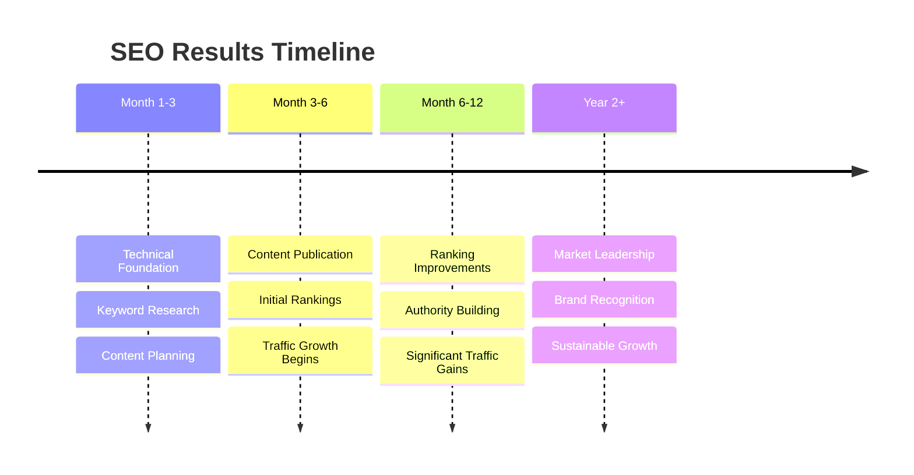

# SEO Fundamentals

Welcome to your journey into **Search Engine Optimization (SEO)**! This guide will introduce you to the core concepts that form the foundation of all successful SEO strategies.

## 🤔 What is SEO?

**Search Engine Optimization (SEO)** is the practice of improving your website to increase its visibility when people search for products or services related to your business in search engines like Google, Bing, and Yahoo.

### The Simple Definition
SEO is about making your website more attractive to search engines so they'll show it to people searching for what you offer.

### The Strategic Definition  
SEO is a comprehensive digital marketing strategy that combines technical optimization, content creation, and user experience improvements to earn higher rankings in search results and drive qualified organic traffic.

## 📈 Why SEO Matters

Understanding why SEO is crucial will help you appreciate the investment in time and resources it requires:

### **🔢 The Numbers Don't Lie**
- **93% of online experiences** begin with a search engine¹
- **75% of users** never scroll past the first page of search results²
- **SEO leads have a 14.6% close rate** compared to 1.7% for outbound leads³
- **Organic search** drives 53% of all website traffic⁴

*Sources: 1) Search Engine Journal, 2) HubSpot, 3) Search Engine Land, 4) BrightEdge*

### **💰 Business Impact**

#### **Cost-Effective Marketing**
- **No pay-per-click costs**: Once you rank, traffic is "free"
- **Long-term results**: Good SEO can drive traffic for months or years
- **Higher ROI**: SEO typically delivers better ROI than paid advertising
- **Compound growth**: SEO efforts build on each other over time

#### **Quality Traffic**
- **Intent-based**: Users are actively searching for what you offer
- **Qualified leads**: Higher conversion rates than other traffic sources
- **Local opportunity**: Capture local customers searching nearby
- **24/7 marketing**: Your website works while you sleep

#### **Competitive Advantage**
- **Market share**: Capture traffic your competitors are missing
- **Brand authority**: Higher rankings signal trustworthiness
- **First-mover advantage**: Difficult for competitors to displace established rankings

## 🎯 Core SEO Concepts

### **🔍 Search Engines vs. Directories**
- **Search engines** (Google, Bing) actively crawl and index web pages
- **Directories** (old Yahoo) required manual submission and categorization
- **Modern SEO** focuses on making content discoverable by search engine crawlers

### **🤖 Algorithms & Rankings**
- **Algorithms** are complex formulas that determine search rankings
- **200+ ranking factors** influence where your page appears
- **Updates happen constantly** - Google makes thousands of changes yearly
- **User experience** has become increasingly important

### **⏱️ SEO Timeline Expectations**

**Important**: SEO is a marathon, not a sprint. Sustainable results take time but are worth the wait.

## 🏗️ The Foundation of Modern SEO

### **📱 Mobile-First World**
- **Mobile searches** exceed desktop searches globally
- **Google uses mobile-first indexing** - they crawl mobile versions first
- **Mobile experience** directly impacts rankings
- **Page speed** is crucial, especially on mobile devices

### **🎯 User Intent Focus**
Modern SEO prioritizes understanding **why** people search, not just **what** they search for:

- **Informational**: "How to bake bread"
- **Commercial**: "Best bread makers 2024" 
- **Transactional**: "Buy KitchenAid bread maker"
- **Navigational**: "KitchenAid official website"

### **🔐 Trust & Authority**
Search engines evaluate websites based on:
- **E-A-T**: Expertise, Authoritativeness, Trustworthiness
- **Content quality**: Comprehensive, accurate, helpful information
- **Technical reliability**: Fast, secure, accessible websites
- **User signals**: How people interact with your content

## 🚀 SEO vs. Other Marketing Channels

### **SEO vs. Pay-Per-Click (PPC)**
| Factor | SEO | PPC |
|--------|-----|-----|
| **Cost** | Time investment | Direct ad spend |
| **Results Speed** | 3-6 months | Immediate |
| **Sustainability** | Long-term | Stops when you stop paying |
| **Click Trust** | Higher user trust | Some users skip ads |
| **ROI** | Higher long-term ROI | Immediate but ongoing cost |

### **SEO vs. Social Media Marketing**
- **SEO**: Captures demand (people actively searching)
- **Social**: Creates demand (builds awareness and interest)
- **Best approach**: Use both strategically for full-funnel marketing

### **SEO vs. Email Marketing**
- **SEO**: Attracts new potential customers
- **Email**: Nurtures existing relationships
- **Integration**: SEO brings visitors who can become email subscribers

## ✅ Quick SEO Readiness Check

Before diving deeper, assess your current position:

### **Technical Foundation**
- [ ] Website loads in under 3 seconds
- [ ] Mobile-friendly design
- [ ] HTTPS security certificate
- [ ] Google Search Console set up
- [ ] Google Analytics installed

### **Content Basics**
- [ ] Clear value proposition
- [ ] Target audience defined
- [ ] Competitor research completed
- [ ] Content calendar planned
- [ ] Keyword research started

### **Business Alignment**
- [ ] SEO goals match business objectives
- [ ] Budget allocated for SEO efforts
- [ ] Team committed to long-term strategy
- [ ] Success metrics defined
- [ ] Realistic timeline expectations

## 🎯 What's Next?

Now that you understand SEO fundamentals, you're ready to dive deeper:

1. **[How Search Engines Work](./how-search-engines-work.md)** - Understanding the technical process behind search
2. **[SEO Pillars: Authority, Relevance & Experience](./seo-pillars.md)** - The three foundations of ranking success  
3. **[Search Intent Optimization](./search-intent-optimization.md)** - Creating content that matches user needs
4. **[Measuring SEO Success](./measuring-success.md)** - Tracking progress and ROI

---

## 💡 Key Takeaways

✅ **SEO is about visibility** - helping search engines find and understand your content  
✅ **Results take time** - expect 3-6 months for significant improvement  
✅ **Quality over quantity** - focus on helpful, authoritative content  
✅ **Mobile-first** - optimize for mobile users and Google's mobile-first indexing  
✅ **User intent matters** - understand why people search, not just what they search for

**Remember**: SEO success comes from consistently providing value to users while making it easy for search engines to understand and rank your content.

---

*Ready to learn how search engines actually work behind the scenes? Continue to [How Search Engines Work →](./how-search-engines-work.md)*
