# The Three Pillars of SEO

Think of SEO like nutrition for your body - you need the right balance of three essential elements to stay healthy and thrive. Just as nutritionists tell us we need protein, carbohydrates, and fats in proper proportions, **successful SEO requires a balanced approach across three fundamental pillars**.

Neglect any one of these pillars, and your SEO performance will suffer. Master all three, and you'll build a sustainable foundation for long-term search success.

## 🏆 **SEO Success Framework**

```mermaid
graph TB
    A[🎯 AUTHORITY] --> D[🏆 SEO SUCCESS]
    B[📊 RELEVANCE] --> D
    C[⚡ EXPERIENCE] --> D
    
    A --> A1[Do you matter<br/>in your space?]
    B --> B1[Do you answer<br/>search intent?]
    C --> C1[Do users love<br/>your site?]
    
    D --> E[Sustainable Rankings<br/>& Organic Growth]
    
    style A fill:#ff6b6b,color:#fff
    style B fill:#4ecdc4,color:#fff
    style C fill:#45b7d1,color:#fff
    style D fill:#96ceb4,color:#fff
    style E fill:#feca57,color:#333
```

### **🔄 The Synergy Effect**
When all three pillars work together, you create an unstoppable SEO foundation that performs today and adapts to future algorithm changes.

---

## 1. **Authority** 🎯
*"Do you matter in your space?"*

Authority is about establishing your website as a trusted, credible source that search engines want to recommend to users. This was actually the **first problem Google solved** with their revolutionary PageRank algorithm - using links as "votes" to determine which pages deserved to rank.

### **Why Authority Matters:**
- **Trust signals**: Search engines want to serve users the most reliable, trustworthy results
- **User satisfaction**: Users who find authoritative content are more likely to return to the search engine
- **Competitive advantage**: Authority signals help search engines distinguish between millions of potential results
- **Long-term stability**: Authoritative sites maintain rankings even through algorithm changes

### **Building Authority Through:**

#### **🔗 Strategic Link Building**
Quality backlinks remain one of the strongest ranking signals:

- **Quality over quantity**: One link from a respected industry publication beats 100 links from low-quality directories
- **Relevance matters**: Links from topically related sites carry more weight
- **Natural link earning**: Create content so valuable that others naturally want to reference it
- **Relationship building**: Develop genuine connections with other authoritative sites in your industry

**Link Building Strategies:**

```mermaid
flowchart TD
    A[Link Building Strategy] --> B[Content-Based Links]
    A --> C[Relationship-Based Links]
    A --> D[Digital PR Links]
    
    B --> B1[📝 Ultimate Guides]
    B --> B2[📊 Original Research]
    B --> B3[🛠️ Free Tools]
    
    C --> C1[🤝 Industry Partnerships]
    C --> C2[👥 Expert Roundups]
    C --> C3[🎤 Podcast Interviews]
    
    D --> D1[📰 Press Releases]
    D --> D2[🏆 Awards & Recognition]
    D --> D3[📈 Industry Studies]
    
    style A fill:#ff6b6b,color:#fff
    style B fill:#ffaaa5
    style C fill:#ffaaa5
    style D fill:#ffaaa5
```

#### **📈 Demonstrating Expertise (E-A-T)**
Google's E-A-T guidelines (Expertise, Authoritativeness, Trustworthiness) are crucial:

- **Author credentials**: Showcase the qualifications of your content creators
- **About pages**: Clearly communicate your expertise and experience
- **Contact information**: Make it easy for users to reach you and verify your legitimacy
- **Industry recognition**: Awards, certifications, and mentions from authoritative sources
- **Professional profiles**: LinkedIn, industry directories, speaking engagements

#### **📝 Authoritative Content Creation**
Content that establishes you as a thought leader:

- **Original research**: Conduct studies, surveys, or experiments in your field
- **Comprehensive guides**: Create the definitive resource on important topics
- **Expert interviews**: Feature recognized authorities in your content
- **Case studies**: Share real results and detailed analysis
- **Industry insights**: Provide unique perspectives and predictions

### **📊 Authority Assessment Checklist**
- [ ] **Backlink Profile**: Growing number of high-quality, relevant backlinks
- [ ] **Author Expertise**: Clear demonstration of knowledge and credentials
- [ ] **Content Depth**: Comprehensive, well-researched content
- [ ] **Industry Recognition**: Mentions, citations, and partnerships
- [ ] **Trust Signals**: Contact info, testimonials, security certificates

**Pro Tip**: Think of authority like academic citations - the more respected sources that reference your work, and the more qualified you are to speak on a topic, the more authoritative you become.

---

## 2. **Relevance** 📊
*"Do you actually answer what people are searching for?"*

Relevance is about ensuring your content precisely matches what users are looking for when they type in their search queries. This goes far beyond simple keyword matching - modern search engines understand context, intent, and semantic relationships.

### **The Evolution of Relevance:**

### **Mastering Relevance Through:**

#### **🎯 Search Intent Optimization**
Understanding the four types of search intent:

- **Informational**: "How to optimize meta descriptions" → Comprehensive educational guides
- **Navigational**: "Google Search Console" → Direct access to tools/pages  
- **Commercial**: "Best SEO tools 2024" → Comparison and review content
- **Transactional**: "Hire SEO consultant" → Service pages with clear CTAs

**Intent Mapping Strategy:**

```mermaid
graph LR
    A[Keyword Research] --> B{Intent Analysis}
    B --> C[Informational]
    B --> D[Navigational]
    B --> E[Commercial]
    B --> F[Transactional]
    
    C --> C1[📚 Guides & Tutorials]
    D --> D1[🏠 Brand/Product Pages]
    E --> E1[📊 Comparisons & Reviews]
    F --> F1[🛒 Product/Service Pages]
    
    style B fill:#4ecdc4,color:#fff
```

#### **🔍 Advanced Keyword Strategy**
Modern keyword strategy goes beyond simple terms:

- **Primary keywords**: Your main target terms with decent search volume
- **Semantic keywords**: Related terms that add context and depth
- **Long-tail variations**: Specific phrases your audience actually uses
- **Entity optimization**: People, places, and things related to your topic
- **Question-based keywords**: What your audience is asking

#### **📚 Content Depth & Comprehensiveness**
Creating content that fully satisfies search intent:

- **Topic clusters**: Cover all aspects of your subject matter comprehensively
- **User questions**: Answer the questions your audience is actually asking
- **Content freshness**: Keep information current and regularly updated
- **Multi-format content**: Text, images, videos, and interactive elements
- **Internal linking**: Connect related topics to build topical authority

### **🎯 Modern Relevance Factors**

### **📊 Relevance Optimization Checklist**
- [ ] **Intent Alignment**: Content matches the primary search intent
- [ ] **Keyword Integration**: Natural use of target and semantic keywords
- [ ] **Content Depth**: Comprehensive coverage of the topic
- [ ] **Freshness**: Regular updates to maintain relevance
- [ ] **User Signals**: Low bounce rate, high engagement metrics

---

## 3. **Experience** ⚡
*"Do users (and search bots) have a great time on your site?"*

Experience encompasses both the technical health of your website and the actual user experience. Google has evolved from just looking at authority and relevance to caring deeply about whether users have a positive experience on the pages they recommend.

### **Why Experience Became Critical:**
- **User expectations**: Users expect fast, smooth, mobile-friendly experiences
- **Engagement signals**: Poor experiences lead to high bounce rates and low engagement
- **Measurable impact**: Search engines can measure user satisfaction through various signals
- **Technical barriers**: Technical issues can prevent search bots from properly crawling and indexing your site

### **Optimizing Experience Through:**

#### **⚡ Core Web Vitals & Performance**
Google's official user experience metrics:

- **Largest Contentful Paint (LCP)**: Main content loads within 2.5 seconds
- **First Input Delay (FID)**: Page responds to user interactions within 100ms  
- **Cumulative Layout Shift (CLS)**: Visual elements don't jump around unexpectedly
- **Overall page speed**: Aim for loading times under 3 seconds across all devices

**Performance Optimization Priority:**

```mermaid
graph TB
    A[Core Web Vitals] --> A1[⚡ LCP < 2.5s]
    A --> A2[👆 FID < 100ms]
    A --> A3[📐 CLS < 0.1]
    
    B[Technical Foundation] --> B1[📱 Mobile-First]
    B --> B2[🔒 HTTPS Security]
    B --> B3[🛠️ Clean Code]
    
    C[User Experience] --> C1[🧭 Easy Navigation]
    C --> C2[📖 Readable Content]
    C --> C3[🎯 Clear CTAs]
    
    A --> D[🏆 Excellent UX Score]
    B --> D
    C --> D
    
    style A fill:#45b7d1,color:#fff
    style B fill:#96ceb4,color:#fff
    style C fill:#feca57,color:#333
    style D fill:#ff6b6b,color:#fff
```

#### **📱 Mobile-First Excellence**
With mobile-first indexing, mobile experience is paramount:

- **Responsive design**: Looks great and functions perfectly on all device sizes
- **Touch-friendly navigation**: Easy to use with fingers, not just mouse cursors
- **Mobile page speed**: Often slower than desktop, needs special attention
- **Mobile-specific features**: Click-to-call buttons, location integration, app banners

#### **🛠️ Technical SEO Foundation**
The technical infrastructure that supports great experiences:

- **Crawlability**: Search bots can easily discover and access your pages
- **Site architecture**: Logical, hierarchical structure with clear navigation
- **HTTPS security**: Secure connections for user trust and search engine preference
- **Schema markup**: Structured data that helps search engines understand your content
- **URL structure**: Clean, descriptive URLs that make sense to users and bots

#### **👤 User Experience Signals**
Metrics that indicate user satisfaction:

- **Intuitive navigation**: Users can easily find what they're looking for
- **Content layout**: Information is well-organized and scannable
- **Internal linking**: Related content is easy to discover
- **Engagement metrics**: Time on page, pages per session, return visits
- **Conversion signals**: Users complete desired actions (signup, purchase, contact)

### **Experience Optimization Roadmap**

```mermaid
graph LR
    A[Technical Health] --> B[User Experience]
    B --> C[Search Bot Experience]
    C --> D[Performance Metrics]
    
    A --> A1[✅ Fast Loading]
    A --> A2[✅ Mobile Responsive]
    A --> A3[✅ Secure HTTPS]
    
    B --> B1[✅ Easy Navigation]
    B --> B2[✅ Quality Content]
    B --> B3[✅ Clear CTAs]
    
    C --> C1[✅ XML Sitemap]
    C --> C2[✅ Clean URLs]
    C --> C3[✅ Proper Redirects]
    
    D --> D1[✅ Core Web Vitals]
    D --> D2[✅ Engagement Metrics]
    D --> D3[✅ Conversion Rates]
```

### **⚡ Experience Optimization Checklist**
- [ ] **Core Web Vitals**: All metrics in "Good" range
- [ ] **Mobile Experience**: Perfect functionality on all devices
- [ ] **Technical Health**: No crawling or indexing issues
- [ ] **User Navigation**: Intuitive site structure and menus
- [ ] **Content Layout**: Scannable, well-organized information

---

## 🎯 **Bringing It All Together**

The magic happens when these three pillars work in harmony:

### **🔄 The Synergy Effect:**

**The Synergy Combinations:**
- **Authority + Relevance**: Authoritative content that perfectly matches search intent
- **Relevance + Experience**: Highly relevant content delivered through an exceptional user experience  
- **Experience + Authority**: Technical excellence that supports and amplifies your authoritative content
- **All Three Together**: The foundation for sustainable, long-term SEO success

### **💡 Strategic Implementation**

**Phase 1: Foundation (Month 1-2)**
- Audit current state of all three pillars
- Fix critical technical issues (Experience)
- Identify content gaps (Relevance)
- Assess authority baseline (Authority)

**Phase 2: Optimization (Month 3-6)**
- Improve Core Web Vitals and mobile experience
- Create intent-optimized content for target keywords
- Begin strategic link building and relationship development

**Phase 3: Scale & Amplify (Month 6+)**
- Expand content to cover broader topic clusters
- Develop thought leadership and industry recognition
- Continuously optimize based on performance data

---

## 💡 **Key Takeaways**

✅ **Balance is crucial** - neglecting any pillar weakens your overall SEO performance  
✅ **Authority takes time** - building genuine authority requires consistent effort over months/years  
✅ **Relevance evolves** - search intent and user needs change; stay adaptable  
✅ **Experience is measurable** - use tools like PageSpeed Insights and Search Console  
✅ **Synergy multiplies results** - the combination is more powerful than individual efforts

**💡 Remember**: Search engines want happy users who will return again and again. They achieve this by serving the most authoritative, relevant content through the best possible user experience.

Focus on these three pillars, and you'll build an SEO strategy that not only ranks well today but continues to perform as search algorithms evolve.

---

## 🎯 What's Next?

Now that you understand the strategic framework, let's dive into practical implementation:

**Continue to**: [Search Intent Optimization →](./search-intent-optimization.md)

*Ready to master the art of matching user intent? The next guide covers advanced techniques for creating content that perfectly answers what searchers are looking for.*
