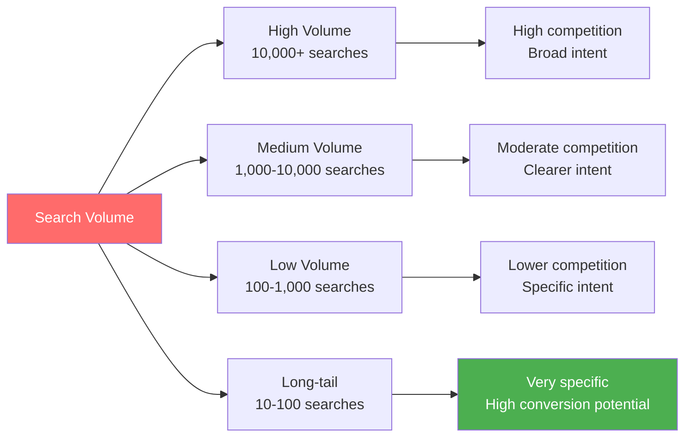
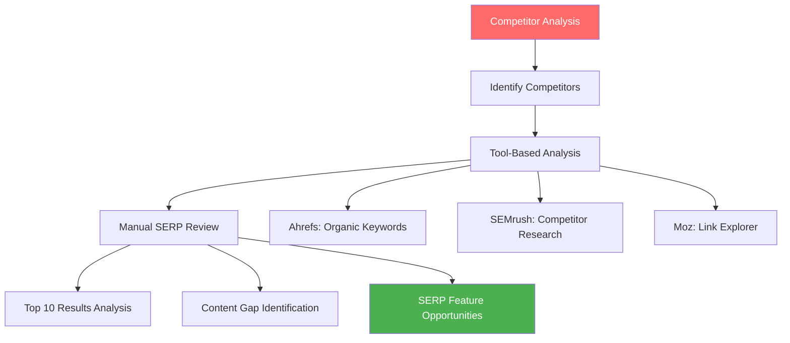
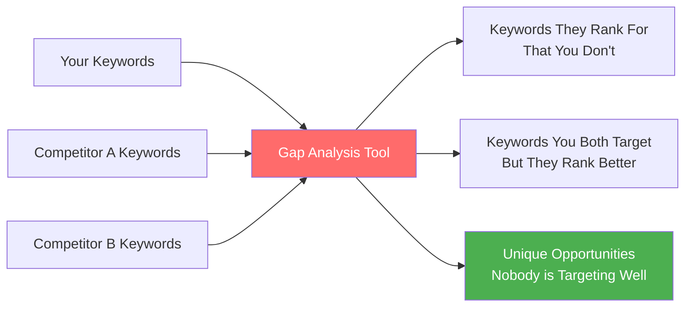

# Keyword Research Fundamentals

Master the foundational principles of keyword research that form the backbone of successful SEO strategies. This comprehensive guide covers everything from understanding search query anatomy to advanced competitive analysis.

## 🎯 **What Is Keyword Research?**

**Keyword research** is the systematic process of discovering, analyzing, and selecting the search terms that your target audience uses when looking for information, products, or services related to your business.

### **Why It's Critical for SEO Success**
- **Foundation of content strategy**: Keywords guide what content to create
- **Traffic prediction**: Estimate potential organic traffic from rankings
- **Competitive intelligence**: Understand what competitors are targeting
- **ROI optimization**: Focus efforts on keywords that drive business results

---

## 🔍 **Anatomy of a Search Query**

Understanding how people search is crucial for effective keyword research:

```mermaid
graph TB
    A[Search Query: "best SEO tools for small business 2024"] --> B[Head Term: "SEO tools"]
    A --> C[Modifiers: "best", "small business", "2024"]
    A --> D[Intent Signals: "best" = commercial]
    A --> E[Long-tail Elements: specific + recent]
    
    style A fill:#ff6b6b,color:#fff
    style B fill:#4ecdc4,color:#fff
    style C fill:#feca57,color:#333
    style D fill:#96ceb4,color:#fff
    style E fill:#45b7d1,color:#fff
```

### **Search Query Components**

#### **1. Head Terms**
- **Definition**: The main topic or concept (1-2 words)
- **Examples**: "SEO", "marketing", "coffee"
- **Characteristics**: High volume, high competition, broad intent

#### **2. Body Terms**
- **Definition**: More specific phrases (2-3 words)
- **Examples**: "SEO tools", "content marketing", "coffee maker"
- **Characteristics**: Medium volume, medium competition, clearer intent

#### **3. Long-Tail Keywords**
- **Definition**: Specific, detailed phrases (4+ words)
- **Examples**: "best SEO tools for small business", "coffee maker under $100"
- **Characteristics**: Lower volume, lower competition, specific intent

#### **4. Modifiers**
- **Quality indicators**: "best", "top", "recommended"
- **Commercial signals**: "buy", "price", "cost", "cheap"
- **Local modifiers**: "near me", city names, "local"
- **Time modifiers**: "2024", "latest", "new", "updated"

---

## 🎨 **The Four Types of Search Intent**

Every keyword has an underlying intent that determines what type of content should rank:

### **📚 Informational Intent (70% of searches)**
*"I want to learn something"*

**Query patterns:**
- "How to..."
- "What is..."
- "Why does..."
- "Guide to..."

**Content types that rank:**
- Blog posts and articles
- How-to guides
- Tutorials and explanations
- Research and studies

**Example keywords:**
- "how to do keyword research"
- "what is SEO"
- "content marketing strategy guide"

### **🧭 Navigational Intent (10% of searches)**
*"I want to find a specific website or brand"*

**Query patterns:**
- Brand names
- Product names + brand
- Website + login
- Company + contact

**Content types that rank:**
- Brand homepages
- Product pages
- Login pages
- Contact pages

**Example keywords:**
- "Google Analytics"
- "Ahrefs login"
- "Nike running shoes"

### **🛍️ Commercial Investigation Intent (15% of searches)**
*"I want to compare options before buying"*

**Query patterns:**
- "Best..."
- "Top 10..."
- "vs" or "compared to"
- "Review of..."

**Content types that rank:**
- Comparison articles
- Review roundups
- "Best of" lists
- Product comparisons

**Example keywords:**
- "best SEO tools 2024"
- "Ahrefs vs SEMrush"
- "top WordPress plugins"

### **💳 Transactional Intent (5% of searches)**
*"I want to buy or take action"*

**Query patterns:**
- "Buy..."
- "Price of..."
- "Discount..."
- Location + service

**Content types that rank:**
- Product pages
- Service pages
- Pricing pages
- Local business listings

**Example keywords:**
- "buy SEO audit"
- "hire SEO consultant"
- "SEO services pricing"

---

## 📊 **Key Keyword Metrics Explained**

### **1. Search Volume**
*How many times per month people search for this keyword*



**Important considerations:**
- **Volume isn't everything**: Low-volume keywords can be highly valuable
- **Seasonal variations**: Some keywords fluctuate throughout the year
- **Geographic differences**: Volume varies by location and language
- **Trend analysis**: Growing vs. declining search interest

### **2. Keyword Difficulty (KD)**
*How hard it will be to rank in the top 10 for this keyword*

**Difficulty scales** (varies by tool):
- **0-10**: Very easy - New sites can rank
- **11-30**: Easy - Some authority required
- **31-50**: Medium - Established sites needed
- **51-70**: Hard - Strong authority required
- **71-100**: Very hard - Top-tier sites only

**Factors affecting difficulty:**
- Domain authority of ranking pages
- Content quality and depth
- Number of referring domains
- User engagement signals
- SERP features present

### **3. Cost Per Click (CPC)**
*How much advertisers pay for this keyword in Google Ads*

**CPC insights:**
- **High CPC**: Commercial value, competitive market
- **Medium CPC**: Moderate commercial intent
- **Low CPC**: Informational queries, less commercial value
- **No CPC data**: Very specific or new keywords

### **4. Click-Through Rate (CTR)**
*Percentage of people who click on search results*

**CTR benchmarks:**
- **Position 1**: 28-35% average CTR
- **Position 2-3**: 15-25% average CTR
- **Position 4-6**: 7-15% average CTR
- **Position 7-10**: 2-7% average CTR

---

## 🏗️ **The Complete Keyword Research Process**

### **Phase 1: Business Foundation** 📋

#### **Step 1: Define Your Goals**
```markdown
Business Objective Examples:
- Increase brand awareness
- Generate more leads
- Drive product sales
- Build industry authority
- Capture local customers
```

#### **Step 2: Understand Your Audience**
- **Demographics**: Age, location, industry, job role
- **Pain points**: What problems do they need to solve?
- **Language**: How do they describe their problems/solutions?
- **Search behavior**: How do they search for information?

#### **Step 3: Inventory Your Content**
- Audit existing content and its target keywords
- Identify content gaps and opportunities
- Document current rankings and performance
- Map content to buyer journey stages

### **Phase 2: Seed Keyword Generation** 🌱

#### **Brainstorming Techniques**

**1. Core Business Terms**
```markdown
Service/Product Brainstorm:
- Main services/products you offer
- Industry terminology and jargon
- Problem-solving keywords
- Solution-oriented terms
```

**2. Customer Language Mining**
- Sales team feedback on common questions
- Customer support tickets and FAQs
- Social media comments and discussions
- Online reviews and testimonials

**3. Internal Site Search Analysis**
- Google Analytics: Site Search reports
- Internal search query logs
- Popular content and pages
- User behavior flow analysis

### **Phase 3: Keyword Expansion** 🔍

#### **Expansion Methods**

**1. Alphabet Soup Technique**
Type your seed keyword + each letter of the alphabet:
- "SEO a" → SEO audit, SEO analysis
- "SEO b" → SEO basics, SEO benefits
- "SEO c" → SEO checklist, SEO consultant

**2. Question-Based Research**
- Who, what, when, where, why, how
- "How to do SEO"
- "What is SEO audit"
- "Why is SEO important"

**3. Modifier Addition**
- **Quality**: best, top, ultimate, complete
- **Cost**: cheap, affordable, free, budget
- **Location**: local, near me, [city name]
- **Time**: 2024, latest, new, updated

### **Phase 4: Competitive Analysis** 🏆

#### **Competitor Identification**

**1. Direct Competitors**
- Companies offering similar products/services
- Same target audience and geographic area
- Similar business models and pricing

**2. SEO Competitors**
- Websites ranking for your target keywords
- May not be direct business competitors
- Content publishers and industry resources

#### **Competitive Keyword Research**



**Key competitive insights:**
- Keywords they rank for that you don't
- Content topics they're not covering
- Their strongest and weakest content areas
- Link building opportunities they've discovered

---

## 🎯 **Search Intent Analysis Deep Dive**

### **Intent Research Process**

#### **Step 1: SERP Analysis**
For each target keyword, analyze the top 10 results:

```markdown
SERP Analysis Checklist:
□ What content types are ranking? (blog posts, product pages, etc.)
□ What's the dominant search intent?
□ Are there mixed intents present?
□ What SERP features are showing?
□ How comprehensive is the top content?
□ What's the average content length?
□ What angles/topics are covered?
```

#### **Step 2: Content Format Matching**
**Match your content format to search intent:**

| Intent Type | Content Format | Example |
|-------------|----------------|---------|
| **Informational** | How-to guides, tutorials, explainers | "Complete Guide to Keyword Research" |
| **Navigational** | Brand pages, product pages, tools | "Ahrefs Keyword Explorer Tool" |
| **Commercial** | Comparisons, reviews, roundups | "10 Best SEO Tools Compared" |
| **Transactional** | Service pages, product pages, pricing | "Professional SEO Services" |

#### **Step 3: Intent Validation**
Use these signals to validate intent alignment:
- **Organic CTR**: High CTR indicates good intent match
- **Bounce rate**: Low bounce rate shows content satisfaction
- **Time on page**: Longer time suggests valuable content
- **Pages per session**: Multiple pages indicate engagement

---

## 🏅 **Keyword Difficulty Assessment**

### **Manual Difficulty Analysis**

#### **Page-Level Factors**
- **Content quality**: Depth, expertise, user experience
- **Content freshness**: Recently updated vs. outdated
- **Page authority**: Backlinks to the specific page
- **Technical SEO**: Page speed, mobile-friendliness, structure

#### **Domain-Level Factors**
- **Domain authority**: Overall site strength and trustworthiness
- **Topical authority**: Site's expertise in the subject area
- **Brand recognition**: Well-known brands have ranking advantages
- **Technical foundation**: Site-wide SEO health

### **SERP Competitiveness Signals**

**High Competition Signals:**
- Multiple high-authority domains (DA 60+)
- Long-form, comprehensive content (2000+ words)
- Many referring domains to top pages
- Presence of major brands or Wikipedia

**Lower Competition Opportunities:**
- Mix of authority levels in top 10
- Outdated content (2+ years old)
- Thin or low-quality content
- Technical SEO issues in ranking pages

---

## 📊 **Keyword Prioritization Framework**

### **The RICE Method for Keywords**

#### **Reach (Search Volume)**
- High volume: 10,000+ monthly searches = 10 points
- Medium volume: 1,000-10,000 searches = 7 points
- Low volume: 100-1,000 searches = 4 points
- Long-tail: 10-100 searches = 2 points

#### **Impact (Business Value)**
- **High impact**: Direct revenue keywords = 10 points
- **Medium impact**: Lead generation keywords = 7 points
- **Low impact**: Brand awareness keywords = 4 points
- **Minimal impact**: General information = 2 points

#### **Confidence (Ranking Probability)**
- **High confidence**: Low difficulty, good content match = 10 points
- **Medium confidence**: Medium difficulty, some advantages = 7 points
- **Low confidence**: High difficulty, strong competition = 4 points
- **Very low confidence**: Extremely competitive = 2 points

#### **Effort (Resources Required)**
- **Low effort**: Optimize existing content = 10 points
- **Medium effort**: Create new content = 7 points
- **High effort**: Comprehensive resource creation = 4 points
- **Very high effort**: Major content project = 2 points

### **RICE Score Calculation**
```
RICE Score = (Reach × Impact × Confidence) ÷ Effort
```

**Prioritization guidelines:**
- **Score 50+**: High priority, immediate action
- **Score 25-49**: Medium priority, plan for next quarter
- **Score 10-24**: Low priority, long-term consideration
- **Score under 10**: Deprioritize or eliminate

---

## 🎯 **Keyword Mapping & Organization**

### **Content-to-Keyword Mapping**

#### **Primary Keyword Assignment**
- **One primary keyword** per page/post
- **Focus the entire page** around this keyword
- **Include in title, headings, and throughout content**
- **Optimize meta tags** for the primary keyword

#### **Secondary Keyword Integration**
- **2-5 related keywords** that support the primary topic
- **Natural integration** throughout the content
- **Support the main topic** without keyword stuffing
- **Include semantic variations** and synonyms

### **Keyword Clustering**

```mermaid
graph TB
    A[Topic Cluster: "SEO Tools"] --> B[Primary Page: "Best SEO Tools 2024"]
    A --> C[Supporting Page: "Free SEO Tools"]
    A --> D[Supporting Page: "SEO Audit Tools"]
    A --> E[Supporting Page: "Keyword Research Tools"]
    A --> F[Supporting Page: "Link Building Tools"]
    
    B --> G[Internal Links to All Supporting Pages]
    C --> G
    D --> G
    E --> G
    F --> G
    
    style A fill:#ff6b6b,color:#fff
    style B fill:#4ecdc4,color:#fff
    style G fill:#4caf50,color:#fff
```

**Benefits of clustering:**
- **Topical authority**: Demonstrates expertise in subject areas
- **Internal linking**: Creates strong page relationship signals
- **User experience**: Helps users find related information
- **Content planning**: Systematic approach to content creation

---

## 🚨 **Common Keyword Research Mistakes**

### **❌ Volume-Only Focus**
**Mistake**: Choosing keywords solely based on search volume
**Why it's wrong**: High volume = high competition, often poor conversion
**✅ Better approach**: Balance volume, difficulty, and business relevance

### **❌ Ignoring User Intent**
**Mistake**: Targeting keywords without understanding searcher goals
**Why it's wrong**: Content won't match what users actually want
**✅ Better approach**: Always analyze intent before content creation

### **❌ Keyword Stuffing**
**Mistake**: Cramming multiple target keywords into one piece of content
**Why it's wrong**: Confuses search engines and users about page topic
**✅ Better approach**: Focus on one primary keyword per page

### **❌ Not Considering Seasonality**
**Mistake**: Targeting seasonal keywords year-round without timing consideration
**Why it's wrong**: Wastes effort during low-interest periods
**✅ Better approach**: Plan content timing based on seasonal trends

### **❌ Neglecting Long-Tail Opportunities**
**Mistake**: Only targeting high-volume, competitive head terms
**Why it's wrong**: Misses easier, more specific ranking opportunities
**✅ Better approach**: 70% long-tail, 30% head term strategy

---

## 📈 **Advanced Keyword Research Techniques**

### **1. Question-Based Keyword Research**

#### **Tools for Question Discovery**
- **AnswerThePublic**: Visual question mapping
- **AlsoAsked**: People Also Ask data
- **Quora/Reddit**: Real user questions
- **Google's People Also Ask**: Live SERP data

#### **Question Category Framework**
- **What**: Definitional queries ("What is SEO")
- **How**: Process and instruction queries ("How to do keyword research")
- **Why**: Reasoning and benefit queries ("Why is SEO important")
- **When**: Timing and frequency queries ("When to update keywords")
- **Where**: Location and placement queries ("Where to put keywords")
- **Who**: People and role-based queries ("Who needs SEO services")

### **2. Semantic Keyword Research**

#### **Understanding Semantic SEO**
Modern search engines understand:
- **Synonyms**: Different words with same meaning
- **Related terms**: Concepts connected to your main topic
- **Entity relationships**: How concepts connect to each other
- **Context clues**: Surrounding words that clarify meaning

#### **Semantic Research Process**
1. **Start with primary keyword**
2. **Use tools to find semantic keywords**:
   - LSIGraph for LSI keywords
   - Google's related searches
   - Keyword tool suggestions
3. **Analyze top-ranking content** for semantic terms
4. **Create comprehensive content** covering all aspects

### **3. Competitor Gap Analysis**

#### **Finding Competitor Keyword Gaps**



**Gap analysis process:**
1. **Identify 3-5 top competitors**
2. **Export their organic keywords** (using Ahrefs, SEMrush)
3. **Compare against your keyword list**
4. **Prioritize gap keywords** by difficulty and relevance
5. **Create content strategy** around opportunities

---

## 💡 **Key Takeaways**

✅ **Understand the anatomy** - Every keyword has volume, difficulty, intent, and business value  
✅ **Intent is king** - Match content to what searchers actually want  
✅ **Balance is crucial** - Mix high, medium, and low-volume keywords strategically  
✅ **Competition analysis matters** - Learn from what's already working  
✅ **Organization is key** - Map keywords to content systematically

**💡 Remember**: Great keyword research is part art, part science. Combine data insights with human understanding of your audience's needs and language.

---

## 🎯 **Next Steps**

Now that you understand the fundamentals, continue your keyword research journey:

**Continue to**: [Keyword Research Tools & Techniques →](./tools-and-techniques.md)

*Ready to put theory into practice? The next guide covers the specific tools and advanced techniques you'll need to execute professional-level keyword research.*
