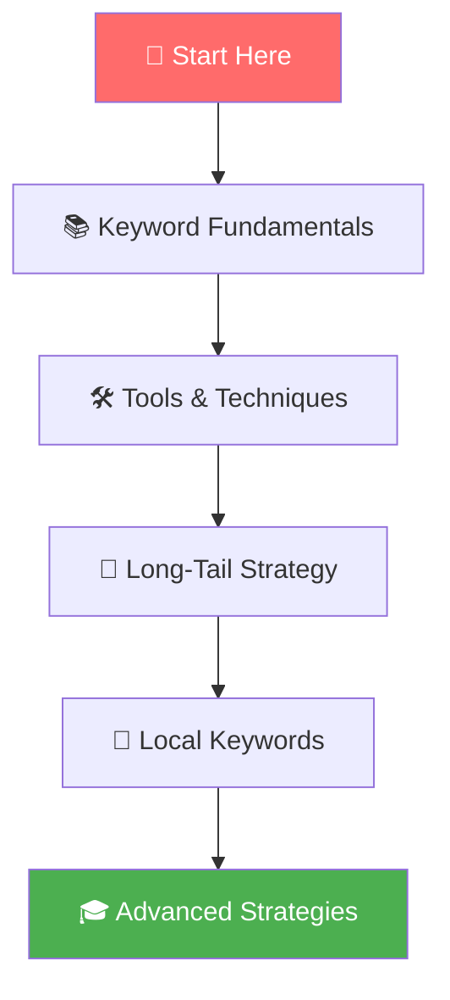
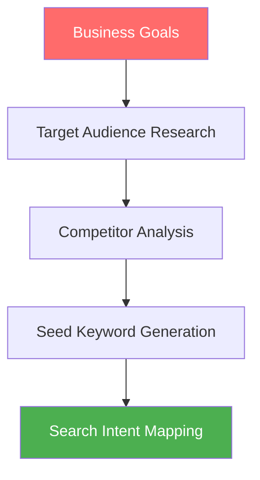
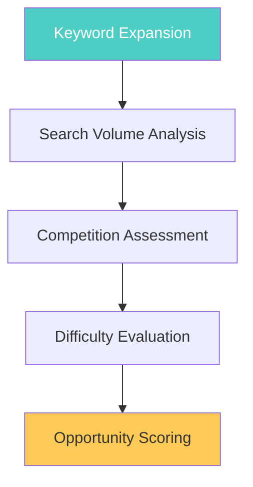
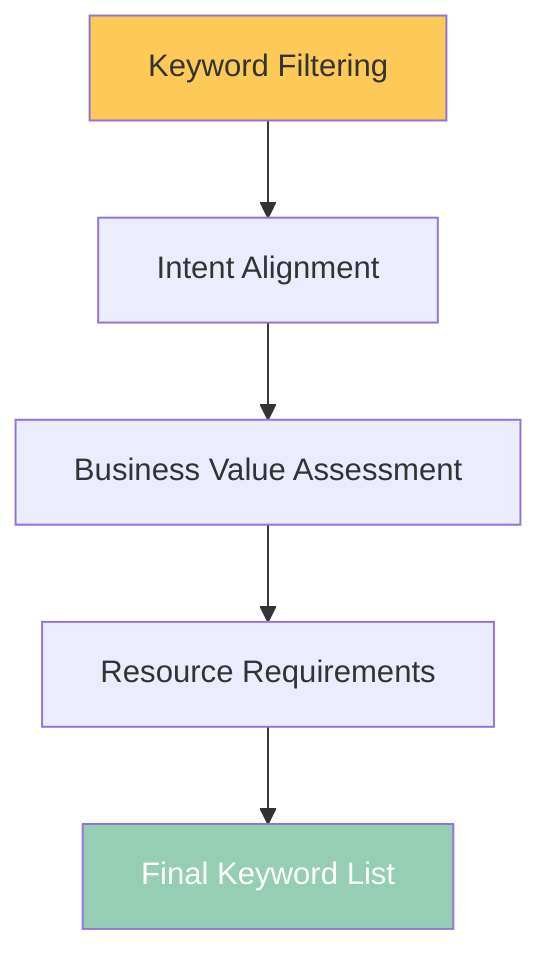
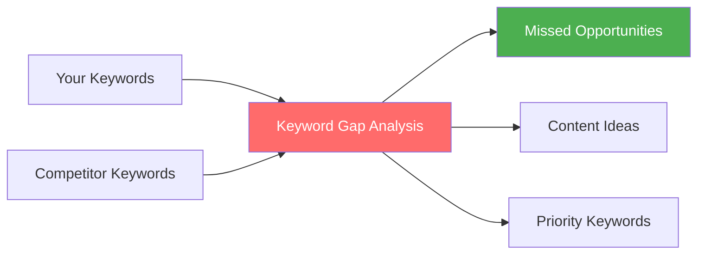

# Keyword Research Mastery

**Keyword research is the foundation of successful SEO**. It's the process of discovering, analyzing, and selecting the search terms your target audience uses to find businesses, products, or information like yours.

## 🎯 **Why Keyword Research Matters**

Effective keyword research is crucial because:
- **94% of all search queries** are 4 words or longer¹
- **Long-tail keywords** account for 70% of all search traffic²
- **Intent-matched content** receives 3x more organic traffic³
- **Proper keyword targeting** can improve conversion rates by up to 200%⁴

*Sources: 1) Ahrefs Study 2024, 2) Search Engine Land, 3) HubSpot Research, 4) WordStream Analytics*

---

## 🗺️ **Your Keyword Research Journey**

Master keyword research through our comprehensive learning path:



---

## 📚 **Step 1: Keyword Research Fundamentals**

**[Master Keyword Research Fundamentals →](./fundamentals.md)**

*Build a solid foundation in keyword research principles and methodologies*

### **What You'll Learn:**
- The anatomy of search queries and user intent
- How search volume, competition, and difficulty work together
- The keyword research process from start to finish
- How to identify your target audience's language
- Competitor keyword analysis strategies

**⏱️ Time to complete**: 25-30 minutes  
**📈 Skill level**: Beginner to Intermediate  
**🎯 Outcome**: Complete understanding of keyword research principles

---

## 🛠️ **Step 2: Tools & Techniques**

**[Explore Keyword Research Tools & Techniques →](./tools-and-techniques.md)**

*Master the tools and advanced techniques that professionals use*

### **What You'll Learn:**
- Free vs. premium keyword research tools comparison
- How to use Google Keyword Planner effectively
- Advanced techniques with Ahrefs, SEMrush, and Moz
- Creative keyword discovery methods
- Data analysis and keyword prioritization frameworks

**⏱️ Time to complete**: 35-40 minutes  
**📈 Skill level**: Intermediate  
**🎯 Outcome**: Hands-on proficiency with keyword research tools

---

## 🎯 **Step 3: Long-Tail Keyword Strategy**

**[Master Long-Tail Keywords →](./long-tail-keywords.md)**

*Discover how to find and leverage high-converting long-tail keywords*

### **What You'll Learn:**
- Why long-tail keywords drive better conversions
- How to systematically find long-tail opportunities
- Question-based keyword research strategies
- Voice search optimization techniques
- Content planning around long-tail keywords

**⏱️ Time to complete**: 30-35 minutes  
**📈 Skill level**: Intermediate to Advanced  
**🎯 Outcome**: Comprehensive long-tail keyword strategy

---

## 📍 **Step 4: Local Keyword Research**

**[Optimize for Local Search →](./local-keyword-research.md)**

*Capture local customers with location-based keyword strategies*

### **What You'll Learn:**
- Local search behavior and intent patterns
- "Near me" and geo-modifier research techniques
- Google My Business optimization keywords
- Multi-location keyword strategies
- Local competition analysis methods

**⏱️ Time to complete**: 25-30 minutes  
**📈 Skill level**: Intermediate  
**🎯 Outcome**: Complete local SEO keyword strategy

---

## 🚀 **The Complete Keyword Research Process**

### **Phase 1: Discovery & Planning** 📊



**Key Activities:**
- Define business objectives and target audience
- Analyze competitor keyword strategies
- Generate initial seed keyword list
- Map keywords to search intent types

### **Phase 2: Research & Analysis** 🔍



**Key Activities:**
- Expand keyword list using multiple sources
- Analyze search volume trends and seasonality
- Assess competitive landscape
- Score keyword opportunities

### **Phase 3: Selection & Prioritization** 🎯



**Key Activities:**
- Filter keywords by relevance and feasibility
- Ensure alignment with business goals
- Prioritize based on potential ROI
- Create implementation roadmap

---

## 📊 **Keyword Research Framework: The 4 Pillars**

### **1. 🎯 Relevance**
*How closely does the keyword match your business?*

- **Business alignment**: Products/services you actually offer
- **Audience match**: Terms your customers actually use
- **Content capability**: Topics you can create authoritative content about
- **Brand consistency**: Keywords that align with your brand message

### **2. 📈 Opportunity**
*What's the potential traffic and conversion value?*

- **Search volume**: Monthly search traffic potential
- **Trend analysis**: Growing, stable, or declining interest
- **Seasonal patterns**: Time-based search behavior
- **Conversion potential**: Intent-based value assessment

### **3. 🏆 Competition**
*How difficult will it be to rank for this keyword?*

- **Keyword difficulty**: Algorithm-based competition scores
- **SERP analysis**: Manual review of top 10 results
- **Content gaps**: Opportunities to create better content
- **Authority requirements**: Domain authority needed to compete

### **4. 🎨 Intent**
*What do searchers really want when they use this keyword?*

- **Informational**: Learning and research queries
- **Navigational**: Brand or website-specific searches
- **Commercial**: Comparison and evaluation searches  
- **Transactional**: Purchase-ready queries

---

## 🛠️ **Essential Keyword Research Tools**

### **🆓 Free Tools**

#### **Google Keyword Planner**
- **Best for**: Search volume data and Google Ads insights
- **Strengths**: Official Google data, historical trends
- **Limitations**: Broad volume ranges, requires Google Ads account

#### **Google Search Console**
- **Best for**: Performance data for existing content
- **Strengths**: Real user data, impression and click data
- **Limitations**: Only shows data for your website

#### **Google Trends**
- **Best for**: Trend analysis and seasonal patterns
- **Strengths**: Real-time data, comparative analysis
- **Limitations**: Relative data, not absolute numbers

### **💰 Premium Tools**

#### **Ahrefs Keywords Explorer**
- **Best for**: Comprehensive keyword research and analysis
- **Strengths**: Massive database, detailed metrics, SERP analysis
- **Pricing**: Starting at $99/month

#### **SEMrush Keyword Magic Tool**
- **Best for**: Competitor analysis and keyword discovery
- **Strengths**: Intent classification, question-based keywords
- **Pricing**: Starting at $119.95/month

#### **Moz Keyword Explorer**
- **Best for**: User-friendly interface and priority scores
- **Strengths**: Difficulty scores, SERP feature data
- **Pricing**: Starting at $99/month

---

## 📈 **Keyword Research Success Metrics**

### **Discovery Phase Metrics**
- **Keyword list size**: 500+ potential keywords identified
- **Intent coverage**: All 4 intent types represented
- **Competition spread**: Mix of low, medium, high difficulty
- **Search volume range**: Variety from high-volume to long-tail

### **Analysis Phase Metrics**
- **Data completeness**: Volume, difficulty, and CPC data for 80%+ of keywords
- **Competitor coverage**: Analysis of top 5-10 competitors
- **Content gap identification**: 20+ opportunity keywords found
- **Intent mapping**: Keywords properly categorized by search intent

### **Implementation Phase Metrics**
- **Content planning**: Editorial calendar created for top 50 keywords
- **Priority scoring**: Keywords ranked by business value and feasibility
- **Resource allocation**: Timeline and budget assigned to keyword targets
- **Success tracking**: KPIs defined for keyword performance measurement

---

## 🎯 **Quick Start Keyword Research Checklist**

### **Week 1: Foundation** 📊
```bash
Keyword Research Setup:
□ Define business goals and target audience
□ Set up Google Search Console and Analytics
□ Choose keyword research tool(s)
□ Create seed keyword list (20-50 terms)
□ Analyze top 5 competitors
```

### **Week 2: Discovery** 🔍
```bash
Keyword Expansion:
□ Use tools to expand seed keywords
□ Research question-based keywords
□ Analyze "People Also Ask" sections
□ Explore autocomplete suggestions
□ Aim for 200-500 keyword variants
```

### **Week 3: Analysis** 📈
```bash
Data Analysis:
□ Collect search volume and difficulty data
□ Analyze search intent for each keyword
□ Assess competitive landscape
□ Identify content gaps and opportunities
□ Score keywords by priority
```

### **Week 4: Strategy** 🎯
```bash
Implementation Planning:
□ Select top 50-100 target keywords
□ Create content calendar around keywords
□ Plan page-level keyword targeting
□ Set up rank tracking
□ Define success metrics and KPIs
```

---

## 🚨 **Common Keyword Research Mistakes**

### **❌ Targeting Only High-Volume Keywords**
**Problem**: High competition, low conversion rates, generic traffic  
**✅ Solution**: Balance high, medium, and low-volume keywords strategically

### **❌ Ignoring Search Intent**
**Problem**: Content that doesn't match what searchers want  
**✅ Solution**: Always analyze and match search intent before content creation

### **❌ Focusing Only on Exact Match Keywords**
**Problem**: Missing semantic and related keyword opportunities  
**✅ Solution**: Include semantic keywords, synonyms, and related terms

### **❌ Not Considering Seasonality**
**Problem**: Targeting seasonal keywords at the wrong time  
**✅ Solution**: Analyze trends and plan content timing accordingly

### **❌ Overlooking Long-Tail Keywords**
**Problem**: Missing highly-converting, lower-competition opportunities  
**✅ Solution**: Dedicate 60-70% of efforts to long-tail keyword targeting

---

## 💡 **Advanced Keyword Research Strategies**

### **🔍 Competitor Keyword Gap Analysis**
Identify keywords your competitors rank for but you don't:



### **📱 Voice Search Optimization**
Optimize for conversational, question-based queries:
- **Natural language patterns**: "How do I..." and "What is..."
- **Local intent**: "Near me" and location-specific queries
- **Answer-focused content**: Direct responses to common questions

### **🎯 Entity-Based Keyword Research**
Target people, places, and things related to your industry:
- **Industry entities**: Companies, products, technologies
- **Geographic entities**: Cities, regions, landmarks
- **Topical entities**: Concepts, processes, methodologies

---

## 📊 **Keyword Research ROI Calculation**

### **Expected Traffic Formula**
```
Potential Monthly Traffic = Search Volume × Expected CTR × Ranking Probability
```

### **Business Value Assessment**
- **Lead generation**: Keyword traffic × conversion rate × lead value
- **E-commerce**: Keyword traffic × conversion rate × average order value
- **Content marketing**: Brand awareness value + engagement metrics

### **Investment vs. Return**
- **Content creation costs**: Time and resources to create optimized content
- **Link building investment**: Outreach and relationship building costs
- **Tool and software expenses**: Monthly subscriptions and services
- **Time to results**: Expected timeline to achieve target rankings

---

## 🎯 **Next Steps in Your Keyword Journey**

Ready to dive deeper into keyword research? Here's your recommended path:

### **🚀 Immediate Actions**
1. **[Start with Fundamentals →](./fundamentals.md)** - Build your foundation
2. **[Explore Tools & Techniques →](./tools-and-techniques.md)** - Get hands-on experience
3. **[Master Long-Tail Keywords →](./long-tail-keywords.md)** - Find high-converting opportunities
4. **[Optimize for Local Search →](./local-keyword-research.md)** - Capture local customers

### **📚 Advanced Learning** *(Next in your SEO journey)*
After completing keyword research, continue with:
- **Technical SEO** - Ensure your site can rank for your target keywords
- **Content Optimization** - Create content that perfectly matches keyword intent
- **Link Building** - Build authority to rank for competitive keywords

---

## 💡 **Key Takeaways**

✅ **Keywords are the bridge** between what people search for and the content you provide  
✅ **Intent matters more than volume** - target keywords that match user goals  
✅ **Long-tail keywords convert better** - focus 70% of efforts on specific, longer queries  
✅ **Tools provide data, strategy drives results** - combine multiple data sources  
✅ **Keyword research never ends** - continuously refine and expand your keyword strategy

**💡 Remember**: Great keyword research leads to great content, which leads to great rankings. Invest time in understanding your audience's language and search behavior.

---

## 🤝 **Need Professional Keyword Research?**

Keyword research can be time-consuming and complex. If you need expert help or want to accelerate your results:

- **[Schedule a Free SEO Consultation →](https://omar-corral.com/#contact)**
- **[Explore Professional SEO Services →](https://omar-corral.com/services)**

*Let's work together to identify the keyword opportunities that will drive real business growth for your website.*
