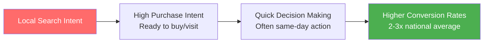
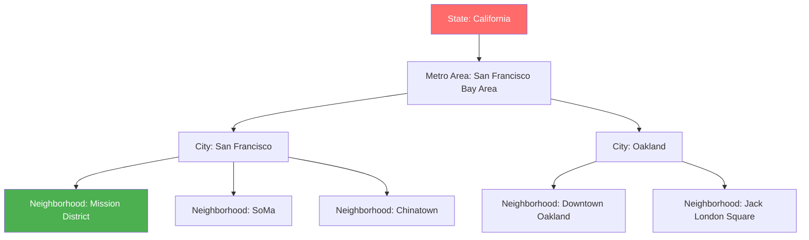
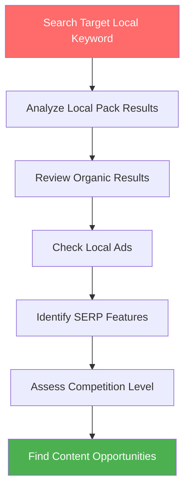
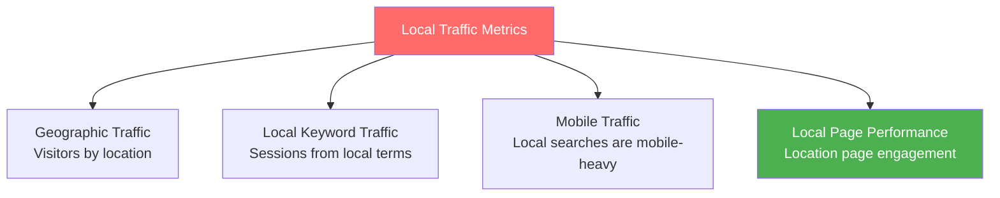

# Local Keyword Research

Local keyword research is essential for businesses that serve customers in specific geographic areas. Whether you're a local service provider, brick-and-mortar store, or multi-location enterprise, understanding how to research and target location-based keywords is crucial for capturing local customers.

## 🎯 **What Is Local Keyword Research?**

**Local keyword research** is the process of identifying and analyzing search terms that include geographic modifiers or have local search intent, used by people looking for products, services, or information in specific locations.

### **Local vs. National Keywords**

```mermaid
graph TB
    A[National Keyword<br/>"pizza delivery"<br/>Volume: 50K<br/>Competition: Very High<br/>Intent: General] 
    
    B[Regional Keyword<br/>"pizza delivery San Francisco"<br/>Volume: 2K<br/>Competition: High<br/>Intent: Local Area]
    
    C[City-Specific<br/>"pizza delivery downtown SF"<br/>Volume: 200<br/>Competition: Medium<br/>Intent: Specific Location]
    
    D[Hyper-Local<br/>"pizza delivery Mission District San Francisco"<br/>Volume: 50<br/>Competition: Low<br/>Intent: Very Specific]
    
    A --> B --> C --> D
    
    style A fill:#ff6b6b,color:#fff
    style D fill:#4caf50,color:#fff
```

### **Key Characteristics of Local Keywords**
- **Geographic modifiers**: Include city, state, neighborhood, or region names
- **"Near me" intent**: Implied or explicit location-based searches
- **Lower search volume**: More targeted than national terms
- **Higher conversion rates**: Users ready to take local action
- **Mobile-dominant**: 60% of local searches happen on mobile devices¹

*Source: 1) Google Local Search Statistics 2024*

---

## 📊 **Why Local Keywords Matter**

### **Local Search Statistics**
- **46% of all Google searches** have local intent²
- **76% of people** who search for something nearby visit a business within 24 hours³
- **28% of local searches** result in a purchase⁴
- **"Near me" searches** have grown 900% over two years⁵

*Sources: 2) Think with Google, 3) Google Local Search Study, 4) HubSpot Research, 5) Google Trends Data*

### **Business Impact of Local SEO**

#### **Immediate Customer Acquisition**


#### **Competitive Advantages**
- **Lower competition**: Less competition than national keywords
- **Higher relevance**: Exactly what local customers search for
- **Better ROI**: More qualified traffic and higher conversion rates
- **Voice search ready**: Natural language patterns align with voice queries

---

## 🔍 **Types of Local Keywords**

### **1. City/State Modifiers**
*Traditional geographic identifiers*

**Pattern Examples:**
- "[service] + [city]": "plumber Chicago"
- "[business] + [city, state]": "dentist Austin Texas"
- "[service] + in + [location]": "wedding venues in Miami"
- "[city] + [service]": "Denver SEO consultant"

### **2. "Near Me" Keywords**
*Location-agnostic searches with local intent*

**Search Patterns:**
- "[service] near me": "coffee shop near me"
- "[business] near me": "bookstore near me"  
- "[product] near me": "organic groceries near me"
- "near me [service]": "near me auto repair"

### **3. Neighborhood/District Keywords**
*Hyper-local geographic identifiers*

**Pattern Examples:**
- "[service] + [neighborhood]": "yoga classes Capitol Hill"
- "[neighborhood] + [business]": "SoHo restaurants"
- "[service] + [landmark/area]": "hotels near Times Square"
- "[local area] + [service]": "downtown Portland coffee"

### **4. Directional Modifiers**
*Geographic relationship indicators*

**Examples:**
- "north [city] [service]": "north Austin plumbing"
- "[service] downtown [city]": "parking downtown Seattle"
- "[service] uptown/midtown": "lawyers midtown Manhattan"
- "[service] [city] area": "contractors Denver area"

### **5. Service Area Keywords**
*Broader geographic coverage terms*

**Patterns:**
- "[service] [metro area]": "HVAC Dallas Fort Worth"
- "[service] [county]": "landscaping Orange County"
- "[service] [region]": "movers San Francisco Bay Area"
- "[state] [service]": "California wine tours"

---

## 🛠️ **Local Keyword Research Tools & Methods**

### **Free Local Keyword Research Tools**

#### **1. Google My Business Insights**
**Access**: Google My Business dashboard → Insights

**Data Provided:**
- **Search queries**: How customers found your listing
- **Discovery searches**: Brand vs. category searches
- **Action data**: Calls, directions, website visits
- **Geographic data**: Where searches originate

**Research Process:**
```markdown
GMB Insights Analysis:
1. Log into Google My Business
2. Go to Insights tab
3. Review "How customers search for your business"
4. Analyze "Queries used to find your business"
5. Export data for further analysis
6. Identify local keyword opportunities
```

#### **2. Google Trends (Geographic Filter)**
**Local Applications:**
- **Regional interest**: Compare keyword popularity by location
- **City-level data**: Drill down to specific metropolitan areas  
- **Seasonal local patterns**: Tourist vs. resident search behavior
- **Local event correlation**: Search spikes during local events

#### **3. Google Search Console (Geographic Filter)**
**Local Analysis:**
- **Performance by country**: Filter search data by location
- **Query analysis**: Identify local keywords you already rank for
- **Click data**: Local keywords driving traffic to your site
- **Impression data**: Local visibility opportunities

### **Premium Local Keyword Research Tools**

#### **1. BrightLocal Local Search Rank Checker**
**Features:**
- **Local pack rankings**: Track local map pack positions
- **Competitor tracking**: Monitor local competitor performance
- **Multi-location tracking**: Manage rankings across locations
- **SERP feature tracking**: Local ads, knowledge panels, etc.

#### **2. Ahrefs (Local Filters)**
**Local Research Capabilities:**
- **Geographic keyword filtering**: Search volume by location
- **Local competitor analysis**: Find local ranking competitors
- **SERP analysis**: Analyze local search results
- **Content gap analysis**: Local keywords competitors rank for

#### **3. SEMrush (Location-Based Analysis)**
**Local Features:**
- **Local keyword tracking**: City and region-specific rankings
- **Local advertising research**: PPC keywords and costs by location
- **Local business listings**: NAP consistency analysis
- **Competitor local strategy**: Local SEO competitive intelligence

---

## 🗺️ **Local Keyword Research Process**

### **Step 1: Define Your Service Area**

#### **Geographic Scope Planning**
```markdown
Service Area Definition:
□ Primary service area (within 15 minutes)
□ Secondary service area (within 30 minutes)  
□ Extended service area (special projects only)
□ Delivery/shipping zones (if applicable)
□ Seasonal service variations
□ Competition density by area
```

#### **Location Hierarchy Mapping**


### **Step 2: Local Keyword Discovery**

#### **Seed Keyword Generation**
1. **Core business terms**: Your main services/products
2. **Add location modifiers**: City, state, region, neighborhood
3. **Include directional terms**: North, south, downtown, uptown
4. **Consider local landmarks**: Near [famous location]

#### **Local Keyword Expansion Techniques**

**1. Autocomplete Method**
```markdown
Local Autocomplete Research:
- "[service] [city]" → Google autocomplete suggestions
- "[city] [service]" → Alternative word order patterns  
- "[service] near [landmark]" → Landmark-based variations
- "[neighborhood] [service]" → Hyper-local opportunities
```

**2. Related Search Mining**
- **Bottom of SERPs**: Local related searches
- **"People Also Ask"**: Local question patterns
- **Local competitor analysis**: What they're targeting
- **Local directory analysis**: Categories and descriptions

### **Step 3: Local Competition Analysis**

#### **Local SERP Analysis Process**


#### **Competitive Intelligence Gathering**
- **Local pack competitors**: Who appears in map results?
- **Organic local competitors**: Non-map local rankings
- **Local advertising competitors**: Who pays for local ads?
- **Content gap analysis**: What local topics they're missing

---

## 📱 **"Near Me" Search Optimization**

### **Understanding "Near Me" Behavior**

#### **"Near Me" Search Patterns**
- **Immediate need**: "urgent care near me"
- **Discovery searches**: "coffee shops near me"
- **Comparison searches**: "gas prices near me"
- **Event-based searches**: "restaurants near me now"

### **Mobile Search Context**


### **"Near Me" Optimization Strategy**

#### **Content Optimization**
- **Natural inclusion**: Include "near me" variations naturally
- **Local service pages**: Create location-specific landing pages
- **FAQ sections**: Answer "near me" related questions
- **Location descriptions**: Detailed area coverage information

#### **Technical Implementation**
- **Schema markup**: LocalBusiness and Service Area schema
- **Google My Business**: Complete and optimized profile
- **Local citations**: NAP consistency across directories
- **Mobile optimization**: Fast, mobile-friendly website

---

## 🏢 **Multi-Location Keyword Strategy**

### **Multi-Location Challenges**
- **Duplicate content**: Similar services across locations
- **Keyword cannibalization**: Locations competing for same terms
- **Content scalability**: Creating unique content for each location
- **Local relevance**: Maintaining local flavor at scale

### **Multi-Location Solutions**

#### **Location-Specific Landing Pages**
```markdown
Location Page Structure:
- Unique local content (not templated)
- Local testimonials and reviews
- Area-specific services or offerings
- Local landmarks and neighborhood info
- Unique photos from that location
- Local staff bios and expertise
- Community involvement/partnerships
```

#### **Localized Content Strategy**
```mermaid
graph TB
    A[Main Service: "Digital Marketing"] --> B[Location 1: Austin]
    A --> C[Location 2: Houston]  
    A --> D[Location 3: Dallas]
    
    B --> B1[Austin tech startup marketing]
    B --> B2[South by Southwest promotion]
    B --> B3[University of Texas partnerships]
    
    C --> C1[Houston energy sector marketing]
    C --> C2[Port of Houston logistics]
    C --> C3[NASA space industry focus]
    
    style A fill:#ff6b6b,color:#fff
    style B1 fill:#4caf50,color:#fff
```

---

## 🎯 **Local Keyword Content Strategy**

### **Content Types for Local Keywords**

#### **1. Location-Specific Service Pages**
- **Primary local keyword**: "SEO services Chicago"
- **Content focus**: How your service serves that specific location
- **Local elements**: Area-specific case studies, testimonials
- **Call-to-action**: Location-specific contact information

#### **2. Local Resource Pages**
- **Target keyword**: "Chicago small business resources"
- **Content type**: Helpful local information and resources
- **SEO benefit**: Builds local authority and attracts links
- **Business benefit**: Positions you as local expert

#### **3. Local Event/News Content**
- **Keywords**: "[city] [industry event]", "[local news] impact"
- **Content approach**: Commentary on local industry developments
- **Timeliness**: Fresh, newsworthy local content
- **Authority building**: Thought leadership in local market

#### **4. Neighborhood Guides**
- **Target keywords**: "[neighborhood] business guide"
- **Content depth**: Comprehensive area information
- **Local linking**: Connect to other local businesses (potential link sources)
- **User value**: Genuine help for people in/moving to the area

### **Local Content Optimization Checklist**

```markdown
Local Content Optimization:
□ Include target local keyword in title tag
□ Use local keyword variations in headers (H2, H3)
□ Mention specific local landmarks/areas
□ Include local contact information
□ Add local schema markup
□ Link to other local/location pages
□ Include local testimonials/reviews
□ Add location-specific images
□ Mention local partnerships/community involvement
□ Include area-specific FAQ sections
```

---

## 📊 **Measuring Local Keyword Success**

### **Local SEO KPIs**

#### **Visibility Metrics**
- **Local pack rankings**: Positions in map results
- **Organic local rankings**: Non-map search result positions
- **Local search visibility**: Percentage of local searches where you appear
- **Geographic ranking distribution**: Performance across target areas

#### **Traffic & Engagement Metrics**


#### **Business Impact Metrics**
- **Store visits**: Google My Business insights data
- **Phone calls**: Call tracking from local searches
- **Direction requests**: GMB directions data
- **Form submissions**: Location-specific contact forms
- **Revenue attribution**: Sales from local search traffic

### **Local Keyword Tracking Setup**

#### **Ranking Tracking Configuration**
```markdown
Local Tracking Setup:
□ Set up location-specific rank tracking
□ Monitor both desktop and mobile rankings
□ Track local pack positions separately
□ Include competitor tracking for each location
□ Set up automated ranking reports
□ Configure ranking change alerts
```

#### **Google Analytics Configuration**
- **Geographic segments**: Create location-based user segments
- **Local keyword tracking**: Monitor organic traffic from local terms
- **Goal tracking**: Set up local conversion tracking
- **Attribution modeling**: Understand local search to conversion path

---

## 🚨 **Common Local Keyword Research Mistakes**

### **❌ Targeting Too Broad Geographic Areas**
**Mistake**: Trying to rank for entire states or large regions
**Why it's wrong**: Dilutes local relevance and increases competition
**✅ Better approach**: Focus on realistic service areas and specific cities

### **❌ Ignoring Neighborhood-Level Keywords**
**Mistake**: Only targeting city-level keywords
**Example**: Only targeting "dentist Chicago" vs. "dentist Lincoln Park Chicago"
**✅ Better approach**: Include neighborhood and district-level terms

### **❌ Creating Duplicate Location Content**
**Mistake**: Using same content template across all locations
**Why it's wrong**: Google recognizes duplicate content and may not rank any version
**✅ Better approach**: Create unique, locally-relevant content for each location

### **❌ Not Optimizing for Mobile/Voice Search**
**Mistake**: Focusing only on desktop search optimization
**Why it's wrong**: Local searches are predominantly mobile and voice-driven
**✅ Better approach**: Mobile-first optimization with conversational keyword targeting

### **❌ Forgetting Google My Business Optimization**
**Mistake**: Only focusing on website optimization
**Why it's wrong**: Local pack rankings heavily depend on GMB optimization
**✅ Better approach**: Comprehensive local SEO including GMB management

---

## 🎯 **Local Keyword Research Action Plan**

### **Week 1: Foundation & Research**
```bash
Local Keyword Setup:
□ Define primary and secondary service areas
□ Set up Google My Business (if not already done)
□ Install Google Analytics with geographic tracking
□ Create initial list of seed local keywords
□ Research local competitors and their strategies
```

### **Week 2: Keyword Expansion**
```bash
Local Keyword Discovery:
□ Use autocomplete for local keyword variations
□ Mine "People Also Ask" for local questions
□ Analyze competitor local keyword strategies
□ Research neighborhood and district-level terms
□ Compile "near me" keyword opportunities
```

### **Week 3: Content Planning**
```bash
Local Content Strategy:
□ Plan location-specific landing pages
□ Create local resource/guide content ideas
□ Develop local FAQ content based on keywords
□ Plan local event and news content calendar
□ Map keywords to specific content pieces
```

### **Week 4: Implementation & Tracking**
```bash
Launch & Monitor:
□ Create and publish initial local content
□ Set up local keyword rank tracking
□ Configure Google Search Console for local monitoring
□ Implement local schema markup
□ Begin local citation building and GMB optimization
```

---

## 💡 **Advanced Local Keyword Strategies**

### **Seasonal Local Keyword Campaigns**

#### **Tourism and Seasonal Business**
```markdown
Seasonal Local Examples:
- Summer: "outdoor dining [city]", "summer festivals [area]"
- Fall: "pumpkin patches near me", "fall foliage tours [region]"  
- Winter: "holiday events [city]", "winter activities [area]"
- Spring: "cherry blossom [location]", "farmers markets [city]"
```

### **Local Event-Based Keywords**

#### **Conference and Event Optimization**
- **Major conferences**: "[conference name] [city] services"
- **Sporting events**: "[team] game day [service]"
- **Festivals**: "[festival name] [accommodations/services]"
- **Trade shows**: "[industry] trade show [city] [service]"

### **Crisis and Emergency Keywords**

#### **Time-Sensitive Local Needs**
- **Weather emergencies**: "emergency [service] [city]"
- **24/7 services**: "24 hour [service] near me"
- **Urgent services**: "same day [service] [location]"
- **Holiday hours**: "[service] open [holiday] [city]"

---

## 💡 **Key Takeaways**

✅ **46% of searches have local intent** - Local keywords are essential for most businesses  
✅ **"Near me" searches grew 900%** - Mobile and voice search drive local demand  
✅ **Local searches convert higher** - 76% visit businesses within 24 hours  
✅ **Multi-layered approach works** - Target city, neighborhood, and "near me" variations  
✅ **Local content must be unique** - Avoid templated content across locations

**💡 Remember**: Local keyword research is about understanding how your specific community searches for your services. Combine data-driven research with local market knowledge for best results.

---

## 🎯 **Complete Your Keyword Research Journey**

Congratulations! You've now mastered all aspects of keyword research. Here's how to apply your knowledge:

### **Implementation Priority**
1. **Start with fundamentals** - [Review SEO Fundamentals](./fundamentals.md)
2. **Master the tools** - [Implement Tools & Techniques](./tools-and-techniques.md)  
3. **Focus on long-tail** - [Apply Long-Tail Strategy](./long-tail-keywords.md)
4. **Optimize for local** - Apply the local strategies you just learned

### **Continue Your SEO Education**
Ready to move beyond keyword research? The next crucial step is:

**[Technical SEO →](../technical-seo/)** *(Coming Soon)*
*Ensure your website can actually rank for all those keywords you've researched.*

**[Content Optimization →](https://omar-corral.com/#contact)** - *Coming Soon - Contact for early access*
*Create content that perfectly matches keyword intent and drives conversions.*

---

## 🤝 **Need Local SEO Help?**

Local keyword research and implementation can be complex, especially for multi-location businesses. If you need expert guidance:

- **[Schedule a Free Local SEO Consultation →](https://omar-corral.com/#contact)**
- **[Get in Touch for SEO Help →](https://omar-corral.com/#contact)**

*Let's work together to dominate local search in your market and drive more qualified local customers to your business.*
