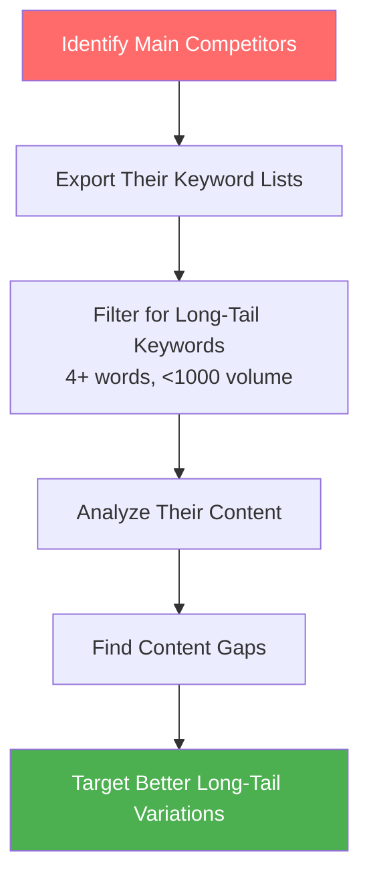
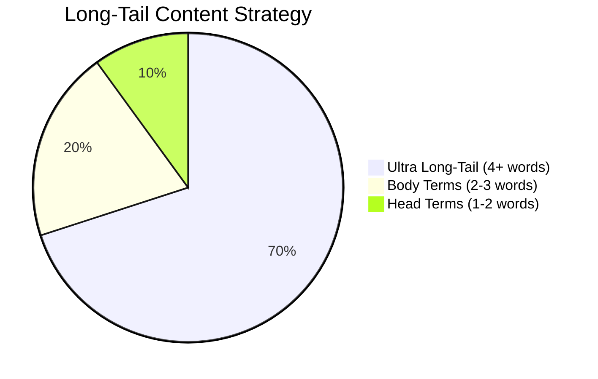
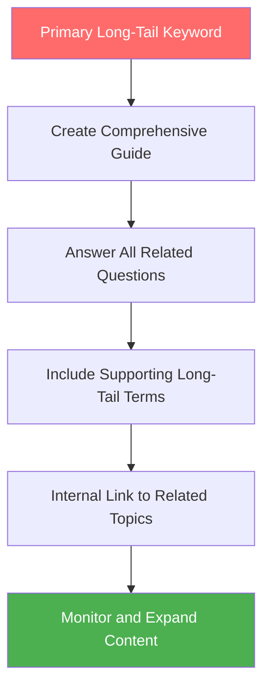
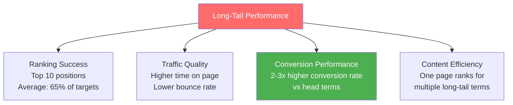

# Long-Tail Keyword Strategy

Long-tail keywords are the secret weapon of successful SEO campaigns. While your competitors fight over competitive head terms, smart SEO practitioners capture highly qualified traffic through strategic long-tail targeting.

## 🎯 **What Are Long-Tail Keywords?**

**Long-tail keywords** are longer, more specific search phrases typically containing 4+ words that have lower search volume but higher conversion potential than shorter, more generic terms.

### **The Long-Tail Spectrum**

```mermaid
graph LR
    A[Head Terms<br/>"SEO"<br/>Volume: 100K+<br/>Competition: Very High<br/>Intent: Broad] 
    
    B[Body Terms<br/>"SEO tools"<br/>Volume: 10K-50K<br/>Competition: High<br/>Intent: Moderate]
    
    C[Long-Tail<br/>"best SEO tools for small business"<br/>Volume: 100-1K<br/>Competition: Low<br/>Intent: Specific]
    
    D[Ultra Long-Tail<br/>"best free SEO tools for small business beginners 2024"<br/>Volume: 10-100<br/>Competition: Very Low<br/>Intent: Very Specific]
    
    A --> B --> C --> D
    
    style A fill:#ff6b6b,color:#fff
    style B fill:#feca57,color:#333
    style C fill:#4ecdc4,color:#fff
    style D fill:#4caf50,color:#fff
```

### **Key Characteristics**
- **4+ words long**: More specific and detailed
- **Lower search volume**: 10-1,000 monthly searches typically  
- **Higher conversion rates**: 2.5x higher conversion than head terms¹
- **Lower competition**: Easier to rank for
- **Clearer intent**: Users know exactly what they want

*Source: 1) WordStream Conversion Rate Study 2024*

---

## 📊 **Why Long-Tail Keywords Matter**

### **The 70-30 Rule**
- **70% of all searches** are long-tail queries²
- **30% of searches** have never been searched before³
- **Long-tail keywords** account for 70% of conversion-driving traffic⁴

*Sources: 2) Ahrefs Search Volume Study, 3) Google Search Statistics, 4) HubSpot Marketing Research*

### **Business Impact of Long-Tail Strategy**

#### **1. Higher Conversion Rates**
```mermaid
graph TB
    A[Head Term: "laptops"<br/>Intent: Browsing<br/>Conversion: 1.2%] 
    
    B[Body Term: "gaming laptops"<br/>Intent: Research<br/>Conversion: 2.8%]
    
    C[Long-Tail: "best gaming laptop under $1000"<br/>Intent: Comparison<br/>Conversion: 4.3%]
    
    D[Ultra Long-Tail: "best gaming laptop under $1000 for college students 2024"<br/>Intent: Purchase-Ready<br/>Conversion: 7.1%]
    
    style A fill:#ff6b6b,color:#fff
    style D fill:#4caf50,color:#fff
```

#### **2. Lower Cost Per Acquisition**
- **Less competition**: Lower keyword difficulty scores
- **Easier rankings**: Faster time to top 10 positions  
- **Better ROI**: Lower investment, higher conversion rates
- **Sustainable growth**: Build authority progressively

#### **3. Voice Search Optimization**
- **Conversational queries**: "Hey Google, what's the best..."
- **Question-based searches**: Natural language patterns
- **Local intent**: "Near me" and location-specific queries
- **Mobile-first behavior**: Voice searches are typically longer

---

## 🔍 **Types of Long-Tail Keywords**

### **1. Problem-Solution Keywords**
*Users describing specific problems and seeking solutions*

**Pattern Examples:**
- "how to fix [problem]"
- "why does [issue] happen"
- "[problem] troubleshooting guide"
- "solutions for [specific issue]"

**SEO Example:**
- Head term: "SEO"
- Long-tail: "how to fix SEO ranking drops after Google update"

### **2. Product/Service Specific Keywords**
*Highly targeted commercial queries*

**Pattern Examples:**
- "[product] for [specific use case]"
- "best [product] under [price]"
- "[service] in [location]"
- "[brand] vs [competitor] comparison"

**E-commerce Example:**
- Head term: "running shoes"
- Long-tail: "best lightweight running shoes for marathon training under $150"

### **3. Question-Based Keywords**
*Direct questions users type into search*

**Question Types:**
- **What**: "what is the best way to..."
- **How**: "how do I optimize..."
- **Why**: "why should I use..."
- **When**: "when should I start..."
- **Where**: "where can I find..."
- **Who**: "who should I hire for..."

### **4. Location-Based Long-Tail**
*Geographic modifiers for local businesses*

**Pattern Examples:**
- "[service] near [location]"
- "best [business type] in [city]"
- "[product] delivery [area]"
- "[service] [neighborhood] [city]"

**Local Example:**
- Head term: "dentist"
- Long-tail: "family dentist accepting new patients downtown Portland Oregon"

### **5. Seasonal/Temporal Long-Tail**
*Time-sensitive or seasonal queries*

**Pattern Examples:**
- "[topic] trends 2024"
- "best [product] for [season]"
- "[event] planning guide"
- "[service] Black Friday deals"

---

## 🛠️ **Long-Tail Keyword Discovery Methods**

### **1. Google Autocomplete Mining**

#### **Manual Autocomplete Technique**
```markdown
Step-by-Step Process:
1. Enter your seed keyword in Google
2. Add a space and try each letter: a-z
3. Record all autocomplete suggestions
4. Repeat with different modifiers
5. Use incognito mode for unbiased results
```

**Example Process:**
- "SEO a" → "SEO audit", "SEO analysis", "SEO agency"
- "SEO b" → "SEO basics", "SEO best practices", "SEO blog"
- "SEO c" → "SEO consultant", "SEO checklist", "SEO course"

#### **Automated Autocomplete Tools**
- **Keyword Tool**: Bulk autocomplete extraction
- **Ubersuggest**: Google, YouTube, Amazon, eBay suggestions
- **KeywordTool.io**: Multi-platform autocomplete mining
- **Soovle**: Aggregated suggestions from multiple platforms

### **2. "People Also Ask" Mining**

#### **Manual PAA Research**
```mermaid
graph TB
    A[Search Target Keyword] --> B[Find "People Also Ask" Box]
    B --> C[Click Each Question]
    C --> D[More Questions Appear]
    D --> E[Record All Questions]
    E --> F[Analyze Question Patterns]
    F --> G[Create Content Strategy]
    
    style A fill:#ff6b6b,color:#fff
    style G fill:#4caf50,color:#fff
```

#### **PAA Tools & Extensions**
- **AlsoAsked.com**: Comprehensive PAA question mining
- **Answer The Public**: Question visualization and clustering
- **People Also Ask Chrome Extension**: Quick PAA extraction
- **Keywords Everywhere**: Shows PAA volume data

### **3. Reddit & Community Mining**

#### **Community Research Process**
1. **Identify relevant subreddits**: Find your target audience communities
2. **Search for discussions**: Use Reddit search and Google site:reddit.com
3. **Analyze question patterns**: Common problems and language used
4. **Extract long-tail phrases**: Natural language used by real people

**Example Subreddits for SEO:**
- r/SEO, r/entrepreneur, r/smallbusiness, r/marketing, r/webdev

#### **Community Keyword Patterns**
- **Problem posts**: "Help! My website suddenly lost rankings..."
- **Recommendation requests**: "What's the best tool for..."
- **Experience sharing**: "I tried this strategy and..."
- **Comparison discussions**: "Should I use X or Y for..."

### **4. Customer Service Data Mining**

#### **Internal Data Sources**
```markdown
Customer Data Sources:
□ Support ticket analysis
□ Live chat transcripts  
□ FAQ page performance
□ Customer survey responses
□ Sales team objection logs
□ Social media comments
□ Product review analysis
```

#### **Language Pattern Analysis**
- **Customer vocabulary**: How they describe problems/solutions
- **Pain point keywords**: Specific issues they face
- **Solution-seeking language**: How they ask for help
- **Product-specific terms**: Internal vs. external terminology

### **5. Competitor Long-Tail Analysis**

#### **Competitor Research Tools**
- **Ahrefs Content Gap**: Keywords competitors rank for but you don't
- **SEMrush Keyword Gap**: Competitive keyword comparison
- **Moz Keyword Explorer**: Competitor keyword difficulty analysis
- **Manual SERP analysis**: Review competitor content for long-tail targeting

#### **Competitor Analysis Process**


---

## 🎯 **Long-Tail Keyword Strategy Development**

### **The 70-20-10 Content Distribution**



#### **70% Ultra Long-Tail Focus**
- **4+ word keywords**: Highly specific, low competition
- **Question-based content**: Detailed how-to guides and tutorials
- **Problem-solution content**: Address specific pain points
- **Comparison content**: "X vs Y for specific use case"

#### **20% Body Terms**
- **2-3 word keywords**: Medium competition, good volume
- **Pillar content**: Comprehensive topic coverage
- **Resource pages**: Tool lists and category pages
- **Service pages**: Main business offerings

#### **10% Head Terms**  
- **1-2 word keywords**: High competition, brand building
- **Homepage optimization**: Primary business terms
- **Category pages**: Main topic areas
- **Authority building**: Thought leadership content

### **Content Mapping for Long-Tail Keywords**

#### **Content Types by Intent**

| Long-Tail Intent | Content Type | Example |
|------------------|--------------|---------|
| **How-to Questions** | Step-by-step guides | "How to optimize WordPress for SEO speed" |
| **Problem-Solving** | Troubleshooting guides | "Why is my website not ranking on Google" |
| **Comparison** | Detailed comparisons | "Ahrefs vs SEMrush for small business SEO" |
| **Best/Top Lists** | Curated recommendations | "Best free SEO tools for beginners 2024" |
| **Local Intent** | Location-specific pages | "SEO consultant for restaurants in Chicago" |

#### **Content Depth Strategy**
- **Comprehensive coverage**: Answer all related questions
- **Internal linking**: Connect related long-tail topics
- **Topic clusters**: Group related long-tail keywords
- **Progressive depth**: Start broad, get more specific

---

## 🗺️ **Long-Tail Content Planning Framework**

### **The Question-Answer Content Model**

#### **Step 1: Question Research**
```markdown
Question Discovery Process:
1. Use AnswerThePublic for question mining
2. Analyze "People Also Ask" sections
3. Review customer service FAQ data
4. Monitor community discussions
5. Survey your audience directly
```

#### **Step 2: Question Categorization**
- **Awareness stage**: "What is..." and "Why should..."
- **Consideration stage**: "How to choose..." and "Best ways to..."
- **Decision stage**: "Where to buy..." and specific product queries

#### **Step 3: Content Creation**


### **Topic Cluster Strategy for Long-Tail Keywords**

#### **Hub and Spoke Model**
```mermaid
graph TB
    A[Pillar Page: "SEO Tools"] --> B[Long-Tail: "Best free SEO tools for beginners"]
    A --> C[Long-Tail: "SEO tools for WordPress websites"]
    A --> D[Long-Tail: "SEO audit tools comparison 2024"]
    A --> E[Long-Tail: "Local SEO tools for small business"]
    A --> F[Long-Tail: "SEO tools for e-commerce stores"]
    
    B --> G[Internal Linking Network]
    C --> G
    D --> G
    E --> G
    F --> G
    
    style A fill:#ff6b6b,color:#fff
    style G fill:#4caf50,color:#fff
```

**Benefits of clustering:**
- **Topical authority**: Demonstrate expertise across related long-tail terms
- **Internal link power**: Boost rankings for all related keywords
- **User journey optimization**: Guide users through related content
- **Content efficiency**: One comprehensive resource ranks for multiple terms

---

## 📱 **Voice Search & Long-Tail Optimization**

### **Voice Search Characteristics**

#### **Conversational Patterns**
- **Natural language**: Full sentences instead of keywords
- **Question format**: "What's the best way to..."
- **Local intent**: "Near me" and location-specific queries
- **Action-oriented**: "Find me..." and "Show me..."

#### **Voice vs. Text Search Differences**

| Aspect | Text Search | Voice Search |
|--------|-------------|--------------|
| **Length** | 2-4 words | 7+ words |
| **Format** | Keywords | Full questions |
| **Intent** | Mixed | Specific action |
| **Location** | Sometimes | Often local |
| **Device** | Desktop/mobile | Mobile/smart speakers |

### **Voice Search Optimization Strategy**

#### **1. FAQ-Style Content**
- **Question headers**: Use exact questions as H2/H3 tags
- **Concise answers**: 40-50 word featured snippet-friendly responses
- **Conversational tone**: Natural, human-like language
- **Local context**: Include location-relevant information

#### **2. Schema Markup for Voice**
- **FAQ Schema**: Mark up Q&A content for rich results
- **How-to Schema**: Structure step-by-step instructions
- **Local Business Schema**: Enable local voice search results
- **Speakable Schema**: Mark content suitable for voice reading

#### **3. Mobile and Speed Optimization**
- **Core Web Vitals**: Fast loading for mobile voice searches
- **Mobile-first design**: Touch-friendly interface for voice users
- **Local optimization**: Google My Business and local citations
- **HTTPS requirement**: Security necessary for voice results

---

## 🎨 **Advanced Long-Tail Techniques**

### **1. Modular Long-Tail Strategy**

#### **Building Block Approach**
```mermaid
graph LR
    A[Base Term:<br/>"SEO tools"] 
    B[User Type:<br/>"for beginners"]
    C[Feature:<br/>"free"]
    D[Year:<br/>"2024"]
    E[Platform:<br/>"WordPress"]
    
    A + B + C --> F["free SEO tools for beginners"]
    A + C + D --> G["free SEO tools 2024"]  
    A + B + E --> H["SEO tools for WordPress beginners"]
    A + B + C + D --> I["best free SEO tools for beginners 2024"]
    
    style A fill:#ff6b6b,color:#fff
    style I fill:#4caf50,color:#fff
```

**Modifier Categories:**
- **Quality modifiers**: best, top, ultimate, complete
- **Price modifiers**: free, cheap, affordable, premium
- **User modifiers**: beginner, advanced, professional, small business  
- **Time modifiers**: 2024, latest, new, updated
- **Feature modifiers**: easy, fast, comprehensive, detailed

### **2. Semantic Long-Tail Expansion**

#### **Entity-Based Long-Tail Research**
- **People entities**: "Neil Patel SEO strategies for beginners"
- **Brand entities**: "Ahrefs vs SEMrush for keyword research"
- **Location entities**: "SEO services in San Francisco Bay Area"
- **Event entities**: "SEO conference 2024 speaker lineup"

#### **Topic Modeling for Long-Tail**
1. **Identify core topics** in your industry
2. **Map related subtopics** and entities
3. **Create long-tail variations** for each combination
4. **Prioritize by search volume** and business relevance

### **3. Seasonal Long-Tail Campaigns**

#### **Seasonal Keyword Patterns**
```markdown
Seasonal Long-Tail Examples:
- Q4: "Black Friday SEO tools deals 2024"
- Q1: "New Year SEO strategy planning guide"
- Q2: "Summer digital marketing campaign ideas"
- Q3: "Back to school SEO for education websites"
```

#### **Holiday and Event-Based Long-Tail**
- **Holiday keywords**: Product/service + holiday modifier
- **Industry events**: Conference, trade show, and event-related terms
- **Seasonal problems**: Weather, time-specific challenges
- **Annual planning**: New Year, quarterly, annual strategy keywords

---

## 📊 **Measuring Long-Tail Keyword Success**

### **Long-Tail Specific Metrics**

#### **Discovery Metrics**
- **Long-tail percentage**: 60-70% of total keyword targets
- **Question keyword ratio**: 30-40% question-based long-tail terms
- **Competition distribution**: Average KD score under 30 for long-tail terms
- **Intent coverage**: Representation across all search intents

#### **Performance Metrics**


#### **Business Impact Metrics**
- **Qualified traffic increase**: Higher-intent visitors from long-tail terms
- **Lead quality improvement**: Better lead-to-customer conversion rates
- **Cost per acquisition**: Lower CPA from organic long-tail traffic
- **Customer lifetime value**: Higher LTV from long-tail acquired customers

### **Long-Tail ROI Analysis**

#### **Content Investment vs. Returns**
```markdown
Long-Tail ROI Calculation:
Content Creation Cost: $500 (comprehensive guide)
Long-Tail Keywords Targeted: 15-25 variations
Average Ranking Time: 3-6 months
Traffic Potential: 500-1,500 monthly visitors
Conversion Rate: 4-8% (vs 1-2% for head terms)
Customer Value: $200 average
ROI: 400-800% within 12 months
```

#### **Scalability Benefits**
- **Content efficiency**: One piece targets multiple long-tail keywords
- **Compound growth**: Long-tail content builds authority over time
- **Lower competition**: Easier to defend rankings long-term
- **Voice search ready**: Positions for future search behavior

---

## 🚨 **Common Long-Tail Keyword Mistakes**

### **❌ Targeting Too Generic**
**Mistake**: Choosing long-tail keywords that are still too broad
**Example**: "best SEO tools" (still competitive)
**✅ Better approach**: "best free SEO audit tools for WordPress beginners"

### **❌ Ignoring Search Intent**
**Mistake**: Creating informational content for commercial long-tail keywords
**Example**: Writing "how-to" content for "buy [product] online" keywords
**✅ Better approach**: Match content type to keyword intent

### **❌ Keyword Stuffing Long-Tail Terms**
**Mistake**: Forcing exact long-tail phrases unnaturally into content
**Example**: Repeating "best free SEO tools for small business" 10 times
**✅ Better approach**: Use natural variations and semantic terms

### **❌ Not Tracking Long-Tail Performance**
**Mistake**: Only monitoring head term rankings and traffic
**Why it's wrong**: Missing the majority of your keyword performance
**✅ Better approach**: Track all long-tail variations and group performance

### **❌ Creating Thin Content**
**Mistake**: Writing short articles targeting long-tail keywords
**Why it's wrong**: Long-tail users expect comprehensive information
**✅ Better approach**: Create detailed, helpful content that fully addresses the query

---

## 💡 **Long-Tail Content Creation Best Practices**

### **Content Depth and Quality**

#### **Comprehensive Topic Coverage**
- **Answer all related questions**: Address every aspect of the topic
- **Include supporting information**: Background context and details
- **Add practical examples**: Real-world applications and case studies
- **Update regularly**: Keep information current and accurate

#### **User Experience Optimization**
- **Scannable format**: Use headers, bullets, and visual elements
- **Internal linking**: Connect to related long-tail content
- **Call-to-actions**: Guide users to next steps
- **Mobile optimization**: Ensure great mobile experience

### **Technical Implementation**

#### **On-Page Optimization**
- **Title tag**: Include primary long-tail keyword naturally
- **Meta description**: Compelling description matching search intent
- **Header tags**: Use long-tail variations in H2, H3 tags
- **URL structure**: Clean, descriptive URLs with key terms

#### **Schema Markup**
- **FAQ schema**: For question-based long-tail content
- **Article schema**: For comprehensive guides and tutorials
- **How-to schema**: For step-by-step instruction content
- **Local schema**: For location-based long-tail keywords

---

## 🎯 **Long-Tail Keyword Action Plan**

### **Month 1: Foundation**
```bash
Long-Tail Research Setup:
□ Audit current keyword targeting (head vs long-tail ratio)
□ Set up Google Search Console to track current long-tail performance  
□ Choose long-tail keyword research tools (free or premium)
□ Identify 5-10 seed keywords for expansion
□ Create initial long-tail keyword list (100+ terms)
```

### **Month 2: Content Planning**
```bash
Content Strategy Development:
□ Analyze search intent for top long-tail targets
□ Group long-tail keywords into topic clusters
□ Create content calendar focusing on long-tail terms
□ Plan comprehensive guides targeting multiple variations
□ Set up tracking for long-tail keyword performance
```

### **Month 3: Content Creation**
```bash
Implementation & Optimization:
□ Create 2-3 comprehensive long-tail focused articles
□ Optimize existing content for long-tail keywords
□ Implement internal linking between related topics
□ Add schema markup for better voice search visibility
□ Monitor early ranking and traffic performance
```

### **Month 4+: Scale and Optimize**
```bash
Growth & Refinement:
□ Analyze performance of initial long-tail content
□ Expand successful content with more long-tail variations
□ Identify new long-tail opportunities from GSC data
□ Create FAQ pages targeting question-based long-tail terms
□ Develop voice search optimized content
```

---

## 💡 **Key Takeaways**

✅ **70% of searches are long-tail** - Focus most efforts on specific, detailed queries  
✅ **Higher conversion rates** - Long-tail keywords convert 2-3x better than head terms  
✅ **Lower competition** - Easier to rank and faster results  
✅ **Voice search ready** - Conversational long-tail terms perform well in voice search  
✅ **Content efficiency** - One comprehensive piece can rank for many long-tail variations

**💡 Remember**: Long-tail keyword strategy is about understanding the specific language your audience uses and creating helpful content that directly addresses their needs.

---

## 🎯 **Next Steps**

Ready to apply long-tail strategies to local search? Continue with:

**Continue to**: [Local Keyword Research →](./local-keyword-research.md)

*Learn how to combine long-tail strategies with local SEO to capture customers in your geographic area.*
