# Keyword Research Tools & Techniques

Transform your keyword research from guesswork to data-driven strategy. This comprehensive guide covers the essential tools, techniques, and methodologies that SEO professionals use to discover high-value keyword opportunities.

## 🛠️ **The Complete Keyword Research Toolkit**

### **Tool Categories Overview**

```mermaid
flowchart TB
    A[Keyword Research Tools] --> B[🆓 Free Tools]
    A --> C[💰 Premium Tools]
    A --> D[🔧 Specialized Tools]
    
    B --> B1[Google Keyword Planner<br/>Search Console<br/>Google Trends<br/>Answer The Public]
    
    C --> C1[Ahrefs Keywords Explorer<br/>SEMrush Keyword Magic<br/>Moz Keyword Explorer]
    
    D --> D1[Screaming Frog<br/>AlsoAsked<br/>Keywords Everywhere]
    
    style A fill:#ff6b6b,color:#fff
    style B fill:#4ecdc4,color:#fff
    style C fill:#feca57,color:#333
    style D fill:#96ceb4,color:#fff
```



---

## 🆓 **Essential Free Tools**

### **1. Google Keyword Planner**
*The foundation of keyword research*

#### **Access & Setup**
1. **Create Google Ads account** (no spend required)
2. **Navigate to Tools & Settings** → Keyword Planner
3. **Choose research method**: Discover new keywords or get search volume

#### **Core Features**

**Keyword Discovery:**
- **Seed keyword expansion**: Enter 1-10 seed keywords
- **Website analysis**: Analyze your own or competitor websites
- **Category exploration**: Browse by business categories

**Data Provided:**
- **Search volume ranges**: Broad estimates (10-100, 100-1K, etc.)
- **Competition level**: Low, Medium, High (for Google Ads)
- **Bid estimates**: Suggested CPC ranges
- **Seasonal trends**: 12-month trend data

#### **Advanced Google Keyword Planner Techniques**

**1. Seed Keyword Strategy**
```markdown
Effective Seed Keywords:
□ Use 3-5 closely related terms
□ Include product/service names
□ Add location modifiers for local business
□ Mix broad and specific terms
□ Include competitor brand names
```

**2. Geographic Targeting**
- **Country-specific data**: Target specific markets
- **City-level insights**: Local business optimization
- **Language targeting**: Multi-lingual keyword research

**3. Device Segmentation**
- **Mobile vs. Desktop**: Different search patterns
- **Tablet insights**: Unique user behavior patterns
- **Cross-device analysis**: Comprehensive search understanding

#### **Google Keyword Planner Limitations**
- **Volume ranges**: No exact numbers without ad spend
- **Limited long-tail data**: Focus on higher volume terms
- **Commercial bias**: Designed for Google Ads, not organic SEO
- **Login required**: Need Google Ads account access

### **2. Google Search Console**
*Your website's search performance goldmine*

#### **Essential Reports for Keyword Research**

**Performance Report:**
- **Queries tab**: See what you already rank for
- **Impressions data**: Keywords where you appear but don't click
- **Position data**: Average ranking positions
- **Click-through rates**: Performance by keyword

**Keyword Discovery Process:**


**Advanced GSC Techniques:**
1. **Filter by high impressions, low CTR**: Optimization opportunities
2. **Compare date ranges**: Identify trending keywords
3. **Device segmentation**: Mobile vs. desktop performance
4. **Page-level analysis**: Content optimization opportunities

### **3. Google Trends**
*Understanding search behavior over time*

#### **Key Applications**

**1. Seasonality Analysis**
- **Identify peak seasons**: Plan content timing
- **Avoid declining trends**: Don't invest in dying keywords
- **Regional variations**: Geographic search differences

**2. Keyword Comparison**
- **Trend comparison**: Up to 5 keywords simultaneously
- **Related queries**: Discover connected terms
- **Rising searches**: Identify emerging opportunities

**3. Content Ideas**
- **Trending topics**: Real-time popular searches
- **Seasonal content**: Plan evergreen vs. timely content
- **Geographic insights**: Location-specific content opportunities

#### **Google Trends Advanced Features**

**Search Filters:**
- **Time range**: Past hour to 2004 data
- **Categories**: Refine by industry/topic
- **Search type**: Web, Image, News, Shopping, YouTube
- **Geography**: Global to city-level data

**Analysis Techniques:**
```markdown
Trends Analysis Checklist:
□ Compare 3-5 related keywords
□ Analyze 5-year trend patterns
□ Identify seasonal peaks and valleys
□ Check regional interest variations
□ Export data for further analysis
```

### **4. AnswerThePublic**
*Question-based keyword discovery*

#### **Question Categories**
- **What**: Definitional queries
- **How**: Process and instruction queries
- **Why**: Reasoning and benefit queries
- **When**: Timing-based queries
- **Where**: Location-specific queries
- **Who**: People and role-based queries

#### **Content Planning with AnswerThePublic**
1. **Enter seed keyword**: Your main topic
2. **Explore question categories**: Identify content gaps
3. **Prioritize by search volume**: Focus on high-impact questions
4. **Create content calendar**: Plan question-based content

---

## 💰 **Premium Keyword Research Tools**

### **1. Ahrefs Keywords Explorer**
*The gold standard for keyword research*

#### **Core Features**

**Keyword Database:**
- **19.2 billion keywords**: Massive database across 243 countries
- **Clickstream data**: Real user behavior insights
- **SERP history**: Track ranking changes over time
- **Parent topic grouping**: Semantic keyword clustering

**Advanced Metrics:**
- **Keyword Difficulty (KD)**: 0-100 scale based on backlink analysis
- **Traffic Potential**: Estimated traffic for ranking #1
- **Clicks per Search**: How many clicks the SERP gets
- **Parent Topic**: Broader topic the keyword belongs to

#### **Ahrefs Keyword Research Process**

**Step 1: Seed Keyword Research**
```markdown
Ahrefs Discovery Process:
1. Enter seed keyword in Keywords Explorer
2. Review "Matching terms" report (exact matches)
3. Explore "Related terms" (semantically related)
4. Check "Also rank for" (what top pages rank for)
5. Analyze "Search suggestions" (autocomplete data)
```

**Step 2: SERP Analysis**
- **Top 10 results**: Manual review of ranking pages
- **SERP features**: Featured snippets, knowledge panels
- **Traffic distribution**: How clicks are distributed
- **Content gaps**: Opportunities to create better content

**Step 3: Competitor Analysis**
- **Content Gap tool**: Keywords competitors rank for but you don't
- **Top Pages report**: Competitor's highest-traffic pages
- **Organic Keywords**: Full competitor keyword profile

#### **Ahrefs Advanced Techniques**

**1. Parent Topic Strategy**
```mermaid
flowchart TB
    A[Seed Keyword: "email marketing"] --> B[Parent Topic: "email marketing"]
    B --> C[Child Keywords:<br/>"email marketing software"<br/>"email marketing tips"<br/>"email marketing strategy"]
    C --> D[Single Content Piece<br/>Can Rank for All]
    
    style A fill:#ff6b6b,color:#fff
    style D fill:#4caf50,color:#fff
```

**2. Traffic Potential vs. Search Volume**
- **Traffic Potential**: Actual traffic estimate for ranking #1
- **Search Volume**: Monthly search count
- **Key insight**: Some keywords have low volume but high traffic potential

**3. Keyword Difficulty Analysis**
- **0-10**: Very easy, new sites can rank
- **11-30**: Easy, some authority needed
- **31-50**: Medium, established sites
- **51-70**: Hard, strong authority required
- **71-100**: Very hard, top-tier sites only

### **2. SEMrush Keyword Magic Tool**
*Comprehensive keyword research and analysis*

#### **Unique Features**

**Intent Classification:**
- **Informational**: Learning and research queries
- **Navigational**: Brand-specific searches
- **Commercial**: Comparison and evaluation
- **Transactional**: Purchase-ready queries

**Advanced Filters:**
- **Keyword difficulty**: 0-100 scale
- **Search volume**: Exact monthly searches
- **CPC range**: Cost per click estimates
- **SERP feature filters**: Target specific features
- **Question keywords**: Question-based queries only

#### **SEMrush Research Workflow**

**Step 1: Keyword Discovery**
1. **Enter broad seed keyword**
2. **Apply intent filters** (focus on informational for content)
3. **Set difficulty range** (match your site's authority)
4. **Filter by search volume** (minimum threshold)

**Step 2: Competitor Keyword Gap**


**Step 3: SERP Feature Analysis**
- **Featured snippet opportunities**: Target position 0
- **People Also Ask**: Question-based content ideas
- **Local pack**: Geographic optimization opportunities
- **Image pack**: Visual content opportunities

### **3. Moz Keyword Explorer**
*User-friendly keyword research with priority scoring*

#### **Unique Moz Features**

**Priority Score:**
- **Combines volume, difficulty, opportunity, and potential**
- **0-100 scale**: Higher scores = higher priority
- **Helps prioritize keywords** when you have limited resources

**Organic CTR Score:**
- **Estimates click-through rate** for ranking positions
- **Accounts for SERP features** that steal clicks
- **More accurate traffic predictions** than volume alone

#### **Moz Keyword Research Process**

**Step 1: Keyword Lists**
- **Create themed lists**: Organize keywords by topic
- **Bulk analysis**: Analyze up to 1,000 keywords at once
- **Priority sorting**: Focus on highest-priority keywords

**Step 2: SERP Analysis**
- **Manual SERP review**: Click-through to analyze top results
- **Content suggestions**: Ideas based on top-ranking content
- **Opportunity assessment**: Gap analysis for better content

**Step 3: Rank Tracking Setup**
- **Campaign creation**: Track keyword performance over time
- **Competitor tracking**: Monitor competitor rankings
- **SERP feature tracking**: Monitor feature captures

---

## 🔧 **Specialized & Supporting Tools**

### **Research Enhancement Tools**

#### **Keywords Everywhere**
- **Chrome/Firefox extension**: Adds keyword data to Google
- **Search volume overlay**: See data directly in SERPs
- **Cost**: $10 for 100,000 keyword credits
- **Best for**: Quick keyword data while browsing

#### **AlsoAsked**
- **People Also Ask data**: Comprehensive PAA question mining
- **Question clustering**: Organized question hierarchies
- **Content planning**: Question-based content strategies
- **Pricing**: Free tier + paid plans

#### **Ubersuggest**
- **Neil Patel's tool**: Simplified keyword research
- **Content ideas**: Suggested content based on keywords
- **Competitor analysis**: Basic competitive insights
- **Pricing**: Free tier with limitations

### **Technical Analysis Tools**

#### **Screaming Frog SEO Spider**
- **Website crawling**: Analyze internal linking and structure
- **Keyword optimization**: Find over/under-optimized pages
- **Technical SEO**: Identify crawling and indexing issues
- **Best for**: Technical keyword implementation analysis

#### **Google Search Console API**
- **Bulk data export**: Download all your keyword data
- **Historical analysis**: Track performance over time
- **Automated reporting**: Build custom dashboards
- **Best for**: Data analysts and developers

---

## 🎯 **Advanced Keyword Research Techniques**

### **1. Reverse Engineering Competitor Success**

#### **Competitor Content Analysis Process**
```markdown
Competitor Analysis Framework:
1. Identify top 5 competitors in your space
2. Export their organic keyword rankings
3. Filter keywords by:
   - Search volume (1,000+ monthly searches)
   - Position (top 10 rankings)
   - Intent alignment (match your content goals)
4. Analyze their top-performing content
5. Identify content gaps and opportunities
```

#### **Tools for Competitor Analysis**
- **Ahrefs**: Most comprehensive competitor keyword data
- **SEMrush**: Strong competitive intelligence features
- **SimilarWeb**: Traffic and engagement insights
- **SpyFu**: Historical keyword tracking

### **2. Question-Based Keyword Research**

#### **Sources for Question Discovery**

**1. Google's "People Also Ask"**
- **Appears in 43% of searches**: High visibility opportunity
- **Expandable questions**: Click to reveal more questions
- **Hierarchical structure**: Questions lead to more questions

**2. Community Platforms**
- **Reddit**: Subreddit discussions and questions
- **Quora**: Direct Q&A platform data
- **Industry forums**: Niche-specific questions
- **Facebook groups**: Community discussions

**3. Customer Service Data**
- **Support tickets**: Common customer questions
- **Live chat logs**: Real-time question patterns
- **FAQ analysis**: Most frequently asked questions
- **Sales team input**: Prospect questions and objections

### **3. Semantic Keyword Research**

#### **Understanding Semantic SEO**
Modern search engines understand:
- **Synonyms**: Different words, same meaning
- **Related terms**: Topically connected concepts
- **Entity relationships**: How concepts connect
- **Context clues**: Surrounding words that clarify meaning

#### **Semantic Research Process**

**Step 1: Identify Semantic Keywords**
```mermaid
graph TB
    A[Primary Keyword: "content marketing"] --> B[Semantic Analysis]
    
    B --> C[Synonyms:<br/>"content strategy"<br/>"content creation"<br/>"inbound marketing"]
    
    B --> D[Related Terms:<br/>"blog writing"<br/>"social media content"<br/>"video marketing"]
    
    B --> E[Entity Connections:<br/>"HubSpot"<br/>"content calendar"<br/>"editorial workflow"]
    
    style A fill:#ff6b6b,color:#fff
    style B fill:#4ecdc4,color:#fff
```

**Step 2: Content Integration**
- **Natural inclusion**: Include semantic terms naturally
- **Topic coverage**: Comprehensive topic exploration
- **Internal linking**: Connect related concepts
- **Content depth**: Demonstrate topical expertise

### **4. Long-Tail Keyword Mining**

#### **Long-Tail Discovery Techniques**

**1. Autocomplete Harvesting**
- **Google Suggest**: Type keyword + space + letters
- **Bing Autocomplete**: Often shows different suggestions
- **YouTube Suggest**: Video-specific long-tail keywords
- **Amazon Search**: E-commerce long-tail opportunities

**2. Related Searches Mining**
- **Bottom of SERPs**: Google's related searches
- **Tool automation**: Bulk related search extraction
- **Recursive searching**: Use related searches as new seeds

**3. Answer-Box Optimization**
- **Question keywords**: Target featured snippet opportunities
- **How-to queries**: Process-based long-tail keywords
- **Comparison queries**: "vs" and comparison long-tails
- **Best/top lists**: Ranking and recommendation keywords

---

## 📊 **Keyword Research Data Analysis**

### **Data Organization & Prioritization**

#### **Keyword Spreadsheet Setup**
```markdown
Essential Columns:
- Keyword
- Search Volume
- Keyword Difficulty
- Search Intent
- SERP Features
- Current Ranking
- Priority Score
- Content Status
- Target URL
- Notes
```

#### **Prioritization Frameworks**

**1. ICE Scoring (Impact, Confidence, Ease)**
- **Impact**: Potential business impact (1-10)
- **Confidence**: Confidence in ranking ability (1-10)
- **Ease**: Ease of implementation (1-10)
- **Score**: (Impact × Confidence × Ease) ÷ 100

**2. Value-Effort Matrix**


### **Trend Analysis & Forecasting**

#### **Seasonal Keyword Planning**
1. **Export 12-24 months** of Google Trends data
2. **Identify seasonal patterns**: Peak and valley periods
3. **Content calendar planning**: Time content for peak seasons
4. **Resource allocation**: Budget for high-season opportunities

#### **Emerging Keyword Opportunities**
- **Google Trends**: Rising search terms
- **Social media trends**: Hashtag analysis and trending topics
- **Industry news**: New developments creating search demand
- **Competitor monitoring**: Track their new keyword targets

---

## 🛠️ **Tool Selection Guide**

### **Budget-Based Recommendations**

#### **$0 Budget: Free Tools Only**
**Primary stack:**
- Google Keyword Planner (volume data)
- Google Search Console (your site's data)
- Google Trends (seasonality)
- AnswerThePublic (questions)

**Workflow:**
1. Use GSC to find current opportunities
2. Expand with Google Keyword Planner
3. Validate seasonality with Google Trends
4. Add question keywords from AnswerThePublic

#### **$100-300/month Budget: Single Premium Tool**
**Recommended:** Ahrefs Keywords Explorer
- Most comprehensive keyword database
- Excellent competitor analysis features
- Strong SERP analysis capabilities
- Good value for comprehensive needs

**Alternative:** SEMrush
- Better for competitor intelligence
- Stronger intent classification
- More marketing-focused features

#### **$300+ Budget: Multi-Tool Setup**
- **Ahrefs**: Primary keyword research and competitor analysis
- **Google Ads account**: Exact search volume data
- **BuzzSumo**: Content performance analysis
- **Screaming Frog**: Technical implementation analysis

### **Use Case Specific Recommendations**

#### **Local Business SEO**
- **Google Keyword Planner**: Local search volume data
- **BrightLocal**: Local keyword tracking
- **Google My Business Insights**: Local search behavior
- **Local competitor analysis**: Manual SERP review

#### **E-commerce SEO**
- **Ahrefs**: Product keyword research
- **Amazon keyword tools**: Jungle Scout, Helium 10
- **Shopping campaign data**: Google Ads shopping insights
- **Product comparison keywords**: SEMrush intent filters

#### **Content Marketing**
- **Ahrefs**: Topic-based keyword clustering
- **BuzzSumo**: Content performance analysis
- **AnswerThePublic**: Question-based content ideas
- **Social listening tools**: Brand24, Hootsuite

---

## 📈 **Measuring Keyword Research Success**

### **KPIs for Keyword Research Effectiveness**

#### **Discovery Metrics**
- **Keywords identified**: Total number in your database
- **Intent coverage**: Balance across all intent types
- **Competition spread**: Mix of difficulty levels
- **Long-tail percentage**: 60-70% should be long-tail

#### **Implementation Metrics**
- **Content created**: Pages targeting priority keywords
- **Rankings achieved**: Keywords ranking in top 10
- **Traffic generated**: Organic sessions from keyword targets
- **Conversions driven**: Business results from keyword traffic

#### **ROI Measurement**
- **Traffic value**: Estimated value of organic traffic
- **Conversion tracking**: Goals completed from keyword traffic
- **Revenue attribution**: Direct sales from organic search
- **Cost efficiency**: ROI vs. paid search alternatives

### **Reporting & Communication**

#### **Monthly Keyword Reports**
```markdown
Report Structure:
1. Executive Summary
   - Key wins and achievements
   - Traffic and ranking improvements
   - Priority focus areas for next month

2. Performance Data
   - Ranking improvements by keyword
   - Traffic growth by keyword group
   - New keyword opportunities identified

3. Competitive Intelligence
   - Competitor ranking changes
   - New competitor keyword targets
   - Market share insights

4. Recommendations
   - Content optimization priorities
   - New content opportunities
   - Technical implementation needs
```

---

## 💡 **Key Takeaways**

✅ **Combine multiple tools** - No single tool has all the data you need  
✅ **Start with free tools** - Build foundation before investing in premium  
✅ **Focus on process** - Consistent methodology beats expensive tools  
✅ **Analyze intent always** - Tools provide data, you provide context  
✅ **Track and iterate** - Keyword research is an ongoing process

**💡 Remember**: The best keyword research combines quantitative data with qualitative insights about your audience's needs and search behavior.

---

## 🎯 **Next Steps**

Ready to dive deeper into specific keyword strategies? Continue with:

**Continue to**: [Long-Tail Keyword Strategy →](./long-tail-keywords.md)

*Master the art of finding and targeting high-converting long-tail keywords that your competitors are missing.*
