# Core Web Vitals Optimization

**Core Web Vitals are Google's official user experience metrics that directly impact search rankings**. These three key metrics measure loading performance, interactivity, and visual stability - essential components of a great user experience.

## 🎯 **Why Core Web Vitals Matter for SEO**

Core Web Vitals became ranking factors in Google's Page Experience Update:
- **Direct ranking impact**: Poor Core Web Vitals can negatively affect rankings¹
- **User experience correlation**: 88% of users won't return to a site with poor UX²
- **Mobile-first importance**: Mobile Core Web Vitals are especially critical³
- **Competitive advantage**: Better vitals can help outrank competitors⁴

*Sources: 1) Google Search Central, 2) Adobe Digital Experience Report, 3) Google Mobile Speed Study, 4) Core Web Vitals Ranking Study 2024*

---

## ⚡ **The Three Core Web Vitals**

```mermaid
graph TB
    A[Core Web Vitals] --> B[🖼️ LCP<br/>Largest Contentful Paint<br/>Loading Performance]
    A --> C[👆 FID<br/>First Input Delay<br/>Interactivity]
    A --> D[📐 CLS<br/>Cumulative Layout Shift<br/>Visual Stability]
    
    B --> B1[Goal: Under 2.5s<br/>75th percentile]
    C --> C1[Goal: Under 100ms<br/>75th percentile]
    D --> D1[Goal: Under 0.1<br/>75th percentile]
    
    B1 --> E[🏆 Good User Experience]
    C1 --> E
    D1 --> E
    
    style A fill:#4ecdc4,color:#fff
    style B fill:#ff6b6b,color:#fff
    style C fill:#feca57,color:#333
    style D fill:#96ceb4,color:#fff
    style E fill:#4caf50,color:#fff
```



---

## 🖼️ **Largest Contentful Paint (LCP)**
*Measures loading performance*

### **What LCP Measures**
LCP measures when the largest content element in the viewport finishes rendering. This could be:
- Large images or image within SVG
- Large text blocks (headings, paragraphs)
- Video thumbnails
- Background images loaded via CSS

### **LCP Scoring Thresholds**
- **Good**: 2.5 seconds or less
- **Needs Improvement**: 2.5-4.0 seconds
- **Poor**: More than 4.0 seconds

### **Common LCP Issues & Solutions**

#### **🚨 Issue #1: Slow Server Response**
**Problem**: Server takes too long to generate page content

**Solutions:**
```bash
# Server Optimization Checklist:
□ Upgrade hosting plan or server resources
□ Implement server-side caching (Redis, Memcached)
□ Optimize database queries
□ Use Content Delivery Network (CDN)
□ Enable Gzip/Brotli compression
□ Optimize Time to First Byte (TTFB) under 200ms
```

**Implementation Example:**
```html
<!-- Enable Gzip compression in .htaccess -->
<IfModule mod_deflate.c>
    AddOutputFilterByType DEFLATE text/plain
    AddOutputFilterByType DEFLATE text/html
    AddOutputFilterByType DEFLATE text/xml
    AddOutputFilterByType DEFLATE text/css
    AddOutputFilterByType DEFLATE application/xml
    AddOutputFilterByType DEFLATE application/xhtml+xml
    AddOutputFilterByType DEFLATE application/rss+xml
    AddOutputFilterByType DEFLATE application/javascript
    AddOutputFilterByType DEFLATE application/x-javascript
</IfModule>
```

#### **🚨 Issue #2: Render-Blocking Resources**
**Problem**: CSS and JavaScript block content rendering

**Solutions:**
```html
<!-- Critical CSS Inlining -->
<style>
  /* Inline critical above-the-fold CSS */
  .hero-section {
    display: flex;
    min-height: 100vh;
    background: #fff;
  }
</style>

<!-- Preload important resources -->
<link rel="preload" href="/fonts/main-font.woff2" as="font" type="font/woff2" crossorigin>
<link rel="preload" href="/css/critical.css" as="style">

<!-- Non-critical CSS with media query -->
<link rel="stylesheet" href="/css/non-critical.css" media="print" onload="this.media='all'">

<!-- Defer non-critical JavaScript -->
<script src="/js/non-critical.js" defer></script>
```

#### **🚨 Issue #3: Slow Resource Load Times**
**Problem**: Images, fonts, or other resources load slowly

**Image Optimization:**
```html
<!-- Responsive images with proper sizing -->


<!-- Modern image formats with fallbacks -->
<picture>
  <source srcset="/images/hero.webp" type="image/webp">
  <source srcset="/images/hero.avif" type="image/avif">
  
</picture>
```

**Font Optimization:**
```css
/* Optimize font loading */
@font-face {
  font-family: 'MainFont';
  src: url('/fonts/main-font.woff2') format('woff2'),
       url('/fonts/main-font.woff') format('woff');
  font-display: swap; /* Prevent invisible text during font load */
  font-weight: 400;
  font-style: normal;
}
```

---

## 👆 **First Input Delay (FID)**
*Measures interactivity*

### **What FID Measures**
FID measures the time from when a user first interacts with your page (clicks, taps, key presses) to when the browser responds to that interaction.

### **FID Scoring Thresholds**
- **Good**: 100 milliseconds or less
- **Needs Improvement**: 100-300 milliseconds
- **Poor**: More than 300 milliseconds

### **Common FID Issues & Solutions**

#### **🚨 Issue #1: Large JavaScript Bundles**
**Problem**: Heavy JavaScript blocks the main thread

**Solutions:**
```javascript
// Code splitting with dynamic imports
const loadComponent = async () => {
  const { default: Component } = await import('./HeavyComponent.js');
  return Component;
};

// Lazy loading for non-critical components
const LazyComponent = lazy(() => import('./NonCriticalComponent'));

// Tree shaking to remove unused code
// Use webpack-bundle-analyzer to identify large dependencies
```

**JavaScript Optimization:**
```html
<!-- Split JavaScript into critical and non-critical -->
<script>
  // Critical JavaScript - inline and minimal
  window.addEventListener('load', function() {
    // Non-critical JavaScript after page load
    const script = document.createElement('script');
    script.src = '/js/non-critical.js';
    document.head.appendChild(script);
  });
</script>
```

#### **🚨 Issue #2: Long-Running Tasks**
**Problem**: JavaScript tasks block user interactions

**Solutions:**
```javascript
// Break up long tasks using requestIdleCallback
function processData(data) {
  const chunks = chunkArray(data, 100); // Process in chunks
  
  function processChunk(index) {
    if (index >= chunks.length) return;
    
    // Process chunk
    chunks[index].forEach(item => processItem(item));
    
    // Schedule next chunk
    if (window.requestIdleCallback) {
      requestIdleCallback(() => processChunk(index + 1));
    } else {
      setTimeout(() => processChunk(index + 1), 0);
    }
  }
  
  processChunk(0);
}

// Use web workers for heavy computations
const worker = new Worker('/js/heavy-computation.js');
worker.postMessage(data);
worker.onmessage = function(e) {
  // Handle result without blocking main thread
  updateUI(e.data);
};
```

#### **🚨 Issue #3: Third-Party Scripts**
**Problem**: External scripts delay interactivity

**Third-Party Script Optimization:**
```html
<!-- Load third-party scripts asynchronously -->
<script async src="https://example.com/analytics.js"></script>

<!-- Use facade patterns for heavy third-party widgets -->
<div id="youtube-facade" class="youtube-facade" onclick="loadRealYoutube()">
  
  <button class="play-button">Play Video</button>
</div>

<script>
function loadRealYoutube() {
  // Replace facade with real YouTube embed only when user clicks
  const facade = document.getElementById('youtube-facade');
  const iframe = document.createElement('iframe');
  iframe.src = 'https://youtube.com/embed/VIDEO_ID?autoplay=1';
  facade.replaceWith(iframe);
}
</script>
```

---

## 📐 **Cumulative Layout Shift (CLS)**
*Measures visual stability*

### **What CLS Measures**
CLS measures the sum of all individual layout shift scores for every unexpected layout shift that occurs during the entire lifespan of the page.

### **CLS Scoring Thresholds**
- **Good**: 0.1 or less
- **Needs Improvement**: 0.1-0.25
- **Poor**: More than 0.25

### **Common CLS Issues & Solutions**

#### **🚨 Issue #1: Images Without Dimensions**
**Problem**: Images cause layout shifts when they load

**Solutions:**
```html
<!-- Always specify image dimensions -->


<!-- Use aspect-ratio CSS property -->
<style>
.image-container {
  aspect-ratio: 16 / 9;
  overflow: hidden;
}

.image-container img {
  width: 100%;
  height: 100%;
  object-fit: cover;
}
</style>
```

#### **🚨 Issue #2: Dynamic Content Injection**
**Problem**: Content added dynamically shifts existing content

**Solutions:**
```css
/* Reserve space for dynamic content */
.ad-container {
  min-height: 250px; /* Reserve space for ads */
  display: flex;
  align-items: center;
  justify-content: center;
  background-color: #f5f5f5;
}

.notification-container {
  position: fixed; /* Don't push other content */
  top: 20px;
  right: 20px;
  z-index: 1000;
}
```

```javascript
// Load content with proper space reservation
function loadDynamicContent(container) {
  // Set minimum height before loading
  container.style.minHeight = '200px';
  
  fetch('/api/content')
    .then(response => response.json())
    .then(data => {
      // Content won't cause layout shift
      container.innerHTML = data.html;
      // Remove min-height after content loads
      container.style.minHeight = 'auto';
    });
}
```

#### **🚨 Issue #3: Web Fonts Causing Layout Shift**
**Problem**: Font loading causes text to reflow and shift

**Solutions:**
```css
/* Use font-display: swap to minimize layout shift */
@font-face {
  font-family: 'CustomFont';
  src: url('/fonts/custom-font.woff2') format('woff2');
  font-display: swap; /* Show fallback font immediately */
}

/* Match fallback font size to custom font */
body {
  font-family: 'CustomFont', -apple-system, BlinkMacSystemFont, sans-serif;
}

/* Use size-adjust to match fallback font metrics */
@font-face {
  font-family: 'fallback-font';
  size-adjust: 97%; /* Adjust to match custom font */
  src: local('Arial');
}
```

---

## 🛠️ **Core Web Vitals Measurement & Monitoring**

### **Measurement Tools**

#### **Field Data (Real User Monitoring)**
```javascript
// Measure Core Web Vitals with web-vitals library
import {getLCP, getFID, getCLS} from 'web-vitals';

// Send to analytics
function sendToAnalytics({name, value, id}) {
  gtag('event', name, {
    event_category: 'Web Vitals',
    event_label: id,
    value: Math.round(name === 'CLS' ? value * 1000 : value),
    non_interaction: true,
  });
}

getLCP(sendToAnalytics);
getFID(sendToAnalytics);
getCLS(sendToAnalytics);
```

#### **Lab Data Tools**
- **Google PageSpeed Insights**: Free performance analysis
- **Google Search Console**: Core Web Vitals report
- **Chrome DevTools**: Lighthouse and Performance panels
- **WebPageTest**: Detailed waterfall analysis

### **Monitoring Setup**


**Automated Monitoring Script:**
```javascript
// Set up automated Core Web Vitals monitoring
class CoreWebVitalsMonitor {
  constructor(options = {}) {
    this.thresholds = {
      LCP: options.lcpThreshold || 2500,
      FID: options.fidThreshold || 100,
      CLS: options.clsThreshold || 0.1
    };
    this.endpoint = options.endpoint || '/api/vitals';
  }
  
  init() {
    // Import and initialize web-vitals
    import('web-vitals').then(({getLCP, getFID, getCLS}) => {
      getLCP(this.handleMetric.bind(this));
      getFID(this.handleMetric.bind(this));
      getCLS(this.handleMetric.bind(this));
    });
  }
  
  handleMetric(metric) {
    // Check against thresholds
    const threshold = this.thresholds[metric.name];
    const status = metric.value <= threshold ? 'good' : 'poor';
    
    // Send to monitoring endpoint
    this.sendMetric({
      ...metric,
      status,
      threshold,
      url: window.location.href,
      userAgent: navigator.userAgent,
      timestamp: Date.now()
    });
    
    // Alert if threshold exceeded
    if (status === 'poor') {
      this.alertPoorPerformance(metric);
    }
  }
  
  sendMetric(data) {
    fetch(this.endpoint, {
      method: 'POST',
      headers: {'Content-Type': 'application/json'},
      body: JSON.stringify(data)
    }).catch(console.error);
  }
  
  alertPoorPerformance(metric) {
    console.warn(`Poor ${metric.name}: ${metric.value} exceeds threshold`);
    // Implement alerting logic (email, Slack, etc.)
  }
}

// Initialize monitoring
new CoreWebVitalsMonitor({
  endpoint: 'https://your-monitoring-service.com/vitals'
}).init();
```

---

## 📊 **Optimization Workflow**

### **Step-by-Step Optimization Process**


### **Priority Matrix**

| Impact | Effort | Priority | Examples |
|--------|---------|----------|----------|
| High | Low | **Critical** | Image compression, critical CSS |
| High | High | **Important** | Server optimization, code splitting |
| Low | Low | **Quick Wins** | Font-display: swap, lazy loading |
| Low | High | **Consider** | Complete redesign, new tech stack |

### **Optimization Checklist**

#### **🔍 Audit Phase**
```bash
Core Web Vitals Audit:
□ Run Google PageSpeed Insights for both mobile and desktop
□ Check Google Search Console Core Web Vitals report
□ Use Chrome DevTools Lighthouse for detailed analysis
□ Analyze real user data if available (RUM)
□ Document current scores and specific issues
□ Identify pages with poorest performance
□ Prioritize fixes based on traffic and business impact
```

#### **⚡ LCP Optimization**
```bash
LCP Improvement Actions:
□ Optimize server response time (aim for under 200ms TTFB)
□ Implement effective caching strategies
□ Remove render-blocking resources from critical path
□ Optimize and compress images (WebP, AVIF formats)
□ Preload important resources (fonts, hero images)
□ Use CDN for faster content delivery
□ Inline critical CSS for above-fold content
```

#### **👆 FID Optimization**
```bash
FID Improvement Actions:
□ Break up long-running JavaScript tasks
□ Use code splitting to reduce bundle size
□ Implement lazy loading for non-critical components
□ Remove or defer unused JavaScript
□ Optimize third-party scripts (async, defer, facades)
□ Use web workers for heavy computations
□ Implement service workers for faster subsequent loads
```

#### **📐 CLS Optimization**
```bash
CLS Improvement Actions:
□ Always include size attributes on images and video
□ Reserve space for ads and dynamic content
□ Use CSS aspect-ratio for responsive media
□ Optimize font loading with font-display: swap
□ Avoid inserting content above existing content
□ Use transform animations instead of layout-triggering properties
□ Test all dynamic content scenarios
```

---

## 🔧 **Advanced Optimization Techniques**

### **Server-Side Optimization**

**HTTP/2 Server Push:**
```html
<!-- Server push for critical resources -->
<link rel="preload" href="/css/critical.css" as="style">
<link rel="preload" href="/fonts/main.woff2" as="font" type="font/woff2" crossorigin>
```

**Resource Hints:**
```html
<!-- DNS prefetch for third-party domains -->
<link rel="dns-prefetch" href="//fonts.googleapis.com">
<link rel="dns-prefetch" href="//www.google-analytics.com">

<!-- Preconnect for critical third-party resources -->
<link rel="preconnect" href="https://fonts.gstatic.com" crossorigin>

<!-- Prefetch for likely next page -->
<link rel="prefetch" href="/likely-next-page.html">
```

### **JavaScript Optimization Patterns**

**Intersection Observer for Lazy Loading:**
```javascript
// Efficient lazy loading implementation
class LazyLoader {
  constructor(options = {}) {
    this.options = {
      rootMargin: '50px',
      threshold: 0.1,
      ...options
    };
    
    this.observer = new IntersectionObserver(
      this.handleIntersection.bind(this),
      this.options
    );
  }
  
  observe(element) {
    this.observer.observe(element);
  }
  
  handleIntersection(entries) {
    entries.forEach(entry => {
      if (entry.isIntersecting) {
        this.loadElement(entry.target);
        this.observer.unobserve(entry.target);
      }
    });
  }
  
  loadElement(element) {
    if (element.tagName === 'IMG') {
      element.src = element.dataset.src;
      element.classList.add('loaded');
    }
  }
}

// Initialize lazy loading
const lazyLoader = new LazyLoader();
document.querySelectorAll('[data-src]').forEach(img => {
  lazyLoader.observe(img);
});
```

### **CSS Optimization**

**Critical CSS Extraction:**
```css
/* Critical CSS - Inline in HTML */
.header, .hero, .above-fold-content {
  /* Styles for above-the-fold content */
}

/* Non-critical CSS - Load asynchronously */
.footer, .modal, .accordion-content {
  /* Styles for below-the-fold content */
}
```

**Container Queries for Responsive Design:**
```css
/* Modern responsive design without layout shifts */
.card-container {
  container-type: inline-size;
}

@container (min-width: 400px) {
  .card {
    display: grid;
    grid-template-columns: 1fr 2fr;
    gap: 1rem;
  }
}
```

---

## 📈 **Performance Monitoring Dashboard**

### **Key Metrics to Track**


### **Monitoring Implementation**

**Google Analytics 4 Custom Events:**
```javascript
// Track Core Web Vitals in GA4
import {getLCP, getFID, getCLS} from 'web-vitals';

function sendToGA4(metric) {
  gtag('event', metric.name, {
    custom_parameter_1: metric.value,
    custom_parameter_2: metric.id,
    custom_parameter_3: metric.rating, // 'good', 'needs-improvement', 'poor'
  });
}

// Initialize tracking
getLCP(sendToGA4);
getFID(sendToGA4);
getCLS(sendToGA4);
```

---

## 🎯 **Success Stories & Case Studies**

### **E-commerce Site Optimization**
**Challenge**: High bounce rates due to poor mobile performance  
**Solution**: Implemented lazy loading, optimized images, reduced JavaScript bundle size  
**Results**: 
- LCP improved from 4.2s to 2.1s
- FID reduced from 180ms to 75ms
- CLS decreased from 0.25 to 0.05
- **Business Impact**: 23% increase in mobile conversions

### **Content Website Optimization**
**Challenge**: Poor Core Web Vitals affecting search rankings  
**Solution**: Server optimization, critical CSS inlining, font optimization  
**Results**:
- All Core Web Vitals moved to "Good" range
- 15% increase in organic search traffic
- 28% reduction in bounce rate

---

## 💡 **Key Takeaways**

✅ **Focus on real user data** - Field data matters more than lab scores  
✅ **Optimize iteratively** - Small improvements compound over time  
✅ **Monitor continuously** - Performance can degrade without notice  
✅ **Balance optimization with functionality** - Don't sacrifice user experience for speed  
✅ **Test on real devices** - Lab conditions don't reflect real user experience

**💡 Remember**: Core Web Vitals optimization is an ongoing process. Regular monitoring and continuous improvement are essential for maintaining excellent performance and search rankings.

---

## 🎯 **Next Steps**

Continue your technical SEO journey:

1. **[Master Crawlability →](./crawlability.md)** - Ensure search engines can find your fast pages
2. **[Perfect Mobile Experience →](./mobile-optimization.md)** - Optimize mobile performance further
3. **[Implement Structured Data →](./structured-data.md)** - Enhance your optimized pages

---

## 🤝 **Need Professional Core Web Vitals Optimization?**

Core Web Vitals optimization requires technical expertise and ongoing monitoring. If you need professional help:

- **[Schedule a Free Performance Audit →](https://omar-corral.com/#contact)**
- **[Get in Touch for SEO Help →](https://omar-corral.com/#contact)**

*Let's work together to achieve excellent Core Web Vitals scores that improve both your search rankings and user experience.*
