# Crawlability & Indexing Optimization

**Crawlability is the foundation of SEO success**. If search engines can't discover, access, and understand your content, you won't rank—no matter how great your content is. This guide covers everything you need to ensure optimal crawlability and indexing.

## 🎯 **Why Crawlability Matters**

Search engines must be able to access your content to rank it:
- **Discovery first**: If search engines can't find your pages, they can't rank them¹
- **Crawl budget efficiency**: Wasted crawl budget means important pages go unindexed²
- **Fresh content indexing**: Poor crawlability delays new content from being indexed³
- **User experience correlation**: Easy-to-crawl sites often provide better user experiences⁴

*Sources: 1) Google Search Essentials, 2) Google Crawl Budget Guidelines, 3) Google Indexing Documentation, 4) Core Web Vitals Studies*

---

## 🕷️ **How Search Engine Crawling Works**

### **The Complete Crawling Process**

```mermaid
flowchart TD
    A[🌐 URL Discovery] --> B[📋 Crawl Queue]
    B --> C[🤖 Crawler Visits Page]
    C --> D{✅ Crawlable?}
    D -->|Yes| E[🔍 Content Analysis]
    D -->|No| F[❌ Skip Page]
    E --> G[🔗 Link Extraction]
    G --> H[📊 Index Processing]
    G --> I[➕ New URLs to Queue]
    I --> B
    
    style A fill:#4ecdc4,color:#fff
    style D fill:#ff6b6b,color:#fff
    style H fill:#4caf50,color:#fff
```



### **URL Discovery Sources**
- **XML sitemaps**: Direct page discovery
- **Internal links**: Natural site navigation
- **External links**: Backlinks from other sites
- **URL submission**: Manual submission via Search Console
- **Social media**: Links shared on social platforms

---

## 🤖 **Robots.txt Optimization**

### **What is Robots.txt?**
Robots.txt is a text file that tells search engine crawlers which pages or sections of your site they should or shouldn't crawl.

### **Robots.txt Best Practices**

#### **Basic Robots.txt Structure**
```txt
# Allow all crawlers to access all content
User-agent: *
Allow: /

# XML Sitemap location
Sitemap: https://example.com/sitemap.xml
Sitemap: https://example.com/sitemap-images.xml

# Crawl delay (use sparingly)
# Crawl-delay: 1
```

#### **Strategic Blocking Examples**
```txt
# Block all crawlers from admin areas
User-agent: *
Disallow: /admin/
Disallow: /wp-admin/
Disallow: /wp-login.php

# Block search and filter pages
Disallow: /search
Disallow: /*?search=
Disallow: /*?filter=
Disallow: /*?sort=

# Block duplicate content
Disallow: /print/
Disallow: /*?print=1
Disallow: /pdf-versions/

# Block staging and development areas
Disallow: /staging/
Disallow: /dev/
Disallow: /test/

# Allow important resources
Allow: /wp-content/uploads/
Allow: /css/
Allow: /js/
Allow: /images/

# Sitemap declaration
Sitemap: https://yoursite.com/sitemap.xml
```

#### **E-commerce Specific Robots.txt**
```txt
User-agent: *
# Block cart and checkout pages
Disallow: /cart
Disallow: /checkout
Disallow: /my-account

# Block search result pages
Disallow: /search/
Disallow: /*?s=
Disallow: /*?search=

# Block filtered/sorted product pages
Disallow: /*?price_range=
Disallow: /*?color=
Disallow: /*?size=
Disallow: /*?orderby=

# Block thank you and confirmation pages
Disallow: /thank-you/
Disallow: /order-confirmation/

# Allow product images
Allow: /wp-content/uploads/

# Sitemaps
Sitemap: https://yourstore.com/sitemap.xml
Sitemap: https://yourstore.com/product-sitemap.xml
```

### **Testing Robots.txt**

#### **Google Search Console Testing**
1. Navigate to Google Search Console
2. Go to "robots.txt Tester" (under Legacy tools)
3. Test specific URLs against your robots.txt rules
4. Verify crawlers can access important resources

#### **Command Line Testing**
```bash
# Check if robots.txt exists and is accessible
curl -I https://yoursite.com/robots.txt

# View robots.txt content
curl https://yoursite.com/robots.txt

# Test specific user agents
curl -A "Googlebot" https://yoursite.com/robots.txt
```

---

## 🗺️ **XML Sitemap Optimization**

### **Sitemap Types and Structure**

#### **Main Sitemap Index**
```xml
<?xml version="1.0" encoding="UTF-8"?>
<sitemapindex xmlns="http://www.sitemaps.org/schemas/sitemap/0.9">
  <sitemap>
    <loc>https://example.com/sitemap-pages.xml</loc>
    <lastmod>2024-01-15T10:30:00+00:00</lastmod>
  </sitemap>
  <sitemap>
    <loc>https://example.com/sitemap-products.xml</loc>
    <lastmod>2024-01-15T10:30:00+00:00</lastmod>
  </sitemap>
  <sitemap>
    <loc>https://example.com/sitemap-blog.xml</loc>
    <lastmod>2024-01-15T10:30:00+00:00</lastmod>
  </sitemap>
  <sitemap>
    <loc>https://example.com/sitemap-images.xml</loc>
    <lastmod>2024-01-15T10:30:00+00:00</lastmod>
  </sitemap>
</sitemapindex>
```

#### **URL Sitemap Example**
```xml
<?xml version="1.0" encoding="UTF-8"?>
<urlset xmlns="http://www.sitemaps.org/schemas/sitemap/0.9">
  <url>
    <loc>https://example.com/</loc>
    <lastmod>2024-01-15T10:30:00+00:00</lastmod>
    <changefreq>daily</changefreq>
    <priority>1.0</priority>
  </url>
  <url>
    <loc>https://example.com/important-page/</loc>
    <lastmod>2024-01-14T15:20:00+00:00</lastmod>
    <changefreq>weekly</changefreq>
    <priority>0.8</priority>
  </url>
  <url>
    <loc>https://example.com/blog/latest-post/</loc>
    <lastmod>2024-01-13T09:15:00+00:00</lastmod>
    <changefreq>monthly</changefreq>
    <priority>0.6</priority>
  </url>
</urlset>
```

### **Sitemap Best Practices**

#### **Content to Include**
```bash
Sitemap Inclusion Checklist:
□ All important pages accessible to users
□ Recently updated content
□ New pages and blog posts
□ Category and product pages (e-commerce)
□ Media files (images, videos) with separate sitemaps
□ Only canonical URLs (no duplicates)
□ Pages that return 200 status codes
```

#### **Content to Exclude**
```bash
Sitemap Exclusion Checklist:
□ Pages blocked in robots.txt
□ Redirect chains (301/302 redirects)
□ Pages with noindex meta tags
□ Duplicate or very similar content
□ Low-quality or thin content pages
□ Admin, cart, and checkout pages
□ Pages with 404 or 5xx errors
```

### **Dynamic Sitemap Generation**

#### **PHP Example**
```php
<?php
header('Content-Type: application/xml; charset=utf-8');
echo '<?xml version="1.0" encoding="UTF-8"?>';
?>
<urlset xmlns="http://www.sitemaps.org/schemas/sitemap/0.9">
<?php
// Database connection
$pdo = new PDO('mysql:host=localhost;dbname=yourdb', $username, $password);

// Fetch pages
$stmt = $pdo->query("
    SELECT url, updated_at, change_frequency, priority 
    FROM pages 
    WHERE status = 'published' 
    AND noindex = 0 
    ORDER BY priority DESC, updated_at DESC
");

while ($row = $stmt->fetch()) {
    $lastmod = date('c', strtotime($row['updated_at']));
    echo "  <url>\n";
    echo "    <loc>" . htmlspecialchars($row['url']) . "</loc>\n";
    echo "    <lastmod>{$lastmod}</lastmod>\n";
    echo "    <changefreq>{$row['change_frequency']}</changefreq>\n";
    echo "    <priority>{$row['priority']}</priority>\n";
    echo "  </url>\n";
}
?>
</urlset>
```

#### **WordPress Sitemap Generation**
```php
// Add to functions.php
function generate_custom_sitemap() {
    $posts = get_posts([
        'numberposts' => -1,
        'post_type' => ['post', 'page', 'product'],
        'post_status' => 'publish',
        'meta_query' => [
            'relation' => 'OR',
            [
                'key' => '_yoast_wpseo_meta-robots-noindex',
                'compare' => 'NOT EXISTS'
            ],
            [
                'key' => '_yoast_wpseo_meta-robots-noindex',
                'value' => '1',
                'compare' => '!='
            ]
        ]
    ]);
    
    header('Content-Type: application/xml');
    echo '<?xml version="1.0" encoding="UTF-8"?>';
    echo '<urlset xmlns="http://www.sitemaps.org/schemas/sitemap/0.9">';
    
    foreach ($posts as $post) {
        $lastmod = date('c', strtotime($post->post_modified));
        $priority = ($post->post_type === 'page') ? '0.8' : '0.6';
        
        echo '<url>';
        echo '<loc>' . get_permalink($post->ID) . '</loc>';
        echo '<lastmod>' . $lastmod . '</lastmod>';
        echo '<changefreq>weekly</changefreq>';
        echo '<priority>' . $priority . '</priority>';
        echo '</url>';
    }
    
    echo '</urlset>';
}

// Create endpoint
add_action('wp', function() {
    if (is_page('sitemap.xml')) {
        generate_custom_sitemap();
        exit;
    }
});
```

---

## 🔗 **Internal Linking Strategy**

### **The Foundation of Site Architecture**

```mermaid
graph TB
    A[🏠 Homepage] --> B[📁 Category Pages]
    B --> C[📄 Individual Pages]
    C --> D[🔗 Related Content]
    D --> B
    
    A --> E[🎯 Priority Pages]
    E --> C
    
    C --> F[📚 Content Clusters]
    F --> C
    
    style A fill:#ff6b6b,color:#fff
    style B fill:#4ecdc4,color:#fff
    style E fill:#feca57,color:#333
```



### **Internal Linking Best Practices**

#### **Strategic Link Placement**
```html
<!-- Contextual internal links within content -->
<p>When optimizing for search engines, 
<a href="/seo-fundamentals/" 
   title="Learn SEO Fundamentals">understanding SEO basics</a> 
is crucial for success. Our comprehensive guide covers 
<a href="/keyword-research/" 
   title="Master Keyword Research">keyword research strategies</a> 
that actually work.</p>

<!-- Related content sections -->
<section class="related-content">
    <h3>Related Resources</h3>
    <ul>
        <li><a href="/technical-seo/">Technical SEO Guide</a></li>
        <li><a href="/content-optimization/">Content Optimization</a></li>
        <li><a href="/link-building/">Link Building Strategies</a></li>
    </ul>
</section>

<!-- Breadcrumb navigation -->
<nav aria-label="Breadcrumb">
    <ol class="breadcrumb">
        <li><a href="/">Home</a></li>
        <li><a href="/seo-guides/">SEO Guides</a></li>
        <li aria-current="page">Technical SEO</li>
    </ol>
</nav>
```

#### **Anchor Text Optimization**
```html
<!-- Good: Descriptive anchor text -->
<a href="/keyword-research-guide/">Complete keyword research guide</a>
<a href="/technical-seo-checklist/">Technical SEO checklist</a>

<!-- Avoid: Generic anchor text -->
<!-- <a href="/page1/">Click here</a> -->
<!-- <a href="/page2/">Read more</a> -->

<!-- Good: Varied but relevant anchor text -->
<a href="/seo-tools/">best SEO tools</a>
<a href="/seo-tools/">professional SEO software</a>
<a href="/seo-tools/">SEO analysis tools</a>
```

### **Content Cluster Internal Linking**

#### **Topic Cluster Structure**

```mermaid
graph TB
    A[🎯 Pillar Content<br/>Complete SEO Guide] --> B[📝 Cluster: Keyword Research]
    A --> C[📝 Cluster: Technical SEO]
    A --> D[📝 Cluster: Content Optimization]
    A --> E[📝 Cluster: Link Building]
    
    B --> B1[Long-tail Keywords]
    B --> B2[Local Keywords]
    B --> B3[Keyword Tools]
    
    C --> C1[Core Web Vitals]
    C --> C2[Site Architecture]
    C --> C3[Mobile Optimization]
    
    B1 --> A
    B2 --> A
    C1 --> A
    C2 --> A
    
    style A fill:#ff6b6b,color:#fff
    style B fill:#4ecdc4,color:#fff
    style C fill:#96ceb4,color:#fff
```


#### **Implementation Example**
```html
<!-- Pillar page linking to cluster content -->
<section class="content-cluster">
    <h2>Master Technical SEO</h2>
    <p>Technical SEO forms the foundation of search success. 
    Start with our <a href="/core-web-vitals/">Core Web Vitals guide</a> 
    to improve loading performance, then optimize 
    <a href="/crawlability/">site crawlability</a> for better indexing.</p>
    
    <div class="cluster-links">
        <a href="/core-web-vitals/" class="cluster-link">
            <h3>Core Web Vitals</h3>
            <p>Master LCP, FID, and CLS optimization</p>
        </a>
        <a href="/crawlability/" class="cluster-link">
            <h3>Crawlability</h3>
            <p>Robots.txt and XML sitemap optimization</p>
        </a>
    </div>
</section>

<!-- Cluster page linking back to pillar -->
<div class="pillar-reference">
    <p>📚 This guide is part of our comprehensive 
    <a href="/technical-seo-guide/">Technical SEO Masterclass</a></p>
</div>
```

---

## 🏗️ **URL Structure Optimization**

### **SEO-Friendly URL Structure**

#### **URL Hierarchy Best Practices**
```bash
# Good URL Structure - Hierarchical and descriptive
https://example.com/seo-guides/technical-seo/core-web-vitals/
https://example.com/blog/2024/keyword-research-tips/
https://example.com/services/seo-consulting/
https://example.com/products/seo-tools/ahrefs-alternative/

# Poor URL Structure - Unclear and non-hierarchical
https://example.com/?p=12345
https://example.com/page1/subpage/item/xyz/
https://example.com/2024/01/15/this-is-a-very-long-title-about-seo/
```

#### **URL Construction Guidelines**
```javascript
// JavaScript function to create SEO-friendly URLs
function createSEOUrl(title, category = '') {
    let url = title
        .toLowerCase()
        .replace(/[^\w\s-]/g, '') // Remove special characters
        .replace(/\s+/g, '-')      // Replace spaces with hyphens
        .replace(/-+/g, '-')       // Remove multiple hyphens
        .trim('-');                // Remove leading/trailing hyphens
    
    // Add category prefix if provided
    if (category) {
        url = category.toLowerCase().replace(/\s+/g, '-') + '/' + url;
    }
    
    // Limit length to 60 characters
    if (url.length > 60) {
        url = url.substring(0, 60).replace(/-[^-]*$/, '');
    }
    
    return url;
}

// Usage examples
createSEOUrl("Ultimate Guide to Technical SEO", "SEO Guides");
// Result: "seo-guides/ultimate-guide-to-technical-seo"

createSEOUrl("How to Optimize Core Web Vitals for Better Rankings");
// Result: "how-to-optimize-core-web-vitals-for-better-rankings"
```

### **Canonical URL Management**

#### **Canonical Tag Implementation**
```html
<!-- Self-referencing canonical on main page -->
<link rel="canonical" href="https://example.com/seo-guide/" />

<!-- Canonical pointing to main version -->
<link rel="canonical" href="https://example.com/product/" />
<!-- This would be on: -->
<!-- https://example.com/product/?color=red -->
<!-- https://example.com/product/?sort=price -->
<!-- https://example.com/product/print-version -->

<!-- Canonical for paginated content -->
<!-- Page 1 -->
<link rel="canonical" href="https://example.com/blog/" />

<!-- Pages 2+ -->
<link rel="canonical" href="https://example.com/blog/page/2/" />
```

---

## ⚡ **Crawl Budget Optimization**

### **Understanding Crawl Budget**

```mermaid
flowchart LR
    A[Crawl Budget Factors] --> B[🏗️ Site Size<br/>Number of pages]
    A --> C[📈 Update Frequency<br/>Content changes]
    A --> D[⚡ Site Speed<br/>Response times]
    A --> E[🔗 Internal Links<br/>Page connectivity]
    A --> F[🌐 External Links<br/>Backlink authority]
    
    B --> G[Daily Crawl Allocation]
    C --> G
    D --> G
    E --> G
    F --> G
    
    style A fill:#ff6b6b,color:#fff
    style G fill:#4caf50,color:#fff
```



### **Crawl Budget Optimization Strategies**

#### **Priority Page Optimization**
```bash
High Priority Pages (Crawl Frequently):
□ Homepage and main navigation pages
□ New content and recently updated pages
□ High-traffic landing pages
□ Conversion-focused pages
□ Category and pillar content pages

Low Priority Pages (Crawl Less Frequently):
□ Old blog posts with no updates
□ Archive and tag pages
□ Thank you and confirmation pages
□ Admin and login pages
□ Duplicate or similar content pages
```

#### **Server Response Optimization**
```bash
# .htaccess optimizations for faster crawling
<IfModule mod_expires.c>
    ExpiresActive On
    
    # Cache static resources
    ExpiresByType image/jpg "access plus 1 month"
    ExpiresByType image/jpeg "access plus 1 month"
    ExpiresByType image/gif "access plus 1 month"
    ExpiresByType image/png "access plus 1 month"
    ExpiresByType text/css "access plus 1 month"
    ExpiresByType application/pdf "access plus 1 month"
    ExpiresByType text/javascript "access plus 1 month"
    ExpiresByType application/javascript "access plus 1 month"
    
    # Cache HTML for shorter periods
    ExpiresByType text/html "access plus 1 day"
</IfModule>

# Enable compression
<IfModule mod_deflate.c>
    AddOutputFilterByType DEFLATE text/plain
    AddOutputFilterByType DEFLATE text/html
    AddOutputFilterByType DEFLATE text/xml
    AddOutputFilterByType DEFLATE text/css
    AddOutputFilterByType DEFLATE application/xml
    AddOutputFilterByType DEFLATE application/xhtml+xml
    AddOutputFilterByType DEFLATE application/rss+xml
    AddOutputFilterByType DEFLATE application/javascript
    AddOutputFilterByType DEFLATE application/x-javascript
</IfModule>
```

---

## 📊 **Crawlability Monitoring & Analysis**

### **Google Search Console Monitoring**

#### **Coverage Report Analysis**

```mermaid
graph TB
    A[Coverage Report] --> B[✅ Valid Pages<br/>Successfully indexed]
    A --> C[⚠️ Valid with Warnings<br/>Indexed with issues]
    A --> D[❌ Error Pages<br/>Cannot be indexed]
    A --> E[🚫 Excluded Pages<br/>Intentionally not indexed]
    
    B --> B1[Monitor for drops<br/>Track index growth]
    C --> C1[Fix warnings<br/>Improve indexing quality]
    D --> D1[Fix errors immediately<br/>Critical for visibility]
    E --> E1[Review exclusions<br/>Ensure intentional]
    
    style A fill:#4ecdc4,color:#fff
    style D fill:#ff6b6b,color:#fff
    style B fill:#4caf50,color:#fff
```


#### **Common Crawl Errors and Solutions**
```bash
Server Error (5xx):
✅ Fix server stability issues
✅ Optimize server response times
✅ Implement proper error handling

Redirect Error:
✅ Fix redirect chains (max 3-5 redirects)
✅ Update internal links to final destinations
✅ Use 301 redirects for permanent moves

Not Found (404):
✅ Fix broken internal links
✅ Implement proper 404 pages
✅ Remove links to deleted content

Blocked by robots.txt:
✅ Review robots.txt for overblocking
✅ Allow access to important resources
✅ Test robots.txt with Search Console

Crawled - currently not indexed:
✅ Improve content quality and uniqueness
✅ Add internal links to these pages
✅ Check for duplicate content issues
```

### **Crawlability Testing Tools**

#### **Command Line Testing**
```bash
# Test page accessibility
curl -I https://example.com/page/

# Check redirect chains
curl -L -I https://example.com/redirected-page/

# Test robots.txt compliance
curl -A "Googlebot" https://example.com/robots.txt

# Check response times
curl -w "@curl-format.txt" -o /dev/null -s https://example.com/

# Format file (curl-format.txt) contents:
# time_namelookup: %{time_namelookup}\n
# time_connect: %{time_connect}\n
# time_appconnect: %{time_appconnect}\n
# time_pretransfer: %{time_pretransfer}\n
# time_redirect: %{time_redirect}\n
# time_starttransfer: %{time_starttransfer}\n
# time_total: %{time_total}\n
```

#### **Automated Monitoring Script**
```python
import requests
import time
from datetime import datetime

def check_crawlability(urls):
    results = []
    
    for url in urls:
        try:
            start_time = time.time()
            response = requests.get(url, timeout=10)
            response_time = time.time() - start_time
            
            result = {
                'url': url,
                'status_code': response.status_code,
                'response_time': round(response_time, 2),
                'crawlable': response.status_code == 200,
                'timestamp': datetime.now().isoformat()
            }
            
            # Check for noindex tag
            if 'noindex' in response.text.lower():
                result['has_noindex'] = True
            
            results.append(result)
            
        except requests.exceptions.RequestException as e:
            results.append({
                'url': url,
                'error': str(e),
                'crawlable': False,
                'timestamp': datetime.now().isoformat()
            })
    
    return results

# Usage
important_urls = [
    'https://example.com/',
    'https://example.com/seo-guide/',
    'https://example.com/services/',
]

crawl_results = check_crawlability(important_urls)
for result in crawl_results:
    print(f"URL: {result['url']}")
    print(f"Crawlable: {result['crawlable']}")
    if 'response_time' in result:
        print(f"Response Time: {result['response_time']}s")
    print("---")
```

---

## 📈 **Crawlability Success Metrics**

### **Key Performance Indicators**


### **Monitoring Dashboard Setup**

#### **Google Search Console API Integration**
```python
# Example Python script for automated monitoring
from googleapiclient.discovery import build
import json

def get_index_coverage(site_url, service):
    """Get index coverage data from Search Console API"""
    request = service.searchanalytics().query(
        siteUrl=site_url,
        body={
            'startDate': '2024-01-01',
            'endDate': '2024-01-31',
            'dimensions': ['page'],
            'rowLimit': 1000
        }
    )
    response = request.execute()
    
    return response.get('rows', [])

def monitor_crawl_stats(site_url):
    """Monitor key crawl statistics"""
    # Initialize Search Console API service
    service = build('webmasters', 'v3', developerKey=API_KEY)
    
    # Get coverage data
    coverage_data = get_index_coverage(site_url, service)
    
    # Analyze results
    total_pages = len(coverage_data)
    indexed_pages = sum(1 for row in coverage_data if row.get('clicks', 0) > 0)
    
    coverage_rate = (indexed_pages / total_pages) * 100 if total_pages > 0 else 0
    
    return {
        'total_pages': total_pages,
        'indexed_pages': indexed_pages,
        'coverage_rate': round(coverage_rate, 2)
    }
```

---

## 🎯 **Advanced Crawlability Strategies**

### **JavaScript SEO Considerations**

#### **Server-Side Rendering (SSR)**
```javascript
// Next.js example for better crawlability
export async function getServerSideProps(context) {
    // Fetch data server-side for better crawlability
    const data = await fetchCriticalData();
    
    return {
        props: {
            data,
            // Ensure crawlers get fully rendered content
        }
    };
}

// Progressive enhancement for crawlers
if (typeof window === 'undefined') {
    // Server-side rendering path
    renderStaticContent();
} else {
    // Client-side enhancement
    addInteractiveFeatures();
}
```

#### **Structured Data for Better Understanding**
```html
<!-- Help crawlers understand your content -->
<script type="application/ld+json">
{
    "@context": "https://schema.org",
    "@type": "Article",
    "headline": "Complete Crawlability Guide",
    "description": "Master website crawlability optimization",
    "author": {
        "@type": "Person",
        "name": "Omar Corral"
    },
    "datePublished": "2024-01-15",
    "dateModified": "2024-01-15"
}
</script>
```

### **Large Site Optimization**

#### **Faceted Navigation Management**
```bash
# Manage faceted navigation in robots.txt
User-agent: *

# Block filtered URLs
Disallow: /*?price=
Disallow: /*?color=
Disallow: /*?size=
Disallow: /*?brand=
Disallow: /*?sort=

# Block multiple filters
Disallow: /*?*&*

# Allow specific important filter combinations
Allow: /products/?category=electronics
Allow: /products/?brand=apple
```

#### **Pagination Optimization**
```html
<!-- Proper pagination markup -->
<link rel="prev" href="https://example.com/page/1/" />
<link rel="next" href="https://example.com/page/3/" />

<!-- Component pagination with proper linking -->
<nav aria-label="Pagination" class="pagination">
    <a href="/page/1/" rel="prev">← Previous</a>
    <a href="/page/1/">1</a>
    <strong>2</strong>
    <a href="/page/3/">3</a>
    <a href="/page/3/" rel="next">Next →</a>
</nav>
```

---

## 💡 **Key Takeaways**

✅ **Make important content easily discoverable** - Use clear internal linking and sitemaps  
✅ **Optimize crawl budget** - Help search engines focus on your best content  
✅ **Monitor regularly** - Use Search Console to identify and fix crawl issues  
✅ **Test before deploying** - Always test robots.txt and structural changes  
✅ **Think mobile-first** - Ensure mobile versions are fully crawlable

**💡 Remember**: Good crawlability is invisible when it works well, but devastating when it's broken. Regular monitoring and testing are essential for maintaining optimal search engine access to your content.

---

## 🎯 **Next Steps**

Continue your technical SEO journey:

1. **[Perfect Mobile Experience →](./mobile-optimization.md)** - Ensure mobile crawlability excellence
2. **[Implement Structured Data →](./structured-data.md)** - Help crawlers understand your content better
3. **Return to [Technical SEO Overview →](./index.md)** - Explore other technical optimizations

---

## 🤝 **Need Professional Crawlability Optimization?**

Crawlability issues can be complex and site-specific. If you need expert help optimizing your site's crawlability:

- **[Schedule a Free Technical SEO Audit →](https://omar-corral.com/#contact)**
- **[Get in Touch for SEO Help →](https://omar-corral.com/#contact)**

*Let's work together to ensure search engines can easily discover, crawl, and index all your important content.*
