# Technical SEO Mastery

**Technical SEO is the foundation that makes all other SEO efforts possible**. It's the practice of optimizing your website's technical infrastructure to help search engines crawl, index, and understand your content more effectively.

## 🎯 **Why Technical SEO is Critical**

Technical SEO directly impacts your ability to rank well in search results:
- **Google uses technical signals as ranking factors** - Core Web Vitals are confirmed ranking factors¹
- **Poor technical performance blocks SEO success** - 53% of users abandon sites that take longer than 3 seconds to load²
- **Technical issues prevent indexing** - If search engines can't crawl your site, you won't rank³
- **Mobile-first indexing requires technical optimization** - Google primarily uses mobile versions for indexing⁴

*Sources: 1) Google Search Central, 2) Google Research, 3) Google Webmaster Guidelines, 4) Google Mobile-First Indexing Documentation*

---

## 🗺️ **Your Technical SEO Journey**

Master technical SEO through our systematic learning path:

```mermaid
flowchart TB
    A[🚀 Start Here] --> B[⚡ Core Web Vitals]
    B --> C[🕷️ Crawlability]
    C --> D[📱 Mobile Optimization]
    D --> E[🏷️ Structured Data]
    E --> F[🎓 Technical Expert]
    
    style A fill:#ff6b6b,color:#fff
    style F fill:#4caf50,color:#fff
```



---

## ⚡ **Step 1: Core Web Vitals & Performance**

**[Master Core Web Vitals →](./core-web-vitals.md)**

*Optimize your site's performance metrics that Google uses for ranking*

### **What You'll Learn:**
- Understanding LCP, FID, and CLS metrics in detail
- How to measure and improve Core Web Vitals
- Advanced performance optimization techniques
- Tools and strategies for ongoing monitoring
- Real-world case studies and implementation guides

**⏱️ Time to complete**: 35-40 minutes  
**📈 Skill level**: Intermediate to Advanced  
**🎯 Outcome**: Site performance optimized for Google's ranking factors

---

## 🕷️ **Step 2: Crawlability & Indexing**

**[Optimize Crawlability →](./crawlability.md)**

*Ensure search engines can discover, crawl, and index your content efficiently*

### **What You'll Learn:**
- How to optimize robots.txt for maximum crawl efficiency
- XML sitemap best practices and implementation
- Internal linking strategies for better crawlability
- URL structure optimization for search engines
- Advanced crawl budget optimization techniques

**⏱️ Time to complete**: 30-35 minutes  
**📈 Skill level**: Intermediate  
**🎯 Outcome**: Complete control over how search engines access your site

---

## 📱 **Step 3: Mobile Optimization**

**[Master Mobile-First SEO →](./mobile-optimization.md)**

*Optimize for Google's mobile-first indexing and provide excellent mobile experiences*

### **What You'll Learn:**
- Mobile-first indexing best practices
- Responsive design implementation for SEO
- Mobile page speed optimization techniques
- Touch-friendly navigation and UX principles
- AMP implementation and considerations

**⏱️ Time to complete**: 25-30 minutes  
**📈 Skill level**: Intermediate  
**🎯 Outcome**: Mobile-optimized site that ranks well in mobile searches

---

## 🏷️ **Step 4: Structured Data & Schema**

**[Implement Structured Data →](./structured-data.md)**

*Help search engines understand your content with structured data markup*

### **What You'll Learn:**
- Schema.org markup fundamentals and implementation
- JSON-LD vs. Microdata best practices
- Rich snippets optimization strategies
- Local business schema implementation
- E-commerce and content-specific schema types

**⏱️ Time to complete**: 40-45 minutes  
**📈 Skill level**: Advanced  
**🎯 Outcome**: Enhanced SERP features and better search visibility

---

## 🏗️ **The Technical SEO Framework**

### **The 4 Pillars of Technical Excellence**

```mermaid
graph TB
    A[🎯 ACCESSIBILITY] --> E[🏆 Technical SEO Success]
    B[⚡ PERFORMANCE] --> E
    C[🔍 CRAWLABILITY] --> E
    D[📊 UNDERSTANDING] --> E
    
    A --> A1[Can search bots<br/>access your content?]
    B --> B1[Does your site<br/>load fast enough?]
    C --> C1[Can search engines<br/>find all your pages?]
    D --> D1[Do search engines<br/>understand your content?]
    
    E --> F[Higher Rankings<br/>Better User Experience<br/>Increased Conversions]
    
    style A fill:#ff6b6b,color:#fff
    style B fill:#4ecdc4,color:#fff
    style C fill:#45b7d1,color:#fff
    style D fill:#feca57,color:#333
    style E fill:#96ceb4,color:#fff
    style F fill:#4caf50,color:#fff
```



### **1. 🎯 Accessibility**
*Can search engines and users access your content?*

- **Server reliability**: Consistent uptime and fast response times
- **HTTPS security**: SSL certificates and secure connections
- **URL structure**: Clean, hierarchical, and descriptive URLs
- **Navigation**: Clear site structure and internal linking

### **2. ⚡ Performance**
*Does your site provide fast, smooth experiences?*

- **Core Web Vitals**: LCP, FID, and CLS optimization
- **Page speed**: Fast loading across all devices
- **Resource optimization**: Compressed images, minified code
- **Caching strategies**: Browser and server-side caching

### **3. 🔍 Crawlability**
*Can search engines discover and process all your important content?*

- **Robots.txt**: Proper crawler guidance
- **XML sitemaps**: Complete page discovery
- **Internal linking**: Logical site architecture
- **Crawl budget**: Efficient use of crawler resources

### **4. 📊 Understanding**
*Do search engines comprehend what your content is about?*

- **Structured data**: Schema markup implementation
- **HTML semantics**: Proper heading structure and tags
- **Meta information**: Optimized title tags and descriptions
- **Content organization**: Logical information architecture

---

## 🛠️ **Essential Technical SEO Tools**

### **🆓 Free Tools**

#### **Google Search Console**
- **Coverage reports**: Index status and errors
- **Core Web Vitals**: Performance insights
- **Mobile usability**: Mobile-specific issues
- **Rich results**: Structured data validation

#### **PageSpeed Insights**
- **Performance metrics**: Real-world Core Web Vitals data
- **Optimization suggestions**: Specific improvement recommendations
- **Lab vs. field data**: Comprehensive performance analysis

#### **Google's Rich Results Test**
- **Schema validation**: Test structured data implementation
- **Preview generation**: See how rich snippets will appear
- **Error identification**: Fix markup issues

### **💰 Premium Tools**

#### **Screaming Frog SEO Spider**
- **Comprehensive site crawls**: Identify technical issues at scale
- **Redirect chains**: Optimize redirect paths
- **Duplicate content**: Find and fix content duplication

#### **Ahrefs Site Audit**
- **Technical health scores**: Overall site performance metrics
- **Priority recommendations**: Focus on high-impact fixes
- **Progress tracking**: Monitor improvements over time

#### **SEMrush Site Audit**
- **Automated monitoring**: Regular technical health checks
- **Competitive analysis**: Compare technical performance
- **Integration capabilities**: Connect with other SEO tools

---

## 📊 **Technical SEO Audit Checklist**

### **🔍 Crawlability Assessment**
```bash
Technical Crawlability Audit:
□ Robots.txt properly configured
□ XML sitemap submitted to search engines
□ No orphaned pages (pages without internal links)
□ Proper URL structure and hierarchy
□ No excessive redirect chains
□ 404 errors minimized and handled properly
□ Server response time under 200ms
```

### **⚡ Performance Evaluation**
```bash
Core Web Vitals Assessment:
□ Largest Contentful Paint (LCP) under 2.5 seconds
□ First Input Delay (FID) under 100 milliseconds
□ Cumulative Layout Shift (CLS) under 0.1
□ Overall page load time under 3 seconds
□ Images optimized and properly sized
□ Critical CSS inlined for above-fold content
□ JavaScript optimized and non-blocking
```

### **📱 Mobile Optimization Review**
```bash
Mobile-First Readiness:
□ Responsive design implemented
□ Mobile-friendly navigation
□ Touch targets appropriately sized
□ Mobile page speed optimized
□ No mobile-specific errors
□ Viewport meta tag properly configured
□ Mobile content parity with desktop
```

### **🏷️ Structured Data Validation**
```bash
Schema Markup Assessment:
□ JSON-LD implementation preferred
□ Organization schema implemented
□ Product/service schema (if applicable)
□ Article schema for blog content
□ Local business schema (if applicable)
□ No schema errors or warnings
□ Rich snippets appearing in SERPs
```

---

## 📈 **Technical SEO Success Metrics**

### **Core Performance KPIs**
- **Core Web Vitals scores**: All metrics in "Good" range (green)
- **Page load speed**: Under 3 seconds on both mobile and desktop
- **Crawl error reduction**: 90% reduction in critical crawl errors
- **Index coverage**: 95%+ of important pages successfully indexed

### **Advanced Technical Metrics**
- **Server response time**: Consistently under 200ms
- **Time to Interactive (TTI)**: Under 3.8 seconds on mobile
- **First Contentful Paint (FCP)**: Under 1.8 seconds
- **Cumulative Layout Shift (CLS)**: Under 0.1 for visual stability

### **Business Impact Indicators**

```mermaid
graph LR
    A[Technical Improvements] --> B[Search Performance]
    B --> C[Business Results]
    
    A --> A1[✅ Faster Loading<br/>✅ Better Crawling<br/>✅ Mobile Optimized<br/>✅ Rich Snippets]
    
    B --> B1[📈 Higher Rankings<br/>📊 More Visibility<br/>🎯 Better CTRs<br/>⭐ Enhanced SERPs]
    
    C --> C1[💰 More Traffic<br/>🎯 Better Conversions<br/>📞 More Leads<br/>🏆 Competitive Advantage]
    
    style A fill:#4ecdc4,color:#fff
    style B fill:#feca57,color:#333
    style C fill:#4caf50,color:#fff
```


---

## 🚨 **Common Technical SEO Mistakes**

### **❌ Mistake #1: Ignoring Mobile Performance**
**Problem**: Focusing only on desktop performance while mobile users suffer  
**Impact**: Poor mobile rankings due to mobile-first indexing  
**✅ Solution**: Prioritize mobile experience and test on real devices

### **❌ Mistake #2: Blocking Important Resources**
**Problem**: Robots.txt blocking CSS, JavaScript, or images  
**Impact**: Search engines can't properly render and understand pages  
**✅ Solution**: Allow access to all resources needed for page rendering

### **❌ Mistake #3: Neglecting Core Web Vitals**
**Problem**: Not monitoring or optimizing for Google's performance metrics  
**Impact**: Direct negative impact on search rankings  
**✅ Solution**: Regular monitoring and optimization of LCP, FID, and CLS

### **❌ Mistake #4: Complex URL Structures**
**Problem**: Long, parameter-heavy URLs with poor hierarchy  
**Impact**: Poor user experience and crawling inefficiencies  
**✅ Solution**: Clean, descriptive, hierarchical URL structure

---

## 🎯 **Technical SEO Implementation Roadmap**

### **Phase 1: Foundation (Week 1)**


**Week 1 Priority Actions:**
- Conduct comprehensive technical audit using Google Search Console
- Fix critical crawlability issues identified in audit
- Optimize robots.txt file for proper crawler guidance
- Create and submit comprehensive XML sitemap
- Address any HTTPS or security issues

### **Phase 2: Performance (Week 2)**
**Week 2 Priority Actions:**
- Optimize images with proper compression and sizing
- Implement critical CSS inlining for above-fold content
- Minify and optimize JavaScript and CSS files
- Set up browser caching and server-side caching
- Test and improve Core Web Vitals scores

### **Phase 3: Mobile & Structure (Week 3)**
**Week 3 Priority Actions:**
- Ensure complete mobile responsiveness across all pages
- Optimize internal linking structure for better crawlability
- Clean up URL structure and implement proper redirects
- Test mobile usability with Google's Mobile-Friendly Test
- Verify mobile-first indexing compliance

### **Phase 4: Advanced Implementation (Week 4)**
**Week 4 Priority Actions:**
- Implement JSON-LD structured data markup
- Test rich snippets with Google's Rich Results Test
- Set up automated monitoring for technical issues
- Create ongoing maintenance schedule
- Document all technical implementations for future reference

---

## 💡 **Advanced Technical SEO Strategies**

### **🔧 Server-Side Optimization**
- **Content Delivery Network (CDN)**: Global content distribution
- **Server response optimization**: Reduce Time to First Byte (TTFB)
- **Database optimization**: Faster dynamic content delivery
- **Compression**: Gzip/Brotli compression implementation

### **🎯 JavaScript SEO**
- **Server-side rendering (SSR)**: Better crawlability for dynamic content
- **Progressive enhancement**: Ensure content accessibility without JavaScript
- **Critical rendering path**: Optimize JavaScript loading and execution
- **Dynamic content optimization**: Proper handling of AJAX and SPA content

### **📊 Monitoring & Maintenance**
- **Automated alerts**: Set up notifications for technical issues
- **Regular audits**: Monthly comprehensive technical reviews
- **Performance budgets**: Set and maintain performance standards
- **Competitive monitoring**: Track technical performance vs. competitors

---

## 🎯 **Ready to Start Your Technical SEO Journey?**

Begin with our systematic approach:

### **🚀 Immediate Actions**
1. **[Master Core Web Vitals →](./core-web-vitals.md)** - Start with performance optimization
2. **[Optimize Crawlability →](./crawlability.md)** - Ensure search engines can access your site
3. **[Perfect Mobile Experience →](./mobile-optimization.md)** - Optimize for mobile-first indexing
4. **[Implement Structured Data →](./structured-data.md)** - Enhance search result appearance

### **📚 Next in Your SEO Journey**
After mastering technical SEO, continue with:
- **Content Optimization** - Create content that leverages your technical foundation
- **Link Building** - Build authority to complement your technical excellence
- **Local SEO** - Apply technical best practices to local search

---

## 💡 **Key Takeaways**

✅ **Technical SEO is the foundation** - Without it, other SEO efforts are limited  
✅ **Performance directly impacts rankings** - Core Web Vitals are confirmed ranking factors  
✅ **Mobile-first is essential** - Google primarily uses mobile versions for indexing  
✅ **Structured data enhances visibility** - Rich snippets improve click-through rates  
✅ **Ongoing monitoring is crucial** - Technical issues can arise at any time

**💡 Remember**: Technical SEO isn't a one-time task—it's an ongoing process that requires regular attention and optimization. The technical foundation you build today will support all your future SEO efforts.

---

## 🤝 **Need Professional Technical SEO Help?**

Technical SEO can be complex and requires specialized knowledge. If you need expert assistance or want to accelerate your technical optimization:

- **[Schedule a Free Technical SEO Audit →](https://omar-corral.com/#contact)**
- **[Explore Professional Technical SEO Services →](https://omar-corral.com/services)**

*Let's work together to build a technically excellent foundation that supports all your SEO goals and drives sustainable organic growth.*
