# Mobile Optimization & Mobile-First Indexing

**Mobile-first indexing means Google primarily uses the mobile version of your content for indexing and ranking**. With mobile searches accounting for over 60% of all searches globally, mobile optimization is no longer optional—it's essential for SEO success.

## 📱 **Why Mobile-First Matters**

Google's mobile-first approach reflects user behavior and search patterns:
- **60%+ of searches happen on mobile devices** worldwide¹
- **Mobile-first indexing is Google's default** for all new websites since 2019²
- **Mobile page speed directly impacts rankings** in mobile search results³
- **Mobile usability affects user experience signals** that influence rankings⁴

*Sources: 1) Statcounter Global Stats, 2) Google Search Central, 3) Google Mobile Speed Update, 4) Google Page Experience Update*

---

## 🔍 **Understanding Mobile-First Indexing**

### **How Mobile-First Indexing Works**

```mermaid
flowchart TD
    A[🌐 Website] --> B{Mobile Version Available?}
    B -->|Yes| C[🤖 Googlebot Smartphone]
    B -->|No| D[🖥️ Googlebot Desktop]
    
    C --> E[📱 Mobile Content Analysis]
    D --> F[💻 Desktop Content Analysis]
    
    E --> G[📊 Index Mobile Version]
    F --> H[📊 Index Desktop Version]
    
    G --> I[🔍 Show in Search Results]
    H --> I
    
    style C fill:#4caf50,color:#fff
    style D fill:#feca57,color:#333
    style G fill:#4caf50,color:#fff
```



### **Mobile-First Indexing Requirements**
- **Content parity**: Mobile and desktop versions must have the same content
- **Structured data**: Include the same structured data on both versions
- **Meta tags**: Ensure mobile pages have proper title tags and meta descriptions
- **hreflang**: Include hreflang links on mobile versions for international sites
- **Social media tags**: Add Open Graph and Twitter Card tags to mobile pages

---

## 📐 **Responsive Design Implementation**

### **Modern Responsive Design Principles**

#### **Mobile-First CSS Approach**
```css
/* Mobile-first base styles */
.container {
    width: 100%;
    padding: 1rem;
    margin: 0 auto;
}

.header {
    display: flex;
    flex-direction: column;
    align-items: center;
    padding: 1rem 0;
}

.navigation {
    width: 100%;
    margin-top: 1rem;
}

.nav-toggle {
    display: block;
    background: none;
    border: none;
    font-size: 1.5rem;
    cursor: pointer;
}

.nav-menu {
    display: none;
    flex-direction: column;
    width: 100%;
    background: #fff;
    box-shadow: 0 2px 5px rgba(0,0,0,0.1);
}

.nav-menu.active {
    display: flex;
}

/* Tablet styles */
@media (min-width: 768px) {
    .container {
        max-width: 750px;
        padding: 1.5rem;
    }
    
    .header {
        flex-direction: row;
        justify-content: space-between;
        align-items: center;
    }
    
    .navigation {
        margin-top: 0;
        width: auto;
    }
    
    .nav-toggle {
        display: none;
    }
    
    .nav-menu {
        display: flex;
        flex-direction: row;
        box-shadow: none;
        background: transparent;
    }
}

/* Desktop styles */
@media (min-width: 1024px) {
    .container {
        max-width: 1200px;
        padding: 2rem;
    }
    
    .header {
        padding: 2rem 0;
    }
}
```

#### **Flexible Grid System**
```css
/* CSS Grid for responsive layouts */
.grid-container {
    display: grid;
    gap: 1rem;
    grid-template-columns: 1fr;
}

@media (min-width: 768px) {
    .grid-container {
        grid-template-columns: repeat(2, 1fr);
        gap: 2rem;
    }
}

@media (min-width: 1024px) {
    .grid-container {
        grid-template-columns: repeat(3, 1fr);
        gap: 2rem;
    }
}

/* Flexbox for component layouts */
.card {
    display: flex;
    flex-direction: column;
    padding: 1rem;
    border-radius: 8px;
    box-shadow: 0 2px 4px rgba(0,0,0,0.1);
}

.card-content {
    flex: 1;
}

.card-actions {
    margin-top: auto;
    padding-top: 1rem;
}
```

### **Responsive Images Optimization**

#### **Responsive Image Implementation**
```html
<!-- Responsive images with multiple sources -->
<picture>
    <!-- WebP format for modern browsers -->
    <source 
        media="(max-width: 768px)" 
        srcset="image-mobile-400.webp 400w,
                image-mobile-600.webp 600w"
        type="image/webp"
    >
    <source 
        media="(min-width: 769px)" 
        srcset="image-desktop-800.webp 800w,
                image-desktop-1200.webp 1200w,
                image-desktop-1600.webp 1600w"
        type="image/webp"
    >
    
    <!-- Fallback JPEG images -->
    <source 
        media="(max-width: 768px)" 
        srcset="image-mobile-400.jpg 400w,
                image-mobile-600.jpg 600w"
    >
    <source 
        media="(min-width: 769px)" 
        srcset="image-desktop-800.jpg 800w,
                image-desktop-1200.jpg 1200w,
                image-desktop-1600.jpg 1600w"
    >
    
    <!-- Default fallback -->
    
</picture>

<!-- CSS for responsive images -->
<style>
img {
    max-width: 100%;
    height: auto;
    display: block;
}

.responsive-image {
    aspect-ratio: 16 / 9;
    object-fit: cover;
    border-radius: 8px;
}
</style>
```

#### **Lazy Loading Implementation**
```javascript
// Modern lazy loading with Intersection Observer
class LazyImageLoader {
    constructor(options = {}) {
        this.options = {
            rootMargin: '50px',
            threshold: 0.1,
            ...options
        };
        
        this.observer = new IntersectionObserver(
            this.handleIntersection.bind(this),
            this.options
        );
        
        this.init();
    }
    
    init() {
        const lazyImages = document.querySelectorAll('[data-src]');
        lazyImages.forEach(img => this.observer.observe(img));
    }
    
    handleIntersection(entries) {
        entries.forEach(entry => {
            if (entry.isIntersecting) {
                this.loadImage(entry.target);
                this.observer.unobserve(entry.target);
            }
        });
    }
    
    loadImage(img) {
        // Load the actual image
        if (img.dataset.src) {
            img.src = img.dataset.src;
            img.removeAttribute('data-src');
        }
        
        // Handle srcset for responsive images
        if (img.dataset.srcset) {
            img.srcset = img.dataset.srcset;
            img.removeAttribute('data-srcset');
        }
        
        // Add loaded class for styling
        img.classList.add('loaded');
        
        // Remove lazy loading placeholder
        img.classList.remove('lazy-loading');
    }
}

// Initialize lazy loading
document.addEventListener('DOMContentLoaded', () => {
    new LazyImageLoader();
});
```

---

## ⚡ **Mobile Page Speed Optimization**

### **Mobile-Specific Performance Issues**

```mermaid
graph TB
    A[Mobile Performance Challenges] --> B[📶 Network Speed<br/>Slower mobile connections]
    A --> C[🔋 Device Resources<br/>Limited CPU and memory]
    A --> D[📱 Screen Size<br/>Smaller viewports]
    A --> E[👆 Touch Interface<br/>Different interaction patterns]
    
    B --> F[Optimization Strategies]
    C --> F
    D --> F
    E --> F
    
    F --> G[🎯 Better Mobile Experience]
    
    style A fill:#ff6b6b,color:#fff
    style F fill:#4ecdc4,color:#fff
    style G fill:#4caf50,color:#fff
```



### **Mobile Speed Optimization Techniques**

#### **Critical Resource Optimization**
```html
<!-- Mobile-optimized critical CSS -->
<style>
/* Critical above-the-fold styles for mobile */
body {
    margin: 0;
    font-family: -apple-system, BlinkMacSystemFont, sans-serif;
    font-size: 16px;
    line-height: 1.5;
}

.header {
    background: #fff;
    padding: 1rem;
    box-shadow: 0 2px 4px rgba(0,0,0,0.1);
    position: sticky;
    top: 0;
    z-index: 100;
}

.hero {
    padding: 2rem 1rem;
    text-align: center;
    background: linear-gradient(135deg, #667eea 0%, #764ba2 100%);
    color: white;
}

.hero h1 {
    font-size: 2rem;
    margin: 0 0 1rem 0;
    font-weight: 700;
}

.cta-button {
    display: inline-block;
    padding: 0.75rem 2rem;
    background: #fff;
    color: #333;
    text-decoration: none;
    border-radius: 25px;
    font-weight: 600;
    margin-top: 1rem;
}
</style>

<!-- Preload critical resources -->
<link rel="preload" href="/fonts/main-font.woff2" as="font" type="font/woff2" crossorigin>
<link rel="preload" href="/css/mobile.css" as="style">

<!-- Preconnect to external domains -->
<link rel="preconnect" href="https://fonts.googleapis.com">
<link rel="preconnect" href="https://www.google-analytics.com">
```

#### **JavaScript Optimization for Mobile**
```javascript
// Progressive enhancement for mobile
class MobileOptimizer {
    constructor() {
        this.isMobile = window.innerWidth < 768;
        this.connection = navigator.connection || navigator.mozConnection || navigator.webkitConnection;
        this.init();
    }
    
    init() {
        // Load features based on device capability
        if (this.isMobile) {
            this.loadMobileFeatures();
        } else {
            this.loadDesktopFeatures();
        }
        
        // Adapt to network conditions
        if (this.isSlowConnection()) {
            this.optimizeForSlowConnection();
        }
    }
    
    isSlowConnection() {
        if (!this.connection) return false;
        
        return this.connection.effectiveType === 'slow-2g' || 
               this.connection.effectiveType === '2g' ||
               this.connection.downlink < 1;
    }
    
    loadMobileFeatures() {
        // Touch-specific interactions
        this.enableTouchGestures();
        
        // Mobile-optimized components
        this.initMobileNavigation();
        
        // Smaller image sizes
        this.loadMobileImages();
    }
    
    optimizeForSlowConnection() {
        // Defer non-critical resources
        this.deferNonCriticalAssets();
        
        // Reduce image quality
        this.loadLowQualityImages();
        
        // Disable auto-playing media
        this.disableAutoplay();
    }
    
    enableTouchGestures() {
        // Add touch-friendly interactions
        document.addEventListener('touchstart', this.handleTouchStart.bind(this), { passive: true });
        document.addEventListener('touchend', this.handleTouchEnd.bind(this), { passive: true });
    }
    
    initMobileNavigation() {
        const navToggle = document.querySelector('.nav-toggle');
        const navMenu = document.querySelector('.nav-menu');
        
        if (navToggle && navMenu) {
            navToggle.addEventListener('click', () => {
                navMenu.classList.toggle('active');
                navToggle.setAttribute(
                    'aria-expanded', 
                    navMenu.classList.contains('active')
                );
            });
        }
    }
}

// Initialize on DOM ready
document.addEventListener('DOMContentLoaded', () => {
    new MobileOptimizer();
});
```

#### **Service Worker for Mobile Caching**
```javascript
// service-worker.js
const CACHE_NAME = 'mobile-site-v1';
const urlsToCache = [
    '/',
    '/css/mobile.css',
    '/js/main.js',
    '/fonts/main-font.woff2',
    '/images/logo.svg',
    // Add critical resources
];

self.addEventListener('install', event => {
    event.waitUntil(
        caches.open(CACHE_NAME)
            .then(cache => cache.addAll(urlsToCache))
    );
});

self.addEventListener('fetch', event => {
    // Network first for HTML pages
    if (event.request.destination === 'document') {
        event.respondWith(
            fetch(event.request)
                .then(response => {
                    const responseClone = response.clone();
                    caches.open(CACHE_NAME)
                        .then(cache => cache.put(event.request, responseClone));
                    return response;
                })
                .catch(() => caches.match(event.request))
        );
        return;
    }
    
    // Cache first for static assets
    event.respondWith(
        caches.match(event.request)
            .then(response => {
                if (response) {
                    return response;
                }
                return fetch(event.request);
            })
    );
});
```

---

## 👆 **Mobile User Experience Optimization**

### **Touch-Friendly Design Principles**

#### **Touch Target Sizing**
```css
/* Minimum touch target sizes */
.touch-target {
    min-height: 44px; /* iOS minimum */
    min-width: 44px;
    padding: 12px;
    margin: 4px;
    
    /* Ensure adequate spacing */
    margin-bottom: 8px;
    
    /* Visual feedback for touch */
    transition: background-color 0.2s ease;
    border-radius: 8px;
}

.touch-target:hover,
.touch-target:focus {
    background-color: rgba(0, 0, 0, 0.05);
    outline: 2px solid #007AFF;
    outline-offset: 2px;
}

/* Button optimization */
.button {
    min-height: 48px;
    padding: 12px 24px;
    font-size: 16px; /* Prevent iOS zoom */
    border: none;
    border-radius: 8px;
    cursor: pointer;
    
    /* Prevent accidental activation */
    -webkit-touch-callout: none;
    -webkit-user-select: none;
    user-select: none;
}

.button-primary {
    background: #007AFF;
    color: white;
    font-weight: 600;
}

.button-secondary {
    background: transparent;
    color: #007AFF;
    border: 2px solid #007AFF;
}
```

#### **Mobile Navigation Patterns**
```html
<!-- Hamburger menu implementation -->
<nav class="mobile-nav">
    <div class="nav-header">
        <a href="/" class="nav-logo">
            
        </a>
        <button class="nav-toggle" aria-label="Toggle navigation" aria-expanded="false">
            <span class="hamburger-line"></span>
            <span class="hamburger-line"></span>
            <span class="hamburger-line"></span>
        </button>
    </div>
    
    <div class="nav-menu" role="navigation">
        <a href="/services/" class="nav-link">Services</a>
        <a href="/about/" class="nav-link">About</a>
        <a href="/blog/" class="nav-link">Blog</a>
        <a href="/contact/" class="nav-link">Contact</a>
    </div>
</nav>

<style>
.mobile-nav {
    position: sticky;
    top: 0;
    background: white;
    z-index: 1000;
    box-shadow: 0 2px 4px rgba(0,0,0,0.1);
}

.nav-header {
    display: flex;
    justify-content: space-between;
    align-items: center;
    padding: 1rem;
}

.nav-toggle {
    display: flex;
    flex-direction: column;
    gap: 4px;
    background: none;
    border: none;
    padding: 8px;
    cursor: pointer;
}

.hamburger-line {
    width: 24px;
    height: 3px;
    background: #333;
    transition: all 0.3s ease;
}

.nav-toggle.active .hamburger-line:nth-child(1) {
    transform: rotate(45deg) translate(6px, 6px);
}

.nav-toggle.active .hamburger-line:nth-child(2) {
    opacity: 0;
}

.nav-toggle.active .hamburger-line:nth-child(3) {
    transform: rotate(-45deg) translate(6px, -6px);
}

.nav-menu {
    display: none;
    flex-direction: column;
    background: white;
    border-top: 1px solid #eee;
}

.nav-menu.active {
    display: flex;
}

.nav-link {
    padding: 1rem;
    text-decoration: none;
    color: #333;
    font-weight: 500;
    border-bottom: 1px solid #eee;
    
    /* Large touch target */
    min-height: 48px;
    display: flex;
    align-items: center;
}

.nav-link:hover,
.nav-link:focus {
    background-color: #f8f9fa;
    color: #007AFF;
}
</style>
```

### **Mobile Form Optimization**

#### **Mobile-Friendly Form Design**
```html
<!-- Optimized mobile form -->
<form class="mobile-form" novalidate>
    <div class="form-group">
        <label for="name">Full Name</label>
        <input 
            type="text" 
            id="name" 
            name="name" 
            autocomplete="name"
            required
            aria-describedby="name-error"
        >
        <span id="name-error" class="error-message" role="alert"></span>
    </div>
    
    <div class="form-group">
        <label for="email">Email Address</label>
        <input 
            type="email" 
            id="email" 
            name="email" 
            autocomplete="email"
            inputmode="email"
            required
            aria-describedby="email-error"
        >
        <span id="email-error" class="error-message" role="alert"></span>
    </div>
    
    <div class="form-group">
        <label for="phone">Phone Number</label>
        <input 
            type="tel" 
            id="phone" 
            name="phone" 
            autocomplete="tel"
            inputmode="tel"
            aria-describedby="phone-error"
        >
        <span id="phone-error" class="error-message" role="alert"></span>
    </div>
    
    <div class="form-group">
        <label for="message">Message</label>
        <textarea 
            id="message" 
            name="message" 
            rows="4"
            required
            aria-describedby="message-error"
        ></textarea>
        <span id="message-error" class="error-message" role="alert"></span>
    </div>
    
    <button type="submit" class="submit-button">Send Message</button>
</form>

<style>
.mobile-form {
    max-width: 100%;
    padding: 1rem;
}

.form-group {
    margin-bottom: 1.5rem;
}

.form-group label {
    display: block;
    margin-bottom: 0.5rem;
    font-weight: 600;
    color: #333;
}

.form-group input,
.form-group textarea {
    width: 100%;
    padding: 12px 16px;
    border: 2px solid #ddd;
    border-radius: 8px;
    font-size: 16px; /* Prevent iOS zoom */
    line-height: 1.5;
    transition: border-color 0.3s ease;
    
    /* Remove default styling */
    -webkit-appearance: none;
    -moz-appearance: none;
    appearance: none;
}

.form-group input:focus,
.form-group textarea:focus {
    border-color: #007AFF;
    outline: none;
    box-shadow: 0 0 0 3px rgba(0, 122, 255, 0.1);
}

.error-message {
    display: block;
    color: #FF3B30;
    font-size: 0.875rem;
    margin-top: 0.5rem;
    min-height: 1.25rem;
}

.submit-button {
    width: 100%;
    padding: 16px;
    background: #007AFF;
    color: white;
    border: none;
    border-radius: 8px;
    font-size: 18px;
    font-weight: 600;
    cursor: pointer;
    transition: background-color 0.3s ease;
}

.submit-button:hover,
.submit-button:focus {
    background: #0056CC;
}

.submit-button:disabled {
    background: #ccc;
    cursor: not-allowed;
}
</style>
```

---

## 🚀 **AMP (Accelerated Mobile Pages) Considerations**

### **When to Consider AMP**

```mermaid
graph TB
    A[AMP Decision Tree] --> B{Content Type?}
    B -->|News/Blog Articles| C[✅ Good AMP Candidate]
    B -->|E-commerce| D[❓ Consider Alternatives]
    B -->|Complex Web App| E[❌ Not Recommended]
    
    C --> F[AMP Benefits:<br/>• Faster loading<br/>• Google AMP cache<br/>• Special SERP features]
    
    D --> G[Alternatives:<br/>• PWA<br/>• Optimized mobile site<br/>• Core Web Vitals focus]
    
    E --> H[Focus on:<br/>• Progressive Web App<br/>• Mobile optimization<br/>• Performance optimization]
    
    style C fill:#4caf50,color:#fff
    style D fill:#feca57,color:#333
    style E fill:#ff6b6b,color:#fff
```



### **Basic AMP Implementation**

#### **AMP HTML Structure**
```html
<!doctype html>
<html ⚡>
<head>
    <meta charset="utf-8">
    <script async src="https://cdn.ampproject.org/v0.js"></script>
    <title>Mobile-Optimized Content</title>
    <link rel="canonical" href="https://example.com/article/">
    <meta name="viewport" content="width=device-width,minimum-scale=1,initial-scale=1">
    
    <!-- AMP CSS -->
    <style amp-custom>
        body {
            font-family: -apple-system, BlinkMacSystemFont, sans-serif;
            line-height: 1.6;
            margin: 0;
            padding: 1rem;
        }
        
        .header {
            border-bottom: 1px solid #eee;
            padding-bottom: 1rem;
            margin-bottom: 2rem;
        }
        
        .article-title {
            font-size: 1.5rem;
            font-weight: 700;
            margin: 0 0 0.5rem 0;
            color: #333;
        }
        
        .article-meta {
            color: #666;
            font-size: 0.875rem;
        }
        
        .article-content {
            font-size: 1rem;
            color: #333;
        }
        
        .article-content p {
            margin-bottom: 1rem;
        }
        
        .cta-section {
            background: #f8f9fa;
            padding: 1.5rem;
            border-radius: 8px;
            margin: 2rem 0;
            text-align: center;
        }
        
        .cta-button {
            display: inline-block;
            padding: 12px 24px;
            background: #007AFF;
            color: white;
            text-decoration: none;
            border-radius: 6px;
            font-weight: 600;
        }
    </style>
    
    <!-- AMP Boilerplate -->
    <style amp-boilerplate>body{-webkit-animation:-amp-start 8s steps(1,end) 0s 1 normal both;-moz-animation:-amp-start 8s steps(1,end) 0s 1 normal both;-ms-animation:-amp-start 8s steps(1,end) 0s 1 normal both;animation:-amp-start 8s steps(1,end) 0s 1 normal both}@-webkit-keyframes -amp-start{from{visibility:hidden}to{visibility:visible}}@-moz-keyframes -amp-start{from{visibility:hidden}to{visibility:visible}}@-ms-keyframes -amp-start{from{visibility:hidden}to{visibility:visible}}@-o-keyframes -amp-start{from{visibility:hidden}to{visibility:visible}}@keyframes -amp-start{from{visibility:hidden}to{visibility:visible}}</style>
    <noscript><style amp-boilerplate>body{-webkit-animation:none;-moz-animation:none;-ms-animation:none;animation:none}</style></noscript>
    
    <!-- Structured Data -->
    <script type="application/ld+json">
    {
        "@context": "https://schema.org",
        "@type": "Article",
        "headline": "Mobile SEO Optimization Guide",
        "author": {
            "@type": "Person",
            "name": "Omar Corral"
        },
        "datePublished": "2024-01-15"
    }
    </script>
</head>
<body>
    <header class="header">
        <h1 class="article-title">Complete Mobile SEO Guide</h1>
        <div class="article-meta">
            By Omar Corral | January 15, 2024
        </div>
    </header>
    
    <main class="article-content">
        <p>Mobile optimization is critical for SEO success in today's mobile-first world...</p>
        
        <!-- AMP Image component -->
        <amp-img src="/images/mobile-seo-guide.jpg"
                 alt="Mobile SEO optimization"
                 width="800"
                 height="600"
                 layout="responsive">
        </amp-img>
        
        <p>Continue with more content...</p>
        
        <div class="cta-section">
            <h3>Need Professional Mobile SEO Help?</h3>
            <p>Get expert assistance optimizing your mobile performance</p>
            <a href="https://omar-corral.com/contact" class="cta-button">
                Get Free Audit
            </a>
        </div>
    </main>
</body>
</html>
```

---

## 📊 **Mobile SEO Testing & Monitoring**

### **Mobile Testing Tools**

#### **Google's Mobile Testing Suite**
```bash
Mobile SEO Testing Checklist:
□ Google Mobile-Friendly Test
□ PageSpeed Insights Mobile scores
□ Search Console Mobile Usability report
□ Core Web Vitals mobile performance
□ Mobile SERP preview testing
□ Touch target accessibility testing
□ Mobile viewport and scaling testing
```

#### **Automated Mobile Testing**
```javascript
// Automated mobile testing script
class MobileSEOTester {
    constructor(url) {
        this.url = url;
        this.results = {};
    }
    
    async runTests() {
        await this.testMobileFriendliness();
        await this.testPageSpeed();
        await this.testViewport();
        await this.testTouchTargets();
        
        return this.generateReport();
    }
    
    async testMobileFriendliness() {
        try {
            // Use Google's Mobile-Friendly Test API
            const response = await fetch(`https://searchconsole.googleapis.com/v1/urlTestingTools/mobileFriendlyTest:run`, {
                method: 'POST',
                headers: {
                    'Content-Type': 'application/json',
                    'Authorization': `Bearer ${this.apiKey}`
                },
                body: JSON.stringify({
                    url: this.url,
                    requestScreenshot: true
                })
            });
            
            const data = await response.json();
            this.results.mobileFriendly = data.mobileFriendliness === 'MOBILE_FRIENDLY';
            this.results.mobileFriendlyIssues = data.mobileFriendlyIssues || [];
            
        } catch (error) {
            console.error('Mobile-friendly test failed:', error);
            this.results.mobileFriendly = null;
        }
    }
    
    async testPageSpeed() {
        try {
            // Use PageSpeed Insights API
            const response = await fetch(`https://www.googleapis.com/pagespeedonline/v5/runPagespeed?url=${encodeURIComponent(this.url)}&strategy=mobile&category=performance&category=accessibility`);
            const data = await response.json();
            
            this.results.pageSpeed = {
                score: data.lighthouseResult.categories.performance.score * 100,
                metrics: {
                    lcp: data.lighthouseResult.audits['largest-contentful-paint'].displayValue,
                    fid: data.lighthouseResult.audits['max-potential-fid'].displayValue,
                    cls: data.lighthouseResult.audits['cumulative-layout-shift'].displayValue
                }
            };
            
        } catch (error) {
            console.error('PageSpeed test failed:', error);
            this.results.pageSpeed = null;
        }
    }
    
    generateReport() {
        const report = {
            url: this.url,
            timestamp: new Date().toISOString(),
            summary: {
                mobileFriendly: this.results.mobileFriendly,
                pageSpeedScore: this.results.pageSpeed?.score,
                hasIssues: this.results.mobileFriendlyIssues?.length > 0
            },
            details: this.results,
            recommendations: this.generateRecommendations()
        };
        
        return report;
    }
    
    generateRecommendations() {
        const recommendations = [];
        
        if (!this.results.mobileFriendly) {
            recommendations.push('Implement responsive design');
            recommendations.push('Fix mobile usability issues');
        }
        
        if (this.results.pageSpeed?.score < 75) {
            recommendations.push('Optimize mobile page speed');
            recommendations.push('Improve Core Web Vitals metrics');
        }
        
        return recommendations;
    }
}

// Usage
const tester = new MobileSEOTester('https://example.com');
tester.runTests().then(report => {
    console.log('Mobile SEO Test Report:', report);
});
```

### **Performance Monitoring Dashboard**

#### **Mobile Performance Metrics Tracking**
```javascript
// Track mobile-specific metrics
class MobilePerformanceMonitor {
    constructor() {
        this.metrics = {};
        this.init();
    }
    
    init() {
        // Check if user is on mobile
        this.isMobile = /Android|webOS|iPhone|iPad|iPod|BlackBerry|IEMobile|Opera Mini/i.test(navigator.userAgent);
        
        if (this.isMobile) {
            this.trackMobileMetrics();
        }
    }
    
    trackMobileMetrics() {
        // Track viewport size
        this.metrics.viewport = {
            width: window.innerWidth,
            height: window.innerHeight,
            devicePixelRatio: window.devicePixelRatio
        };
        
        // Track connection information
        if (navigator.connection) {
            this.metrics.connection = {
                effectiveType: navigator.connection.effectiveType,
                downlink: navigator.connection.downlink,
                rtt: navigator.connection.rtt
            };
        }
        
        // Track touch capability
        this.metrics.touchSupport = 'ontouchstart' in window;
        
        // Track orientation changes
        window.addEventListener('orientationchange', () => {
            this.metrics.orientationChanges = (this.metrics.orientationChanges || 0) + 1;
        });
        
        // Send metrics to analytics
        this.sendMetrics();
    }
    
    sendMetrics() {
        // Send to Google Analytics
        if (typeof gtag !== 'undefined') {
            gtag('event', 'mobile_metrics', {
                custom_parameter_1: JSON.stringify(this.metrics),
                non_interaction: true
            });
        }
        
        // Or send to custom endpoint
        fetch('/api/mobile-metrics', {
            method: 'POST',
            headers: {
                'Content-Type': 'application/json'
            },
            body: JSON.stringify(this.metrics)
        }).catch(console.error);
    }
}

// Initialize mobile monitoring
new MobilePerformanceMonitor();
```

---

## 📈 **Mobile SEO Success Metrics**

### **Key Performance Indicators**

```mermaid
graph TB
    A[Mobile SEO Metrics] --> B[🔍 Search Performance<br/>Mobile rankings & CTR]
    A --> C[⚡ Technical Performance<br/>Core Web Vitals mobile]
    A --> D[👥 User Experience<br/>Engagement & conversions]
    A --> E[📊 Business Impact<br/>Mobile revenue & leads]
    
    B --> B1[Mobile-specific<br/>keyword rankings]
    C --> C1[Mobile page speed<br/>under 3 seconds]
    D --> D1[Low mobile<br/>bounce rate]
    E --> E1[Mobile conversion<br/>rate parity]
    
    style A fill:#4ecdc4,color:#fff
    style B1 fill:#4caf50,color:#fff
    style C1 fill:#4caf50,color:#fff
    style D1 fill:#4caf50,color:#fff
    style E1 fill:#4caf50,color:#fff
```



### **Mobile SEO Benchmarks**
- **Mobile-friendly test**: 100% pass rate
- **Core Web Vitals**: All metrics in "Good" range on mobile
- **Mobile page speed**: Under 3 seconds load time
- **Touch target size**: Minimum 44px × 44px
- **Viewport optimization**: Proper meta viewport tag
- **Content parity**: Same content on mobile and desktop
- **Mobile bounce rate**: Within 10% of desktop bounce rate

---

## 💡 **Key Takeaways**

✅ **Mobile-first is mandatory** - Google primarily uses mobile versions for indexing  
✅ **Speed is critical** - Mobile users are even less patient than desktop users  
✅ **Touch-friendly design** - Ensure all interactive elements are easily tappable  
✅ **Content parity matters** - Mobile and desktop should have the same content  
✅ **Test on real devices** - Simulators don't reflect real mobile experience

**💡 Remember**: Mobile optimization isn't just about responsive design—it's about creating experiences optimized specifically for mobile users' needs, behaviors, and constraints.

---

## 🎯 **Next Steps**

Complete your technical SEO journey:

1. **[Implement Structured Data →](./structured-data.md)** - Help mobile search understand your content
2. **Return to [Technical SEO Overview →](./index.md)** - Explore other technical optimizations
3. **[Continue to Content Optimization →](https://omar-corral.com/#contact)** - *Coming Soon - Contact for early access to mobile content optimization strategies*

---

## 🤝 **Need Professional Mobile SEO Help?**

Mobile optimization requires specialized knowledge and testing across multiple devices. If you need expert assistance:

- **[Schedule a Free Mobile SEO Audit →](https://omar-corral.com/#contact)**
- **[Explore Mobile Optimization Services →](https://omar-corral.com/services)**

*Let's work together to ensure your mobile experience drives both excellent search rankings and user satisfaction.*
