# Structured Data & Schema Markup

**Structured data is code that helps search engines understand your content better**, leading to enhanced search result features like rich snippets, knowledge panels, and more prominent display in SERPs. When implemented correctly, structured data can significantly improve your click-through rates and search visibility.

## 🎯 **Why Structured Data Matters**

Structured data provides clear benefits for SEO and user experience:
- **Rich snippets increase CTR by up to 30%** compared to standard results¹
- **Enhanced search features** make your results more prominent and attractive²
- **Voice search optimization** - structured data helps voice assistants understand content³
- **Future-proofing** - search engines are increasingly relying on structured data⁴

*Sources: 1) Google Rich Results Study, 2) Search Engine Land Analysis, 3) Voice Search Optimization Research, 4) Google's Structured Data Guidelines*

---

## 📊 **Understanding Structured Data Formats**

### **JSON-LD vs. Microdata vs. RDFa**

```mermaid
graph TB
    A[Structured Data Formats] --> B[JSON-LD<br/>Google's Preferred]
    A --> C[Microdata<br/>HTML Embedded]
    A --> D[RDFa<br/>Attribute-based]
    
    B --> B1[✅ Easy to implement<br/>✅ Doesn't affect HTML<br/>✅ Google recommended]
    C --> C1[✅ Inline with content<br/>❌ Can clutter HTML<br/>❌ Harder to maintain]
    D --> D1[✅ Semantic attributes<br/>❌ Complex syntax<br/>❌ Less supported]
    
    B1 --> E[🏆 Best Choice for Most Sites]
    
    style B fill:#4caf50,color:#fff
    style E fill:#ff6b6b,color:#fff
```



### **JSON-LD Implementation**

#### **Basic JSON-LD Structure**
```html
<script type="application/ld+json">
{
    "@context": "https://schema.org",
    "@type": "Article",
    "headline": "Complete Guide to Structured Data",
    "description": "Learn how to implement schema markup for better SEO",
    "author": {
        "@type": "Person",
        "name": "Omar Corral",
        "url": "https://omar-corral.com"
    },
    "datePublished": "2024-01-15T09:00:00-05:00",
    "dateModified": "2024-01-15T15:30:00-05:00",
    "image": {
        "@type": "ImageObject",
        "url": "https://example.com/structured-data-guide.jpg",
        "width": 1200,
        "height": 630
    },
    "publisher": {
        "@type": "Organization",
        "name": "Omar Corral SEO",
        "logo": {
            "@type": "ImageObject",
            "url": "https://omar-corral.com/logo.jpg",
            "width": 600,
            "height": 60
        }
    }
}
</script>
```

---

## 🏢 **Organization & Website Schema**

### **Organization Schema Implementation**

#### **Complete Organization Schema**
```html
<script type="application/ld+json">
{
    "@context": "https://schema.org",
    "@type": "Organization",
    "name": "Omar Corral SEO Services",
    "alternateName": "Omar Corral Digital Marketing",
    "url": "https://omar-corral.com",
    "logo": {
        "@type": "ImageObject",
        "url": "https://omar-corral.com/logo.jpg",
        "width": 600,
        "height": 60
    },
    "description": "Professional SEO services and digital marketing consultancy specializing in technical SEO, content optimization, and search engine visibility.",
    "email": "mailto:hello@omar-corral.com",
    "telephone": "+1-555-123-4567",
    "address": {
        "@type": "PostalAddress",
        "streetAddress": "123 Business Street",
        "addressLocality": "Phoenix",
        "addressRegion": "AZ", 
        "postalCode": "85001",
        "addressCountry": "US"
    },
    "geo": {
        "@type": "GeoCoordinates",
        "latitude": "33.4484",
        "longitude": "-112.0740"
    },
    "openingHours": [
        "Mo-Fr 09:00-17:00"
    ],
    "contactPoint": [
        {
            "@type": "ContactPoint",
            "telephone": "+1-555-123-4567",
            "contactType": "customer service",
            "availableLanguage": ["English", "Spanish"]
        }
    ],
    "sameAs": [
        "https://www.linkedin.com/in/omar-corral",
        "https://twitter.com/omarcorral_seo",
        "https://github.com/omarcorral"
    ],
    "foundingDate": "2020-01-01",
    "founders": [
        {
            "@type": "Person",
            "name": "Omar Corral"
        }
    ],
    "numberOfEmployees": "1-5",
    "slogan": "Driving Organic Growth Through Technical Excellence"
}
</script>
```

### **Website Schema**
```html
<script type="application/ld+json">
{
    "@context": "https://schema.org",
    "@type": "WebSite",
    "name": "Omar Corral SEO Resources",
    "alternateName": "SEO Resource Center",
    "url": "https://omar-corral.com",
    "description": "Comprehensive SEO resources, guides, and tools for digital marketers and business owners",
    "publisher": {
        "@type": "Organization",
        "name": "Omar Corral SEO Services"
    },
    "potentialAction": {
        "@type": "SearchAction",
        "target": {
            "@type": "EntryPoint",
            "urlTemplate": "https://omar-corral.com/search?q={search_term_string}"
        },
        "query-input": "required name=search_term_string"
    },
    "mainEntity": {
        "@type": "WebPage",
        "@id": "https://omar-corral.com/#webpage"
    }
}
</script>
```

---

## 📝 **Content Schema Types**

### **Article Schema**

#### **Blog Post Implementation**
```html
<script type="application/ld+json">
{
    "@context": "https://schema.org",
    "@type": "Article",
    "mainEntityOfPage": {
        "@type": "WebPage",
        "@id": "https://example.com/seo-guide/"
    },
    "headline": "The Complete Technical SEO Guide for 2024",
    "description": "Master technical SEO with our comprehensive guide covering Core Web Vitals, crawlability, mobile optimization, and structured data.",
    "image": {
        "@type": "ImageObject",
        "url": "https://example.com/images/technical-seo-guide.jpg",
        "width": 1200,
        "height": 630,
        "caption": "Technical SEO optimization strategies and best practices"
    },
    "author": {
        "@type": "Person",
        "name": "Omar Corral",
        "description": "SEO consultant and technical optimization specialist",
        "url": "https://omar-corral.com/about",
        "image": {
            "@type": "ImageObject", 
            "url": "https://omar-corral.com/author-photo.jpg",
            "width": 400,
            "height": 400
        },
        "sameAs": [
            "https://linkedin.com/in/omar-corral",
            "https://twitter.com/omarcorral_seo"
        ]
    },
    "publisher": {
        "@type": "Organization",
        "name": "Omar Corral SEO",
        "logo": {
            "@type": "ImageObject",
            "url": "https://omar-corral.com/logo.jpg",
            "width": 600,
            "height": 60
        }
    },
    "datePublished": "2024-01-15T09:00:00-05:00",
    "dateModified": "2024-01-15T15:30:00-05:00",
    "wordCount": 2850,
    "timeRequired": "PT15M",
    "keywords": [
        "technical SEO",
        "Core Web Vitals", 
        "crawlability",
        "mobile optimization",
        "structured data"
    ],
    "articleSection": "SEO Guides",
    "inLanguage": "en-US",
    "isAccessibleForFree": true,
    "copyrightYear": 2024,
    "copyrightHolder": {
        "@type": "Organization",
        "name": "Omar Corral SEO"
    }
}
</script>
```

### **How-To Schema**

#### **Tutorial Content Schema**
```html
<script type="application/ld+json">
{
    "@context": "https://schema.org",
    "@type": "HowTo",
    "name": "How to Optimize Core Web Vitals",
    "description": "Step-by-step guide to improve your website's Core Web Vitals scores",
    "image": {
        "@type": "ImageObject",
        "url": "https://example.com/core-web-vitals-guide.jpg",
        "width": 1200,
        "height": 630
    },
    "totalTime": "PT30M",
    "estimatedCost": {
        "@type": "MonetaryAmount",
        "currency": "USD",
        "value": "0"
    },
    "supply": [
        {
            "@type": "HowToSupply",
            "name": "Website access"
        },
        {
            "@type": "HowToSupply", 
            "name": "Google Search Console account"
        },
        {
            "@type": "HowToSupply",
            "name": "PageSpeed Insights tool"
        }
    ],
    "tool": [
        {
            "@type": "HowToTool",
            "name": "Chrome DevTools"
        },
        {
            "@type": "HowToTool",
            "name": "Lighthouse"
        }
    ],
    "step": [
        {
            "@type": "HowToStep",
            "name": "Measure Current Performance",
            "text": "Run PageSpeed Insights to establish baseline measurements",
            "image": {
                "@type": "ImageObject",
                "url": "https://example.com/pagespeed-insights-screenshot.jpg",
                "width": 800,
                "height": 600
            }
        },
        {
            "@type": "HowToStep", 
            "name": "Optimize Largest Contentful Paint",
            "text": "Improve server response time and optimize critical resources",
            "image": {
                "@type": "ImageObject",
                "url": "https://example.com/lcp-optimization.jpg", 
                "width": 800,
                "height": 600
            }
        },
        {
            "@type": "HowToStep",
            "name": "Reduce First Input Delay", 
            "text": "Split JavaScript bundles and remove unused code",
            "image": {
                "@type": "ImageObject",
                "url": "https://example.com/fid-optimization.jpg",
                "width": 800,
                "height": 600
            }
        },
        {
            "@type": "HowToStep",
            "name": "Minimize Cumulative Layout Shift",
            "text": "Add size attributes to images and reserve space for dynamic content",
            "image": {
                "@type": "ImageObject", 
                "url": "https://example.com/cls-optimization.jpg",
                "width": 800,
                "height": 600
            }
        }
    ]
}
</script>
```

### **FAQ Schema**

#### **Frequently Asked Questions**
```html
<script type="application/ld+json">
{
    "@context": "https://schema.org",
    "@type": "FAQPage",
    "mainEntity": [
        {
            "@type": "Question",
            "name": "What are Core Web Vitals?",
            "acceptedAnswer": {
                "@type": "Answer",
                "text": "Core Web Vitals are Google's official metrics for measuring user experience, consisting of Largest Contentful Paint (LCP), First Input Delay (FID), and Cumulative Layout Shift (CLS). These metrics directly impact search rankings."
            }
        },
        {
            "@type": "Question", 
            "name": "How long does it take to see SEO results?",
            "acceptedAnswer": {
                "@type": "Answer",
                "text": "SEO results typically begin showing within 3-6 months for new optimization efforts. However, the timeline varies based on competition, website authority, content quality, and technical optimization level. Significant improvements often require 6-12 months of consistent effort."
            }
        },
        {
            "@type": "Question",
            "name": "What is the difference between technical SEO and content SEO?",
            "acceptedAnswer": {
                "@type": "Answer", 
                "text": "Technical SEO focuses on website infrastructure, crawlability, page speed, and technical factors that help search engines access and understand your site. Content SEO involves creating and optimizing content for target keywords and user intent. Both are essential for comprehensive SEO success."
            }
        }
    ]
}
</script>
```

---

## 🛍️ **E-commerce Schema**

### **Product Schema Implementation**

#### **Individual Product**
```html
<script type="application/ld+json">
{
    "@context": "https://schema.org",
    "@type": "Product",
    "name": "Professional SEO Audit Service",
    "description": "Comprehensive technical SEO audit including Core Web Vitals analysis, crawlability assessment, and actionable recommendations",
    "category": "SEO Services",
    "brand": {
        "@type": "Brand",
        "name": "Omar Corral SEO"
    },
    "manufacturer": {
        "@type": "Organization",
        "name": "Omar Corral SEO Services"
    },
    "image": [
        {
            "@type": "ImageObject",
            "url": "https://omar-corral.com/seo-audit-service.jpg",
            "width": 1200,
            "height": 800
        },
        {
            "@type": "ImageObject", 
            "url": "https://omar-corral.com/seo-audit-results.jpg",
            "width": 800,
            "height": 600
        }
    ],
    "sku": "SEO-AUDIT-001",
    "mpn": "SEO-AUDIT-PROFESSIONAL",
    "offers": {
        "@type": "Offer",
        "url": "https://omar-corral.com/seo-audit-service/",
        "priceCurrency": "USD",
        "price": "297",
        "priceValidUntil": "2024-12-31",
        "availability": "https://schema.org/InStock",
        "itemCondition": "https://schema.org/NewCondition",
        "seller": {
            "@type": "Organization",
            "name": "Omar Corral SEO Services"
        },
        "hasMerchantReturnPolicy": {
            "@type": "MerchantReturnPolicy",
            "returnPolicyCategory": "https://schema.org/MerchantReturnFiniteReturnWindow",
            "merchantReturnDays": 30,
            "returnMethod": "https://schema.org/ReturnByMail"
        },
        "deliveryLeadTime": {
            "@type": "QuantitativeValue",
            "minValue": 3,
            "maxValue": 5,
            "unitCode": "DAY"
        }
    },
    "aggregateRating": {
        "@type": "AggregateRating",
        "ratingValue": "4.9",
        "reviewCount": "47",
        "bestRating": "5",
        "worstRating": "1"
    },
    "review": [
        {
            "@type": "Review",
            "reviewRating": {
                "@type": "Rating",
                "ratingValue": "5",
                "bestRating": "5"
            },
            "author": {
                "@type": "Person",
                "name": "Sarah Johnson"
            },
            "reviewBody": "Outstanding SEO audit that identified critical issues affecting our rankings. The recommendations were clear and actionable.",
            "datePublished": "2024-01-10"
        }
    ]
}
</script>
```

### **Service Schema**

#### **Professional Services**
```html
<script type="application/ld+json">
{
    "@context": "https://schema.org",
    "@type": "Service",
    "name": "Technical SEO Optimization",
    "description": "Complete technical SEO optimization service including Core Web Vitals improvement, crawlability enhancement, and mobile optimization",
    "provider": {
        "@type": "Organization",
        "name": "Omar Corral SEO Services",
        "address": {
            "@type": "PostalAddress",
            "streetAddress": "123 Business Street", 
            "addressLocality": "Phoenix",
            "addressRegion": "AZ",
            "postalCode": "85001",
            "addressCountry": "US"
        },
        "telephone": "+1-555-123-4567"
    },
    "areaServed": {
        "@type": "Country",
        "name": "United States"
    },
    "availableChannel": {
        "@type": "ServiceChannel",
        "serviceUrl": "https://omar-corral.com/technical-seo-services/",
        "serviceSmsNumber": "+1-555-123-4567",
        "servicePhone": "+1-555-123-4567"
    },
    "category": "SEO Services",
    "serviceType": "Technical SEO Optimization",
    "offers": {
        "@type": "Offer",
        "price": "1997",
        "priceCurrency": "USD",
        "description": "One-time technical SEO optimization with 30-day support"
    },
    "hasOfferCatalog": {
        "@type": "OfferCatalog", 
        "name": "SEO Services Catalog",
        "itemListElement": [
            {
                "@type": "Offer",
                "itemOffered": {
                    "@type": "Service",
                    "name": "SEO Audit"
                }
            },
            {
                "@type": "Offer", 
                "itemOffered": {
                    "@type": "Service",
                    "name": "Technical SEO Optimization"
                }
            }
        ]
    }
}
</script>
```

---

## 📍 **Local Business Schema**

### **Local SEO Implementation**

#### **Complete Local Business Schema**
```html
<script type="application/ld+json">
{
    "@context": "https://schema.org",
    "@type": ["Organization", "LocalBusiness"],
    "name": "Omar Corral SEO Services",
    "image": {
        "@type": "ImageObject",
        "url": "https://omar-corral.com/storefront.jpg",
        "width": 1200,
        "height": 800
    },
    "logo": {
        "@type": "ImageObject",
        "url": "https://omar-corral.com/logo.jpg",
        "width": 600,
        "height": 60
    },
    "description": "Professional SEO services and digital marketing consultancy in Phoenix, Arizona. Specializing in technical SEO, local search optimization, and organic growth strategies.",
    "url": "https://omar-corral.com",
    "telephone": "+1-555-123-4567",
    "email": "hello@omar-corral.com",
    "address": {
        "@type": "PostalAddress",
        "streetAddress": "123 Business Street, Suite 200",
        "addressLocality": "Phoenix", 
        "addressRegion": "AZ",
        "postalCode": "85001",
        "addressCountry": "US"
    },
    "geo": {
        "@type": "GeoCoordinates",
        "latitude": "33.4484",
        "longitude": "-112.0740"
    },
    "openingHours": [
        "Mo-Fr 09:00-17:00"
    ],
    "openingHoursSpecification": [
        {
            "@type": "OpeningHoursSpecification",
            "dayOfWeek": [
                "Monday",
                "Tuesday", 
                "Wednesday",
                "Thursday",
                "Friday"
            ],
            "opens": "09:00",
            "closes": "17:00"
        }
    ],
    "priceRange": "$$",
    "currenciesAccepted": "USD",
    "paymentAccepted": "Cash, Credit Card, Check, Bank Transfer",
    "areaServed": [
        {
            "@type": "City",
            "name": "Phoenix",
            "containedInPlace": {
                "@type": "State",
                "name": "Arizona"
            }
        },
        {
            "@type": "State",
            "name": "Arizona"
        },
        {
            "@type": "Country",
            "name": "United States"
        }
    ],
    "serviceArea": [
        "Phoenix",
        "Scottsdale", 
        "Tempe",
        "Mesa",
        "Glendale"
    ],
    "hasMap": "https://goo.gl/maps/example",
    "aggregateRating": {
        "@type": "AggregateRating",
        "ratingValue": "4.9",
        "reviewCount": "127",
        "bestRating": "5",
        "worstRating": "1"
    },
    "review": [
        {
            "@type": "Review",
            "reviewRating": {
                "@type": "Rating", 
                "ratingValue": "5"
            },
            "author": {
                "@type": "Person",
                "name": "Michael Chen"
            },
            "reviewBody": "Excellent SEO services that significantly improved our local search rankings. Highly professional and results-driven.",
            "datePublished": "2024-01-12"
        }
    ],
    "sameAs": [
        "https://www.facebook.com/omarcorralseo",
        "https://www.linkedin.com/company/omar-corral-seo", 
        "https://twitter.com/omarcorral_seo",
        "https://www.yelp.com/biz/omar-corral-seo-phoenix"
    ]
}
</script>
```

---

## 🎯 **Advanced Schema Strategies**

### **Breadcrumb Schema**

#### **Navigation Breadcrumbs**
```html
<script type="application/ld+json">
{
    "@context": "https://schema.org",
    "@type": "BreadcrumbList",
    "itemListElement": [
        {
            "@type": "ListItem",
            "position": 1,
            "name": "Home",
            "item": "https://omar-corral.com/"
        },
        {
            "@type": "ListItem", 
            "position": 2,
            "name": "SEO Resources",
            "item": "https://omar-corral.com/seo-resources/"
        },
        {
            "@type": "ListItem",
            "position": 3,
            "name": "Technical SEO",
            "item": "https://omar-corral.com/seo-resources/technical-seo/"
        },
        {
            "@type": "ListItem",
            "position": 4,
            "name": "Structured Data Guide",
            "item": "https://omar-corral.com/seo-resources/technical-seo/structured-data/"
        }
    ]
}
</script>
```

### **Video Schema**

#### **Educational Video Content**
```html
<script type="application/ld+json">
{
    "@context": "https://schema.org",
    "@type": "VideoObject",
    "name": "Core Web Vitals Optimization Tutorial",
    "description": "Learn how to optimize your website's Core Web Vitals for better search rankings and user experience",
    "thumbnailUrl": "https://example.com/video-thumbnail.jpg",
    "uploadDate": "2024-01-15T09:00:00-05:00",
    "duration": "PT15M30S",
    "contentUrl": "https://example.com/videos/core-web-vitals-tutorial.mp4",
    "embedUrl": "https://example.com/embed/core-web-vitals-tutorial", 
    "publisher": {
        "@type": "Organization",
        "name": "Omar Corral SEO",
        "logo": {
            "@type": "ImageObject",
            "url": "https://omar-corral.com/logo.jpg",
            "width": 600,
            "height": 60
        }
    },
    "creator": {
        "@type": "Person",
        "name": "Omar Corral"
    },
    "isAccessibleForFree": true,
    "isFamilyFriendly": true,
    "inLanguage": "en-US",
    "keywords": [
        "Core Web Vitals",
        "page speed optimization",
        "technical SEO",
        "website performance"
    ]
}
</script>
```

### **Event Schema**

#### **Webinar or Workshop Events**
```html
<script type="application/ld+json">
{
    "@context": "https://schema.org",
    "@type": "Event",
    "name": "Advanced Technical SEO Workshop",
    "description": "Comprehensive workshop covering Core Web Vitals optimization, crawlability, and structured data implementation",
    "startDate": "2024-02-15T14:00:00-05:00",
    "endDate": "2024-02-15T16:00:00-05:00",
    "eventStatus": "https://schema.org/EventScheduled",
    "eventAttendanceMode": "https://schema.org/OnlineEventAttendanceMode",
    "location": {
        "@type": "VirtualLocation",
        "url": "https://omar-corral.com/webinar-room"
    },
    "image": {
        "@type": "ImageObject",
        "url": "https://omar-corral.com/technical-seo-workshop.jpg",
        "width": 1200,
        "height": 630
    },
    "organizer": {
        "@type": "Organization",
        "name": "Omar Corral SEO Services",
        "url": "https://omar-corral.com"
    },
    "performer": {
        "@type": "Person",
        "name": "Omar Corral"
    },
    "offers": {
        "@type": "Offer",
        "url": "https://omar-corral.com/technical-seo-workshop/",
        "price": "97",
        "priceCurrency": "USD",
        "availability": "https://schema.org/InStock",
        "validFrom": "2024-01-15T00:00:00-05:00",
        "validThrough": "2024-02-14T23:59:59-05:00"
    },
    "audience": {
        "@type": "Audience", 
        "audienceType": "SEO professionals, digital marketers, website owners"
    }
}
</script>
```

---

## 🔧 **Testing & Validation Tools**

### **Google's Testing Suite**

#### **Rich Results Test**
```bash
# Testing structured data implementation
1. Visit: https://search.google.com/test/rich-results
2. Enter your URL or paste code directly
3. Review detected structured data types
4. Check for errors and warnings
5. Preview how rich results will appear
```

#### **Structured Data Testing Workflow**


### **Automated Testing Implementation**

#### **Schema Validation Script**
```javascript
// Automated schema validation
class SchemaValidator {
    constructor() {
        this.apiEndpoint = 'https://validator.schema.org/';
        this.results = {};
    }
    
    async validatePage(url) {
        try {
            const response = await fetch(`${this.apiEndpoint}?url=${encodeURIComponent(url)}`);
            const data = await response.json();
            
            this.results = {
                url: url,
                timestamp: new Date().toISOString(),
                valid: data.valid || false,
                errors: data.errors || [],
                warnings: data.warnings || [],
                detectedTypes: this.extractSchemaTypes(data)
            };
            
            return this.results;
            
        } catch (error) {
            console.error('Schema validation failed:', error);
            return null;
        }
    }
    
    extractSchemaTypes(data) {
        const types = new Set();
        
        if (data.graph && Array.isArray(data.graph)) {
            data.graph.forEach(item => {
                if (item['@type']) {
                    types.add(item['@type']);
                }
            });
        }
        
        return Array.from(types);
    }
    
    generateReport() {
        if (!this.results) {
            return 'No validation results available';
        }
        
        const report = {
            summary: {
                url: this.results.url,
                isValid: this.results.valid,
                errorCount: this.results.errors.length,
                warningCount: this.results.warnings.length,
                schemaTypes: this.results.detectedTypes
            },
            details: {
                errors: this.results.errors,
                warnings: this.results.warnings
            },
            recommendations: this.generateRecommendations()
        };
        
        return report;
    }
    
    generateRecommendations() {
        const recommendations = [];
        
        if (this.results.errors.length > 0) {
            recommendations.push('Fix critical schema errors to enable rich results');
        }
        
        if (this.results.warnings.length > 0) {
            recommendations.push('Address schema warnings to improve implementation');
        }
        
        if (this.results.detectedTypes.length === 0) {
            recommendations.push('Add structured data to improve search visibility');
        }
        
        return recommendations;
    }
}

// Usage example
const validator = new SchemaValidator();
validator.validatePage('https://example.com/article/')
    .then(results => {
        console.log('Validation Results:', validator.generateReport());
    });
```

---

## 📊 **Monitoring Schema Performance**

### **Google Search Console Integration**

#### **Rich Results Monitoring**
```javascript
// Monitor rich results performance
class RichResultsMonitor {
    constructor(searchConsoleAPI) {
        this.api = searchConsoleAPI;
        this.metrics = {};
    }
    
    async getRichResultsData(siteUrl, startDate, endDate) {
        try {
            const request = await this.api.searchanalytics.query({
                siteUrl: siteUrl,
                requestBody: {
                    startDate: startDate,
                    endDate: endDate,
                    dimensions: ['query', 'page'],
                    searchType: 'web',
                    dimensionFilterGroups: [{
                        filters: [{
                            dimension: 'searchAppearance',
                            operator: 'contains',
                            expression: 'richSnippet'
                        }]
                    }]
                }
            });
            
            return request.data;
            
        } catch (error) {
            console.error('Failed to fetch rich results data:', error);
            return null;
        }
    }
    
    analyzePerformance(data) {
        if (!data || !data.rows) {
            return null;
        }
        
        const analysis = {
            totalClicks: 0,
            totalImpressions: 0,
            averageCTR: 0,
            averagePosition: 0,
            richSnippetPages: new Set(),
            topPerformingQueries: []
        };
        
        data.rows.forEach(row => {
            analysis.totalClicks += row.clicks;
            analysis.totalImpressions += row.impressions;
            analysis.richSnippetPages.add(row.keys[1]); // page URL
        });
        
        analysis.averageCTR = (analysis.totalClicks / analysis.totalImpressions) * 100;
        analysis.topPerformingQueries = data.rows
            .sort((a, b) => b.clicks - a.clicks)
            .slice(0, 10)
            .map(row => ({
                query: row.keys[0],
                clicks: row.clicks,
                impressions: row.impressions,
                ctr: ((row.clicks / row.impressions) * 100).toFixed(2)
            }));
            
        return analysis;
    }
}
```

### **Rich Results Performance Tracking**

#### **CTR Analysis for Structured Data**

```mermaid
graph TB
    A[Rich Results Performance] --> B[📊 Click-Through Rate<br/>Compare vs. standard results]
    A --> C[👁️ Impressions<br/>Rich snippet visibility]
    A --> D[🔍 Query Performance<br/>Structured data keywords]
    A --> E[📱 Mobile vs Desktop<br/>Rich result performance]
    
    B --> B1[Target: 20-40%<br/>higher CTR than standard]
    C --> C1[Monitor feature<br/>appearance frequency]
    D --> D1[Track ranking<br/>improvements]
    E --> E1[Optimize mobile<br/>rich results display]
    
    style A fill:#4ecdc4,color:#fff
    style B1 fill:#4caf50,color:#fff
    style C1 fill:#4caf50,color:#fff
    style D1 fill:#4caf50,color:#fff
    style E1 fill:#4caf50,color:#fff
```


---

## 🚀 **Advanced Schema Implementation**

### **Dynamic Schema Generation**

#### **WordPress Implementation**
```php
<?php
// Dynamic schema generation for WordPress
class DynamicSchemaGenerator {
    
    public function __construct() {
        add_action('wp_head', array($this, 'output_schema'), 1);
    }
    
    public function output_schema() {
        if (is_single()) {
            $this->output_article_schema();
        } elseif (is_page()) {
            $this->output_webpage_schema();
        } elseif (is_home()) {
            $this->output_website_schema();
        }
        
        // Always output organization schema
        $this->output_organization_schema();
    }
    
    private function output_article_schema() {
        global $post;
        
        $schema = array(
            '@context' => 'https://schema.org',
            '@type' => 'Article',
            'headline' => get_the_title($post->ID),
            'description' => get_the_excerpt($post->ID),
            'author' => array(
                '@type' => 'Person',
                'name' => get_the_author_meta('display_name', $post->post_author),
                'url' => get_author_posts_url($post->post_author)
            ),
            'datePublished' => get_the_date('c', $post->ID),
            'dateModified' => get_the_modified_date('c', $post->ID),
            'publisher' => array(
                '@type' => 'Organization',
                'name' => get_bloginfo('name'),
                'logo' => array(
                    '@type' => 'ImageObject',
                    'url' => get_theme_mod('custom_logo_url', ''),
                )
            )
        );
        
        // Add featured image if available
        if (has_post_thumbnail($post->ID)) {
            $image = wp_get_attachment_image_src(get_post_thumbnail_id($post->ID), 'full');
            $schema['image'] = array(
                '@type' => 'ImageObject',
                'url' => $image[0],
                'width' => $image[1],
                'height' => $image[2]
            );
        }
        
        $this->output_json_ld($schema);
    }
    
    private function output_organization_schema() {
        $schema = array(
            '@context' => 'https://schema.org',
            '@type' => 'Organization',
            'name' => get_bloginfo('name'),
            'description' => get_bloginfo('description'),
            'url' => home_url(),
            'logo' => array(
                '@type' => 'ImageObject',
                'url' => get_theme_mod('custom_logo_url', ''),
            ),
            'contactPoint' => array(
                '@type' => 'ContactPoint',
                'telephone' => get_option('business_phone', ''),
                'contactType' => 'customer service'
            ),
            'address' => array(
                '@type' => 'PostalAddress',
                'streetAddress' => get_option('business_address', ''),
                'addressLocality' => get_option('business_city', ''),
                'addressRegion' => get_option('business_state', ''),
                'postalCode' => get_option('business_zip', ''),
                'addressCountry' => get_option('business_country', 'US')
            )
        );
        
        $this->output_json_ld($schema);
    }
    
    private function output_json_ld($schema) {
        echo '<script type="application/ld+json">';
        echo json_encode($schema, JSON_PRETTY_PRINT | JSON_UNESCAPED_SLASHES);
        echo '</script>' . "\n";
    }
}

new DynamicSchemaGenerator();
?>
```

### **React/Next.js Implementation**

#### **Component-Based Schema**
```javascript
// React component for structured data
import React from 'react';
import Head from 'next/head';

const StructuredData = ({ type, data }) => {
    const generateSchema = () => {
        const baseSchema = {
            '@context': 'https://schema.org',
            '@type': type,
            ...data
        };
        
        return JSON.stringify(baseSchema, null, 2);
    };
    
    return (
        <Head>
            <script
                type="application/ld+json"
                dangerouslySetInnerHTML={{
                    __html: generateSchema()
                }}
            />
        </Head>
    );
};

// Usage in Next.js page
const ArticlePage = ({ article }) => {
    const articleSchema = {
        headline: article.title,
        description: article.excerpt,
        author: {
            '@type': 'Person',
            name: article.author.name,
            url: article.author.url
        },
        datePublished: article.publishDate,
        dateModified: article.modifiedDate,
        image: {
            '@type': 'ImageObject',
            url: article.featuredImage.url,
            width: article.featuredImage.width,
            height: article.featuredImage.height
        },
        publisher: {
            '@type': 'Organization',
            name: 'Omar Corral SEO',
            logo: {
                '@type': 'ImageObject',
                url: 'https://omar-corral.com/logo.jpg'
            }
        }
    };
    
    return (
        <>
            <StructuredData type="Article" data={articleSchema} />
            <article>
                <h1>{article.title}</h1>
                <p>{article.content}</p>
            </article>
        </>
    );
};

export default ArticlePage;
```

---

## 📈 **Schema Success Metrics**

### **Key Performance Indicators**

```mermaid
graph TB
    A[Schema Performance Metrics] --> B[🔍 Search Visibility<br/>Rich result appearances]
    A --> C[📊 Click Performance<br/>CTR improvements]
    A --> D[⭐ Result Enhancements<br/>Feature availability]
    A --> E[📱 Mobile Features<br/>Mobile-specific displays]
    
    B --> B1[Monitor rich snippet<br/>impression share]
    C --> C1[Track CTR lift<br/>vs. standard results]
    D --> D1[Measure feature<br/>adoption rates]
    E --> E1[Optimize mobile<br/>rich result display]
    
    style A fill:#4ecdc4,color:#fff
    style B1 fill:#4caf50,color:#fff
    style C1 fill:#4caf50,color:#fff
    style D1 fill:#4caf50,color:#fff
    style E1 fill:#4caf50,color:#fff
```



### **Performance Benchmarks**
- **Rich snippet appearance**: 15-25% of eligible queries
- **CTR improvement**: 20-40% lift over standard results
- **Schema validation**: 100% error-free implementation
- **Feature coverage**: Structured data on 80%+ of important pages
- **Mobile optimization**: Rich features display correctly on mobile

---

## 💡 **Key Takeaways**

✅ **JSON-LD is preferred** - Google recommends JSON-LD over microdata or RDFa  
✅ **Start with basics** - Organization, Article, and FAQ schemas provide immediate value  
✅ **Test thoroughly** - Always validate structured data before deployment  
✅ **Monitor performance** - Track rich result appearances and CTR improvements  
✅ **Stay current** - Schema.org vocabulary evolves; keep implementations updated

**💡 Remember**: Structured data doesn't directly improve rankings, but it enhances search result appearance, leading to higher click-through rates and better user engagement signals.

---

## 🎯 **Next Steps**

You've completed the Technical SEO section! Continue your SEO journey:

1. **[Return to Technical SEO Overview →](./index.md)** - Review all technical optimizations
2. **[Continue to Content Optimization →](https://omar-corral.com/#contact)** - *Coming Soon - Contact for early access to content optimization with structured data*
3. **[Get Professional SEO Tools Recommendations →](https://omar-corral.com/#contact)** - Contact for personalized schema testing and monitoring tool recommendations

---

## 🤝 **Need Professional Structured Data Implementation?**

Structured data implementation can be complex and requires ongoing maintenance. If you need expert assistance:

- **[Schedule a Free Schema Audit →](https://omar-corral.com/#contact)**
- **[Get in Touch for SEO Help →](https://omar-corral.com/#contact)**

*Let's work together to implement comprehensive structured data that enhances your search visibility and drives more qualified traffic to your business.*
